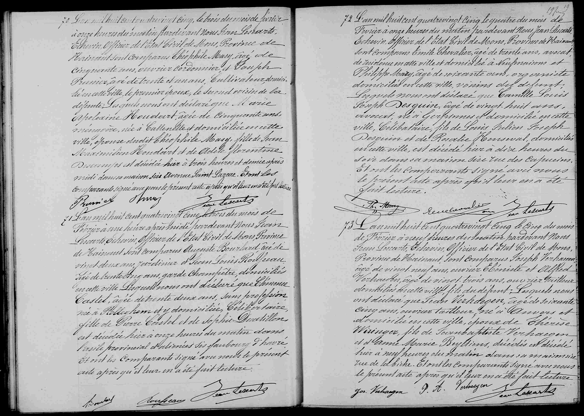

# Décès de Camille Desguin

72 

L'an mil huit cent quatre vingt cinq le quatre du mois de
février à onze heures du matin pardevant Nous Jean Lescarts
Echevin officier de l'état civil de Mons, Province de Hainaut
sont comparus Emile Chevalier, âgé de trente ans, avocat,
de résidence en cette ville et domicilié à Neufmaisons et
Philippe Mary, âgé de soixante ans, organiste
domicilié en cette ville, voisins du défunt;
lesquels nous ont déclaré que **Camille Louis
Joseph Desguin**, âgé de vingt-huit ans,
avocat, né à Gosselies et domicilié en cette
ville, célibataire, fils de Louis Julien Joseph
Desguin et de Rosalie Henseval, domiciliés
en cette ville, est décédé hier à dix heures du
soir dans sa maison sise rue des Capucins.
Et ont les comparants signé avec nous
le présent acte après qu'il leur en a été
fait lecture.

[Signatures : Ph. Mary, Emile Chevalier, Jean Lescarts]

### Tableau récapitulatif des personnes citées

| Nom | Rôle dans l'acte | Occupation / Notes |
| :--- | :--- | :--- |
| **Camille Louis Joseph Desguin** | Défunt | 28 ans, avocat, né à Gosselies, célibataire. |
| **Émile Chevalier** | Déclarant | 30 ans, avocat, résidant à Mons, domicilié à Neufmaisons, voisin. |
| **Philippe Mary** | Déclarant | 60 ans, organiste, domicilié à Mons, voisin. |
| **Louis Julien Joseph Desguin** | Père du défunt | Domicilié à Mons. |
| **Rosalie Henseval** | Mère du défunt | Domiciliée à Mons. |
| **Jean Lescarts** | Officier de l'état civil | Échevin de la ville de Mons. |

### Dates clés

*   **Date de l'acte :** 4 février 1885 à 11h00.
*   **Date de l'événement (Décès) :** 3 février 1885 (indiqué comme « hier ») à 22h00.

### Lieux mentionnés

*   **Mons (Hainaut, Belgique) :** Ville de l'acte et domicile du défunt.
*   **Rue des Capucins (Mons) :** Lieu du décès (maison du défunt).
*   **Gosselies :** Lieu de naissance du défunt.
*   **Neufmaisons :** Lieu de domicile du témoin Émile Chevalier.