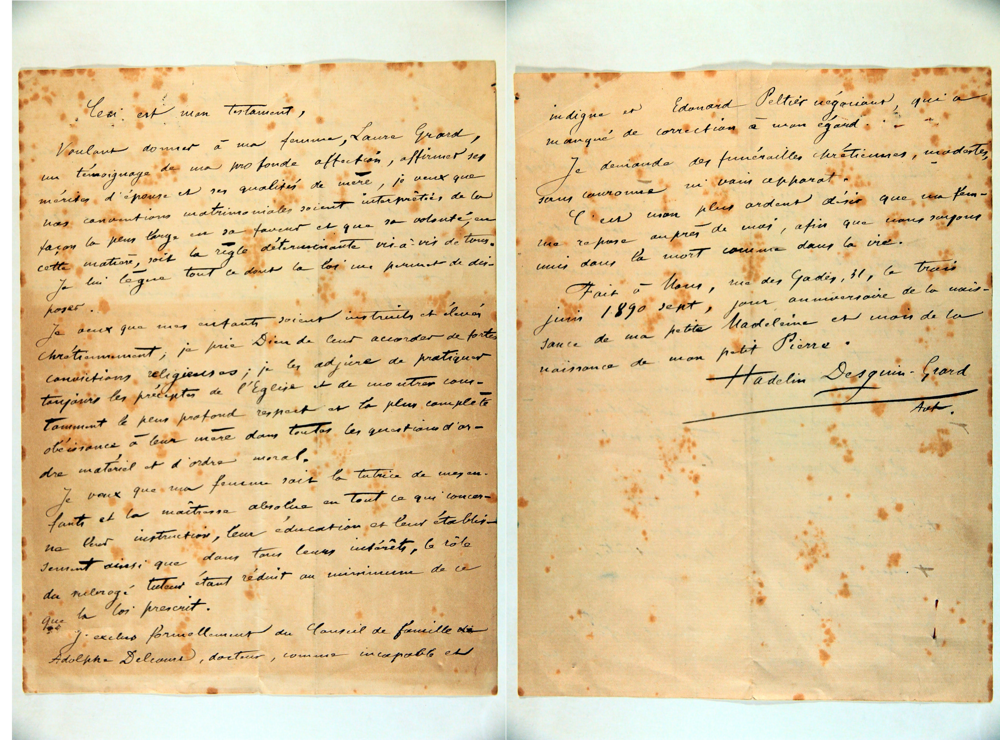

### Testament de Hadelin Desguin (1897)

[Page 1]

Ceci est mon Testament,

Voulant donner à ma femme, Laure Grard,
un témoignage de ma profonde affection, affirmer ses
mérites d’épouse et ses qualités de mère, je veux que
nos conventions matrimoniales soient interprétées de la
façon la plus large en sa faveur et que sa volonté, en
cette matière, soit la règle déterminante vis-à-vis de tous.
Je lui lègue tout ce dont la loi me permet de dis-
poser.
Je veux que mes enfants soient instruits et élevés
chrétiennement ; je prie Dieu de leur accorder de fortes
convictions religieuses ; je les adjure de pratiquer
toujours les préceptes de l’Eglise et de montrer cons-
tamment le plus profond respect et la plus complète
obéissance à leur mère dans toutes les questions d’or-
dre matériel et d’ordre moral.
Je veux que ma femme soit la tutrice de mes en-
fants et la maîtresse absolue en tout ce qui concer-
ne leur instruction, leur éducation et leur établis-
sement ainsi que dans tous leurs intérêts, le rôle
du subrogé tuteur étant réduit au minimum de ce
que la loi prescrit.
J’exclus formellement du Conseil de famille
Adolphe Delcour, docteur, comme incapable et

[Page 2]

indigne et Edouard Peltier négociant, qui a
manqué de correction à mon égard.
Je demande des funérailles chrétiennes, modestes,
sans couronne ni vain apparat.
C’est mon plus ardent désir que ma fem-
me repose auprès de moi, afin que nous soyons
unis dans la mort comme dans la vie.
Fait à Mons, rue des Gades, 51, le trois
juin 1890 sept, jour anniversaire de la nais-
sance de ma petite Madeleine et mois de la
naissance de mon petit Pierre.

Hadelin Desguin-Grard

(Avct.)

---

### Tableau récapitulatif des personnes mentionnées

| Nom | Rôle dans le document | Profession / Notes |
| :--- | :--- | :--- |
| **Hadelin Desguin-Grard** | Testateur | Avocat. Signe "Hadelin Desguin-Grard, Avocat". |
| **Laure Grard** | Épouse | Épouse du testateur, désignée comme légataire universelle (dans la limite de la loi) et tutrice absolue des enfants. |
| **Madeleine [Desguin]** | Fille | Enfant mineure. Le testament est écrit le jour de son anniversaire de naissance. |
| **Pierre [Desguin]** | Fils | Enfant mineur. Le testament est écrit le mois de sa naissance. |
| **Adolphe Delcour** | Exclu du conseil de famille | Docteur. Exclu formellement car qualifié d'« incapable et indigne » par le testateur. |
| **Edouard Peltier** | Exclu du conseil de famille | Négociant. Exclu formellement pour avoir « manqué de correction » envers le testateur. |

---

### Dates clés

* **Date du document :** 3 juin 1897 (*"le trois juin 1890 sept"*).
* **Date de l'événement (Testament) :** 3 juin 1897.
* **Notes sur d'autres dates :** Le document mentionne coïncider avec le jour anniversaire de naissance de sa fille Madeleine et le mois de naissance de son fils Pierre.

---

### Lieux mentionnés

* **Mons (Belgique) :** Ville de rédaction du testament.
* **Rue des Gades, 51 :** Adresse précise du domicile ou du lieu de rédaction à Mons.