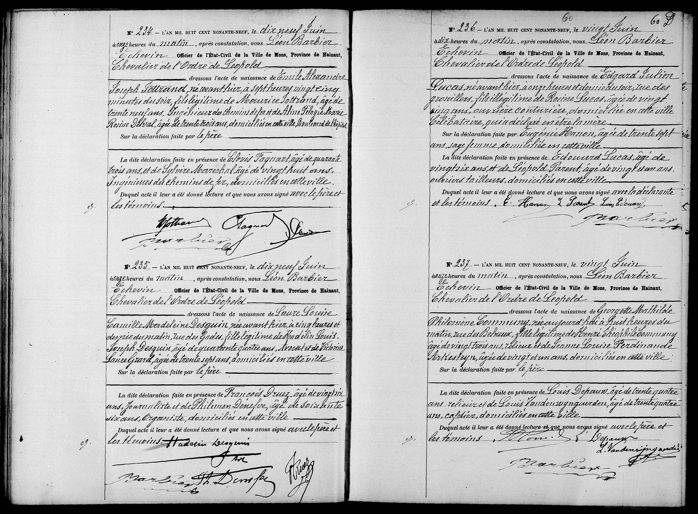

# 1899 Naissance de Laure Desguin

N° 235. — L’AN MIL HUIT CENT NONANTE-NEUF, le dix neuf Juin
à onze heures du matin, après constatation, nous Léon Barbier
Échevin Officier de l’État-Civil de la Ville de Mons, Province de Hainaut,
Chevalier de l’Ordre de Léopold
dressons l’acte de naissance de Laure Louise
Camille Madeleine Desguin née avant-hier, à cinq heures et
demie du matin, rue des Gades, fille légitime de Hyacinthe Louis
Joseph Desguin âgé de quarante quatre ans, Avocat, et de Victorine
Laure Gérard, agée de trente sept ans, domiciliés en cette ville.
Sur la déclaration faite par le père.
La dite déclaration faite en présence de Francois Druez, âgé de vingt six
ans, Journaliste, et de Philemon Denefve, âgé de soixante
six ans, Organiste, domiciliés en cette ville.
Duquel acte il leur a été donné lecture et que nous avons signé avec le père et
les témoins.
[Signatures : H. Desguin, Fr. Druez, Ph. Denefve, Léon Barbier]

### Tableau récapitulatif des personnes citées

| Nom | Rôle dans l’acte | Occupation / Notes |
| :--- | :--- | :--- |
| **Laure Louise Camille Madeleine Desguin** | Enfant | Née rue des Gades. |
| **Hyacinthe Louis Joseph Desguin** | Père | 44 ans, Avocat, domicilié à Mons. |
| **Victorine Laure Gérard** | Mère | 37 ans, domiciliée à Mons. |
| **Léon Barbier** | Officier de l'état civil | Échevin, Chevalier de l'Ordre de Léopold. |
| **François Druez** | Témoin | 26 ans, Journaliste, domicilié à Mons. |
| **Philémon Denefve** | Témoin | 66 ans, Organiste, domicilié à Mons. |

### Dates clés

*   **Date de l’acte :** 19 juin 1899.
*   **Date de l’événement (Naissance) :** 17 juin 1899 (indiqué comme « avant-hier ») à 5h30 du matin.

### Lieux mentionnés

*   **Mons (Hainaut, Belgique) :** Lieu de rédaction de l'acte et domicile des parents.
*   **Rue des Gades :** Lieu spécifique de la naissance à Mons.