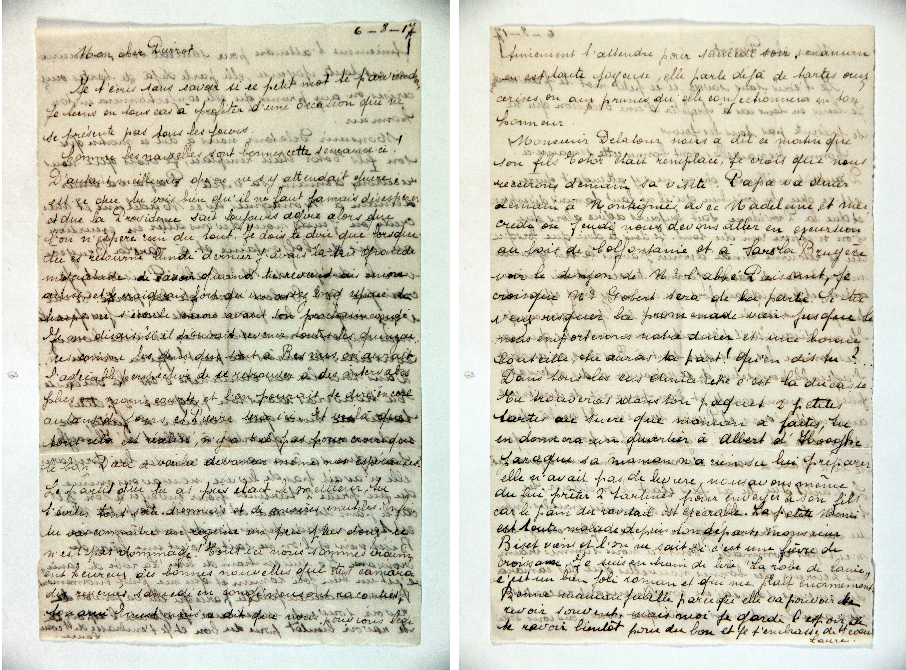

###  Lettre à Pierre Desguin (1917)

#### Hadelin

Mon bien cher fils et vaillant Ami, nous voici lundi. Je suis XXX  
je viens de faire le tour de la maison ; intra et extra. Je t’écris à la  
hâte ces renseignements. Je ne comptais guère sur toi hier ; mais j'espère  
pour dimanche prochain ; nous espérons tous. Il XXX ramasse des XXX de  
la forêt XXX ; nous n’avons pas vu de soldats avec eux. Or, mainte-  
nant, se fait difficile de faire accepter une lettre. Hier matin est venu  
Hubert Lebailly qui t’apportera un paquet. Il nous a mis au courant de ta  
nouvelle situation. XXX XXX XXX engagement  
Je t’avais [rature] écrit à ce sujet une lettre qui est encore ici XXX-  
dis faute d'XXX de transmission. Elle te parviendra XXX pour mardi.  
J’aurai sous la main le type nécessaire ; je ne croyais XXX t'écrire n'ayant per-  
sonne à ma disposition. Car hier, comme je me promenais vers XXX  
avec Laure, j’ai rencontré un homme qui m’a dit venir de Bernissart  
où il retourne lundi. Il m'a offert [rature] de te rapporter ce mot. Comme  
cela m’allait bien j'ai accepté. Il viendra tous à l’heure. Ce doit être le  
domestique du notaire de la rue Grande Triperie. Je l’attends de la mati-  
née et suis content de pouvoir disposer de lui. Rien ici qui vaille la  
peine d'être cité. On s’attend à de gros événements vers les Flandres en tout  
l’attention est là. Tout le monde se porte bien ; maman en forme, surtout  
depuis qu'elle t'a vu. Nous vivons dans l'espoir de te revoir et le désir de te  
[rature] recevoir. Hier Raoul Hainaut est venu et nous le reverrons  
ce matin. Maman te prépare de la tarte et je ne sais quoi. Les deux filles  
vont bien, grand-mère aussi. La température s'adoucit, il fait excellent  
et la pluie s'en va enfin. Tant mieux ! XXX ces jours, mercredi ou jeudi je vais  
  
**page 2**  
  
aller, avec Gobert à Sars-la-Bruyère, voir l’installation de l’abbé Puissant  
qui fait des XXX. un XXX d’ici XXX jusqu’à Enghien, puis 15 kilo-  
mètres à pied, nous reviendrons par le bois de Colfontaine, ceci un XXX [rature] XXX  
à-XXX. Je prendrai les deux filles avec moi, l'histoire de les faire sortir  
de leur [rature] milieu, nous serons [rature] de retour vers 4 ou 5 heures  
du soir ; nous partirons avec des [ratures] tartines et à boire. Nous nous  
rapprocherons pour l’autre côté de la forêt de XXX. Samedi, dîner à Montignies  
avec Madeleine, question de ravitaillement, j’ai vu de braves légionnaires chez Jourdain  
j’irai encore cette semaine. Écris-moi encore avec ce nouveau système, écris-  
nous tout ce que tu veux, du moment que nous avons un mot de toi. La ville est  
fort tranquille, même le dimanche. On voit que les liards manquent pour  
tout. Dans les champs on a déjà coupé des avoines et du blé, et XXX pommes de terre ; un XXX se   présente convenablement XXX ni plus de nouvelles
de l'XXX XXX. Lebailly paraît bien portant, soigne-toi autant  
que possible, évite les accidents, ne t’expose pas. Il y a eu réclamation des  
conseillers provinciaux en votre faveur. LXXX-Legrand réclame votre mise en li-  
berté et le remplacement par d’autres ; qu’en adviendra-t-il ? Nous avons destitué  
un marchand de pain du XXX qui fraudait, terrible besogne, mais il faut  
bien des exemples. Nous songeons à toi en tous temps, en tous lieux et pensons  
à te ravitailler. Il y a une XXX de maman en route tous les jours.  
Si tu as besoin de quelque chose, dis-le-moi ; aussitôt je me mettrai en route et XXX  
XXX aussi. Je t’embrasse bien fort, fraternellement, amicalement, j'envoie  
toutes mes pensées et te souhaite bonne santé et fort courage en l’honneur de  
la Patrie. Je compte sur toi que tu resteras ferme et droit. Ceci  
est une petite lettre rapide en attendant que je puisse t'en envoyer davantage  
ce à quoi je ne manquerai pas. J'ai des fleurs de mon jardin dans la maison  
je fume un cigare tous les jours et t'en envoie trois et songe à ton  
père et ami, ton Hadelin Desguin  
Lundi 12 heures du matin 6 août.  
  
---  
  
#### Laure  
[Page 1]  

6-8-17

Mon cher Pierrot

Je t’écris sans savoir si ce petit mot te parviendra.
Je tiens en tous cas à profiter d’une occasion qui ne
se présente pas tous les jours.
Comme les nouvelles sont bonnes cette semaine-ci.
D’autant meilleures qu’on ne s’y attendait guère.
Est-ce que tu vois bien qu’il ne faut jamais désespérer
et que la Providence sait toujours agir alors que
l’on n’espère rien du tout. Je dois te dire que lorsque
tu es retourné lundi dernier j’avais la plus grande
inquiétude de savoir quand tu reverrais de nouveau
les tiens et j’avais au fond du cœur assez grand effroi de
l’espace qui s’écoule encore avant ton prochain congé.
Je me disais, s’il pouvait revenir toutes les quinzai-
nes comme les gardes qui sont à Bernissart, on aurait
l’agréable perspective de se retrouver à des intervalles
plus rapprochés et moins égaux, et l'on pourrait se dire, encore
autant de jours, et l’heure sera ici, et voilà que
tout cela est réalisé, n’y a t-il pas de quoi croire que
le bon Dieu a voulu devancer même nos espérances.
Le parti que tu as pris était le meilleur, tu
t’évites tout de suite d’ennuyeuses et de couteuses démarches inutiles. Enfin
tu vas connaître un régime un peu plus doux, ce
n’est pas dommage ! Tout ici nous sommes vraiment heureux des bonnes nouvelles que tes camara-
des revenus samedi en congé nous ont racontées.
Ton ami Ernest nous a dit que vous pouviez vous

[Page 2]

uniquement t’attendre pour samedi soir, Maman
en est toute joyeuse, elle parle déjà de tartes aux
cerises ou aux prunes qu’elle confectionnera en ton
honneur.
Monsieur Delatour nous a dit ce matin que
son fils Célestin était remplacé, je crois que nous
recevrons demain sa visite. Papa va dîner
demain à Montignies, avec Madeleine et mer-
credi ou jeudi nous devons aller en excursion
au bois de Bellefontaine et à Sars-la-Bruyère
voir le donjon de XXXXX l’abbé Puissant, je
crois que Mlle Gobert sera de la partie. Si tu
veux risquer la promenade viens jusque là
nous emporterons notre dîner et une bonne
bouteille, tu auras ta part ! Qu’en dis-tu ?
Dans tous les cas Marie est à la ducasse.
Tu trouveras dans ton paquet 2 petites
tartes au sucre que monsieur a faites, tu
en donneras un quartier à Albert d’Hooghe
parce que sa maman n’a réussi lui préparer
elle n’avait pas de levure, nous avons même
du lui prêter 2 tartines pour envoyer à son fils
car le pain du ravitaillement est exécrable. La petite Nini
est toute malade depuis ton départ, Monsieur
Biset vient et l’on ne sait si c’est une fièvre de
croissance. Je suis en train de lire "La robe de laine",
c’est un bien joli roman et qui me plaît énormément.
Bonne maman tressaille parce qu’elle va pouvoir te
revoir souvent, mais moi je garde l’espoir de
te revoir bientôt pour de bon et je t’embrasse de tout cœur.

Laure.

---

### Tableau consolidé des personnages (Correspondance du 6 août 1917)

Ce tableau rassemble et fusionne les informations sur l'ensemble des membres de la famille, des connaissances locales et des camarades mentionnés dans les deux lettres écrites et envoyées conjointement par Laure Desguin (la sœur) et Hadelin Desguin (le père) à Pierre Desguin (le fils soldat) le 6 août 1917.

| Nom | Rôle / Statut dans la correspondance | Relations familiales & Notes |
| :--- | :--- | :--- |
| **Hadelin Desguin** | Auteur de la seconde lettre | Père de Pierre et de Laure. Avocat à Mons. Il donne des conseils paternels prudents à son fils, l'encourage (« en l'honneur de la Patrie ») et organise la logistique des lettres et des ravitaillements familiaux. |
| **Laure Desguin** | Autrice de la première lettre | Sœur de Pierre. Elle lui donne des nouvelles affectueuses de la maison, de ses lectures et des préparatifs pour son retour temporaire (confection de tartes). |
| **Pierre Desguin** | Destinataire (« Pierrot ») | Fils de Hadelin et frère de Laure. Soldat mobilisé durant la Première Guerre mondiale, il traverse alors un changement de situation militaire (« nouveau système », « nouveau paquetage ») et s'apprête à faire de la garnison. |
| **Maman (Laure Grard)** | Évoquée dans les deux lettres | Épouse de Hadelin. Qualifiée de « tordue maman en route tous les jours » par son mari en raison de ses efforts incessants pour le ravitaillement. Elle se réjouit du retour de son fils et lui prépare des tartes aux fruits. |
| **Madeleine Desguin** | Évoquée dans les deux lettres | Sœur de Pierre et Laure. Elle participe aux activités de la famille, notamment le dîner de ravitaillement prévu à Montignies et l'excursion à Sars-la-Bruyère. |
| **Raoul Hainaut** | Évoqué dans la lettre du père | Gendre (ou futur gendre) de la famille. Mentionné comme étant passé la veille et attendu à nouveau le matin même de la rédaction. |
| **L’abbé Puissant** | Personnalité locale citée par les deux auteurs | Le chanoine Edmond Puissant, célèbre archéologue et collectionneur montois. Le père et la sœur prévoient une excursion pour visiter ses « merveilles » d'installations et ses collections au donjon de Sars-la-Bruyère. |
| **Monsieur Delatour** | Connaissance locale (Lettre de Laure) | Venu donner des nouvelles de son fils Célestin le matin même. (Père de Louis Delatour, futur époux de Madeleine). |
| **Célestin [Delatour]** | Évoqué (Lettre de Laure) | Fils de Monsieur Delatour, mentionné comme ayant été « remplacé » (terme lié au contexte de la mobilisation ou des gardes). |
| **Hubert Lebailly / Le Bailly** | Intermédiaire et ami (Lettre d’Hadelin) | Venu le dimanche matin apporter un paquet et donner des détails à la famille sur la nouvelle affectation de Pierre. |
| **Albert d’Hooghe** | Camarade ou voisin (Lettre de Laure) | Reçoit une part de la tarte au sucre de la famille Desguin car sa propre mère manquait de matières premières pour cuisiner. |
| **La maman d'Albert** | Voisine (Lettre de Laure) | Mère d'Albert d'Hooghe. Elle doit emprunter de la levure et deux tartines à la famille Desguin pour envoyer à son fils en raison de la qualité exécrable du pain de rationnement. |
| **Mlle Gobert** | Amie de la famille | Mentionnée par le père et la sœur comme devant prendre part à la grande excursion vers Sars-la-Bruyère. |
| **Jourdain** | Logeur (Lettre d’Hadelin) | Qualifié de « brave logeur » offrant une solution d'hébergement ou de restauration à Montignies. |
| **La petite Nini** | Enfant de l'entourage | Malade depuis le départ de Pierre, suspectée d'avoir une « fièvre de croissance ». |
| **Monsieur Biset** | Médecin ou proche | Vient ausculter la petite Nini à la maison. |
| **Bonne maman** | Grand-mère | Grand-mère de Pierre, Laure et Madeleine, impatiente et émue à l'idée de revoir son petit-fils soldat. |
| **Marie** | Employée ou proche | Mentionnée comme étant partie festoyer à « la ducasse ». |
| **Monin** | Connaissance (Lettre d’Hadelin) | Cité brièvement en lien avec le conducteur de train qui sert d'intermédiaire pour les nouvelles. |
| **Laure-Léopold** | Connaissances administratives | Évoqués par Hadelin dans le cadre des tensions et des remplacements au sein du Conseil provincial sous l'occupation. |

---

### Tableau consolidé des lieux (Correspondance du 6 août 1917)

| Lieu mentionné | Contexte dans les lettres | Importance géographique / Généalogique |
| :--- | :--- | :--- |
| **Mons** | Ville de départ des lettres | Lieu de résidence de la famille Desguin. C'est de là que Hadelin évoque sa « toux persistante » et d'où partent les colis de nourriture pour Pierre. |
| **Bernissart** | Point de passage des gardes et messagers | Lieu d'affectation de gardes qui obtiennent des congés réguliers. C'est en croisant sur la chaussée un homme revenant de Bernissart que Hadelin trouve l'opportunité de faire parvenir sa lettre à Pierre. |
| **Sars-la-Bruyère** | Destination de l'excursion familiale | Village où la famille (Hadelin, Laure, Madeleine, Mlle Gobert) se rend pour admirer les travaux de restauration et les collections d'art de l'abbé Puissant au sein du donjon médiéval. |
| **Montignies** | Lieu du dîner de ravitaillement | Ville (probablement Montignies-sur-Sambre ou le-Tilleul) où le père se rend le samedi suivant pour un dîner d'affaires ou familial axé sur la recherche de nourriture (« question de ravitaillement »), logé chez Jourdain. |
| **Bois de Bellefontaine** | Étape de la promenade à pied | Massif forestier emprunté par Hadelin et ses filles lors de leur long trajet de retour à pied depuis Sars-la-Bruyère. |
| **Enghien** | Repère de la randonnée du père | Cité par Hadelin pour évaluer l'état de sa santé lors de sa marche forcée (« santé assez bonne jusqu'à Enghien »). |
| **Blaregnies** | Étape de l'excursion | Village frontalier traversé à pied par le groupe familial (à « un ou deux kilomètres » du parcours principal). |
| **Forêt d’Hermignies** | Lieu de mémoire militaire | Évoquée par le père à propos des mouvements de troupes ou de souvenirs de positions militaires (« Il ne se souvient de rien que de la forêt d'Hermignies »). |
| **Forêt de Frameries** | Repère géographique de l'excursion | Mentionnée par Hadelin comme point de passage pour se rapprocher de leur destination lors de la marche. |
| **La Flandre** | Zone de front militaire | Évoquée par Hadelin pour désigner les tensions militaires majeures et les mouvements de troupes de l'été 1917 (« On s'attend à de gros événements vers la Flandre »). |
| **Pas-de-Calais** | Source de nouvelles du front | Mentionné brièvement par le père qui réussit à glaner quelques rares informations provenant de cette région française occupée. |
| **Antoing** | Lieu de stockage (Évoqué en 1932 mais lié au patrimoine familial) | Ville où se trouve le piano de jeune fille de Laure Grard, qui doit être rapatrié à Mons. |