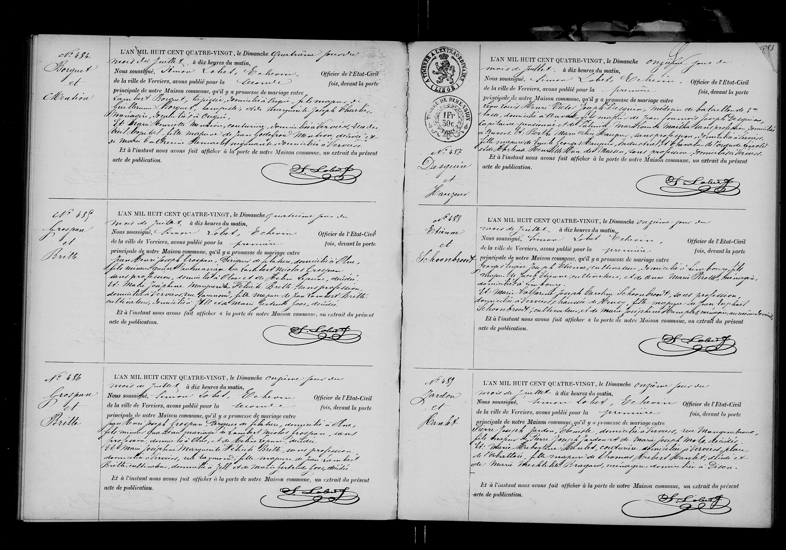

### 1880 Mariage de Henri Desguin & Berthe Hauzeur

L'AN MIL HUIT CENT QUATRE-VINGT, le Dimanche onzième jour du
mois de juillet, à dix heures du matin,
Nous soussigné, Simon Lobet, Échevin, Officier de l'État-Civil
de la ville de Verviers, avons publié pour la première
fois, devant la porte principale de notre Maison commune, qu'il y a promesse de mariage entre
Monsieur **Henri Victor Joseph Desguin**, médecin de bataillon de 2ème
classe, domicilié à Anvers, fils majeur de feu Francois Joseph Desguin,
Capitaine pensionné et de Dame Marie Marthe de Mailly sans profession, domiciliée
à Anvers, Et Mademoiselle **Berthe Marie Anne Hauzeur**, sans profession, domiciliée à Verviers,
fille majeure de feu Georges Hauzeur, industriel, et de Dame Marie Marguerite Léopold-
-ine Ghislaine Henriette Marie des Maezes, sans profession, domiciliée à Verviers.
Et à l'instant nous avons fait afficher à la porte de notre Maison commune, un extrait du présent
acte de publication.

### Tableau récapitulatif des personnes citées

| Nom | Rôle dans l'acte | Occupation / Notes |
| :--- | :--- | :--- |
| **Henri Victor Joseph Desguin** | Futur époux | Médecin de bataillon de 2ème classe, domicilié à Anvers, fils majeur. |
| **Berthe Marie Anne Hauzeur** | Future épouse | Sans profession, domiciliée à Verviers, fille majeure. |
| **François Joseph Desguin** | Père du futur époux | Décédé, ancien Capitaine pensionné. |
| **Marie Marthe de Mailly** | Mère du futur époux | Sans profession, domiciliée à Anvers. |
| **Georges Hauzeur** | Père de la future épouse | Décédé, de son vivant industriel. |
| **Marie Marguerite Léopoldine Ghislaine Henriette Marie des Maezes** | Mère de la future épouse | Sans profession, domiciliée à Verviers. |
| **Simon Lobet** | Officier de l'état civil | Échevin de la ville de Verviers. |

### Dates clés

* **Date de l'acte (Publication) :** Dimanche 11 juillet 1880.

### Lieux mentionnés

* **Verviers (Belgique) :** Lieu de la publication (Maison commune) et domicile de la future épouse et de sa mère.
* **Anvers (Antwerpen) :** Domicile du futur époux et de sa mère.