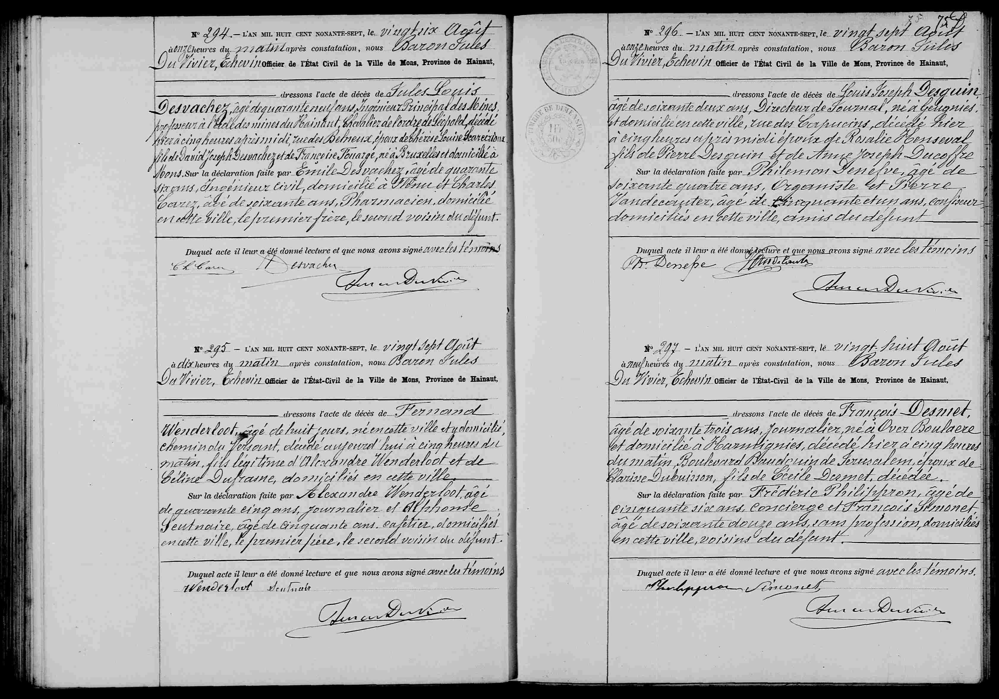

# Décès de Louis Desguin (1897)

N° 296. — L’AN MIL HUIT CENT NONANTE-SEPT, le vingt sept Août
à onze heures du matin, après constatation, nous Baron Jules
Du Vivier, Échevin Officier de l’État Civil de la Ville de Mons, Province de Hainaut,
dressons l’acte de décès de **Louis Joseph Desguin**
âgé de soixante deux ans, Directeur de Journal, né à Blégnies
et domicilié en cette ville, rue des Capucins, décédé hier
à cinq heures après midi époux de Rosalie Henseval,
fils de Pierre Desguin et de Anne Joseph Ducoffre
Sur la déclaration faite par Philemon Denefve, âgé de
soixante quatre ans, Organiste, et Pierre
Vandecasteele, âgé de cinquante et un ans, coiffeur
domiciliés en cette ville, amis du défunt
Duquel acte il leur a été donné lecture et que nous avons signé avec les témoins.
[Signatures : Ph. Denefve, P. Vandecasteele, Baron Du Vivier]

### Tableau récapitulatif des personnes citées

| Nom | Rôle dans l'acte | Occupation / Notes |
| :--- | :--- | :--- |
| **Louis Joseph Desguin** | Défunt | 62 ans, Directeur de Journal, né à Blégnies, époux de Rosalie Henseval. |
| **Rosalie Henseval** | Épouse | Survivante, domiciliée à Mons. |
| **Pierre Desguin** | Père du défunt | Défunt (mentionné pour l'ascendance). |
| **Anne Joseph Ducoffre** | Mère du défunt | Défunte (mentionnée pour l'ascendance). |
| **Philémon Denefve** | Déclarant | 64 ans, Organiste, ami du défunt, domicilié à Mons. |
| **Pierre Vandecasteele** | Déclarant | 51 ans, Coiffeur, ami du défunt, domicilié à Mons. |
| **Baron Jules Du Vivier** | Officier de l'état civil | Échevin de la ville de Mons. |

### Dates clés

* **Date de l'acte :** 27 août 1897 à 11h00.
* **Date de l'événement (Décès) :** 26 août 1897 (indiqué comme « hier ») à 17h00 (5 heures après midi).

### Lieux mentionnés

* **Mons (Hainaut, Belgique) :** Ville de l'acte et de résidence.
* **Rue des Capucins (Mons) :** Domicile et lieu de décès de Louis Joseph Desguin.
* **Blégnies (Blegny) :** Lieu de naissance du défunt.