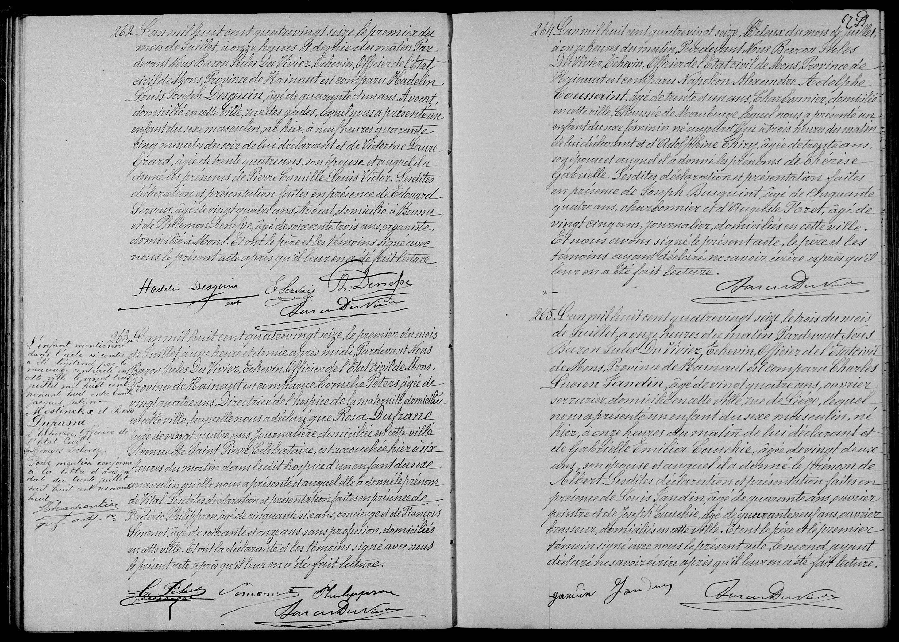

# Naissance de Pierre Desguin

262 
    
L'an mil huit cent quatre-vingt-seize le premier du
mois de Juillet, à onze heures et demie du matin Par-
devant Nous Baron Jules Du Vivier, échevin, Officier de l'État-
civil de Mons, Province de Hainaut, est comparu Hadelin
Louis Joseph Desguin, âgé de quarante et un ans, Avocat,
domicilié en cette ville, rue des Gades, lequel nous a présenté un
enfant du sexe masculin, né hier, à neuf heures quarante
cinq minutes du soir, de lui déclarant et de Victorine Laure
Gérard, âgée de trente quatre ans, son épouse et auquel il a
donné les prénoms de **Pierre Camille Louis Victor**. Lesdites
déclaration et présentation faites en présence de Edouard
Servais, âgé de vingt quatre ans, Avocat, domicilié à Boussu
et de Philemon Denefve, âgé de soixante trois ans, organiste,
domicilié à Mons. Et ont le père et les témoins signé avec
nous le présent acte après qu'il leur en a été fait lecture.
[Signatures : Hadelin Desguin, E. Servais, Ph. Denefve, Baron Du Vivier]

### Tableau récapitulatif des personnes citées

| Nom | Rôle dans l’acte | Occupation / Notes |
| :--- | :--- | :--- |
| **Pierre Camille Louis Victor Desguin** | Enfant | Né rue des Gades. |
| **Hadelin Louis Joseph Desguin** | Père | 41 ans, Avocat, domicilié rue des Gades à Mons. |
| **Victorine Laure Gérard** | Mère | 34 ans, épouse du déclarant, domiciliée à Mons. |
| **Baron Jules Du Vivier** | Officier de l'état civil | Échevin de la ville de Mons. |
| **Édouard Servais** | Témoin | 24 ans, Avocat, domicilié à Boussu. |
| **Philémon Denefve** | Témoin | 63 ans, Organiste, domicilié à Mons. |

### Dates clés

*   **Date de l’acte :** 1er juillet 1896.
*   **Date de l’événement (Naissance) :** 30 juin 1896 (indiqué comme « hier ») à 21h45.

### Lieux mentionnés

*   **Mons (Hainaut, Belgique) :** Ville de l'acte et de résidence des parents.
*   **Rue des Gades (Mons) :** Lieu de naissance de l'enfant et domicile du père.
*   **Boussu :** Lieu de domicile du témoin Édouard Servais.