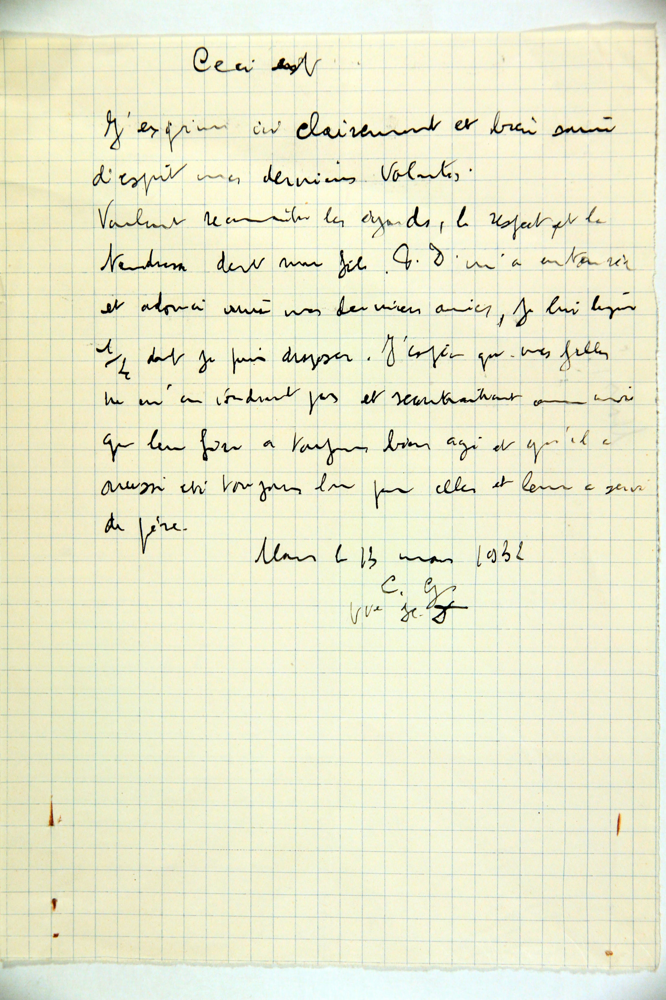

### Brouillon du testament de Laure Grard (1932)

Ceci est

J’exprime ici clairement et très saine
d’esprit mes dernières volontés.
Voulant reconnaître les égards, le respect et la
tendresse dont mon fils P. D. m’a entourée
et adouci ainsi mes dernières années, je lui lègue
1/4 dont je puis disposer. J’espère que mes filles
ne m’en voudront pas et reconnaîtront avec moi
que leur frère a toujours bien agi et qu’il a
aussi été toujours là pour elles et leur a servi
de père.

Mons le 13 mars 1932

L. G.

Vve H. D.

---

### Lettre de Laure Grard a ses enfants (1932)

[Page 1]

Mons ce 3 Août 1932.

Mes chers enfants

Dans mon testament
où sont formulées mes dernières volontés
je donne à Pierre tout ce que
la loi me permet d’attribuer.
Cependant, je voudrais qu’après
ma mort, s’il n’était pas encore
marié, qu’on le laisse dans
la maison meublée comme elle
est, jusqu’au moment où il
se mettrait en ménage en se ma-
riant, il ne faut pas quand
il se trouvera seul, qu’on le
laisse entre quatre murs.
Madeleine et Laure ont de beaux
intérieurs, elles doivent être bonnes

[Page 2]

pour leur frère, car il m’a
rendue bien heureuse, il ne
m’a jamais fait la moindre
peine, je le bénis comme
je bénis mes filles. J'espère
que vous resterez toujours ensemble
en bons termes, que vous vous
aimerez toujours bien comme
quand nous vivions Papa
et moi.
Mon piano est toujours à Antoing,
à la première occasion, il doit
rentrer à Mons, il est entendu
qu’il devient exclusivement la
propriété de Pierre, il lui appar-
tient, je l’ai payé de mon
argent de jeune fille, on ne
peut pas le discuter.
Je ne doute pas que Raoul
et Louis ratifieront mes inten-
tions ci-dessus et qu’ils ne met-
tront pas d’obstacle à mes dernières
volontés.
J’espère que le bon Dieu m’accordera
encore de longs jours, je voudrais
encore vivre quelques années,
mais si c’était sa volonté je
suis prête, consciente de mon
devoir accompli.

Laure Grard
Vve Hadelin Desguin

### Tableau récapitulatif des personnes mentionnées

| Nom | Rôle / Statut dans ces documents | Relations familiales & Notes |
| :--- | :--- | :--- |
| **Laure Grard** | Testatrice et autrice de la lettre | Veuve d'Hadelin Desguin. |
| **Pierre Desguin** | Fils / Légataire privilégié | Désigné par « P. D. » ou « Pierre ». Célibataire en 1932. |
| **Madeleine Desguin** | Fille | Fille de Laure et Hadelin. En 1932, elle est mariée et solidement établie. |
| **Laure Desguin** | Fille | Sœur cadette|
| **Raoul** | Gendre | Époux de Laure |
| **Louis** | Gendre | Époux de Madeleine |
| **Hadelin Desguin** | Époux décédé  |  |
---
