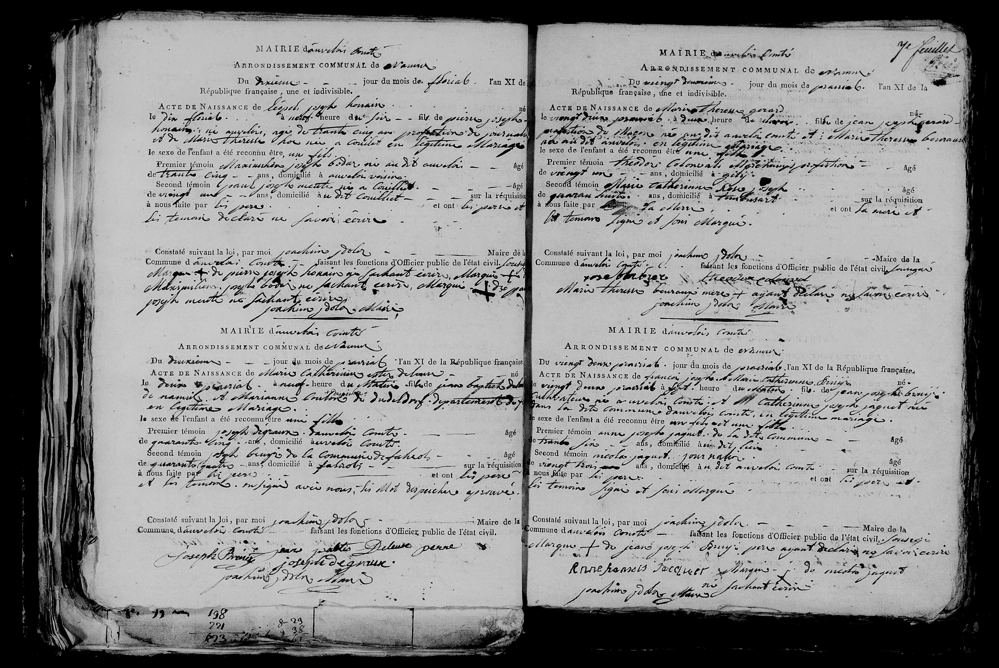

## Analyse 

# Marie Thérèse GERARD (1803)

### Transcription

MAIRIE d'auvelais Comté
ARRONDISSEMENT COMMUNAL de namur

Du vingt deuxième jour du mois de prairial l'an XI de la République française, une et indivisible.

ACTE DE NAISSANCE de **Marie Thérèse gerard** né le vingt deux prairial à deux heures du matin fille de **jean joseph gerard** profession de maçon né au dit auvelais Comté et de **Marie Thérèse beuraus** née au dit auvelais en légitime mariage.
le sexe de l'enfant a été reconnu être une fille

Premier témoin Théodore Colovrat Marchand de profession  âgé de vingt un ans, domicilié à gilly
Second témoin Marie Catherine Deleuse veuve de Joseph âgé de quarante huit ans, domicilié à Tamines sur la réquisition à nous faite par la mère et ont la mère et le témoin signé et fait marqué.

Constaté suivant la loi, par moi joachim doler Maire de la Commune d'auvelais Comté faisant les fonctions d'Officier public de l'état civil.

[Signatures / Marques]
marque + de Théodore Colovrat
Marie Thérèse beuraus mère ayant déclaré ne savoir écrire
joachim doler maire

---

### 2. Tableau Récapitulatif des Personnes Mentionnées

| Nom | Rôle dans l'acte | Profession / Notes |
| :--- | :--- | :--- |
| **Marie Thérèse GERARD** | Enfant (Née) | Née le 22 Prairial An XI à 2h du matin. |
| **Jean Joseph GERARD** | Père | Maçon. Né à Auvelais. |
| **Marie Thérèse BEURAUS** | Mère | Née à Auvelais. Déclarante (le père est absent ou non-signataire). Ne sait pas écrire. |
| Théodore COLOVRAT | Premier témoin | 21 ans. Domicilié à Gilly. A apposé une marque (+). |
| Marie Catherine DELEUSE | Second témoin | 48 ans. Veuve. Domiciliée à Tamines. |
| Joachim DOLER | Officier d'état civil | Maire de la commune d'Auvelais. |

---

### 3. Dates Clés

* **Date de l'acte :** 22 Prairial An XI
* **Date de l'événement (Naissance) :** 22 Prairial An XI
* **Conversion Grégorienne :** 11 juin 1803

---

### 4. Lieux Mentionnés

* **Commune :** Auvelais (nommée "Auvelais Comté" dans l'acte).
* **Arrondissement :** Namur.
* **Domiciles des témoins :** Gilly (pour Colovrat) et Tamines (pour Deleuse).