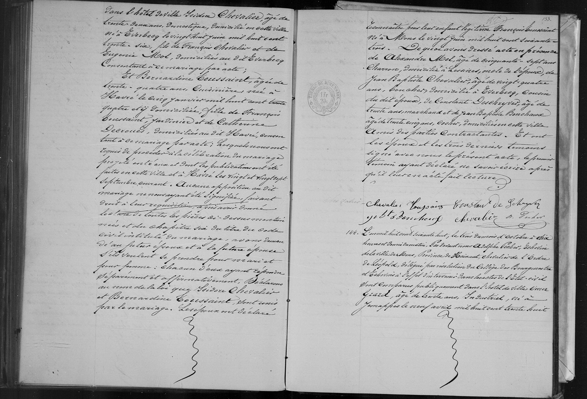
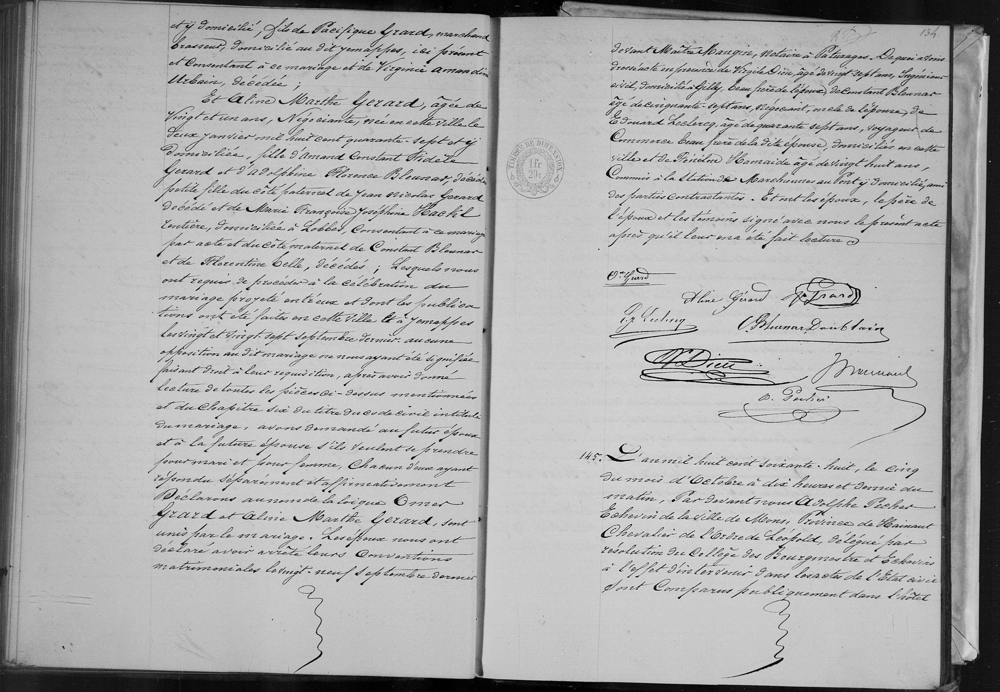

##  Mariage Omer GRARD x Aline Marthe GERARD (1868)

### 1. Transcription 

L’an mil huit cent soixante huit, le trois du mois d’octobre à dix heures et demi du matin. Pardevant nous Adolphe Pecher, Échevin de la ville de Mons, Province de Hainaut, Chevalier de l’Ordre de Léopold, délégué par résolution du Collège des Bourgmestre et Échevins à l’effet d’intervenir dans les actes de l’État-civil Ont comparu publiquement dans l’Hôtel de ville :

**Omer Grard**, âgé de trente ans, Industriel, né à Jemappes le neuf avril mil huit cent trente huit et y domicilié, fils de **Pacifique Grard**, marchand brasseur, domicilié au dit Jemappes, ici présent et consentant à ce mariage et de **Virginie Amandine Urbain**, décédée ;

Et **Aline Marthe Gerard**, âgée de vingt et un ans, Négociante, née en cette ville le deux janvier mil huit cent quarante sept et y domiciliée, fille d'**Amand Constant Fidèle Gerard** et **d’Adolphine Florence Bleusart**, décédée ; petite-fille du côté paternel de **Jean Nicolas Gerard**, décédé et de **Marie Françoise Joséphine Macké Lontière**, domiciliée à Lobbes, consentant à ce mariage par acte et du côté maternel de **Constant Bleusart** et de **Florentine Celle**, décédées ; lesquels nous ont requis de procéder à la célébration du mariage projeté entre eux et dont les publications ont été faites en cette ville et à Jemappes les vingt et vingt-sept septembre dernier : aucune opposition au dit mariage ne nous ayant été signifiée.

Faisant droit à leur réquisition, après avoir donné lecture de toutes les pièces ci-dessus mentionnées et du Chapitre six du titre du Code civil intitulé du mariage, avons demandé au futur époux et à la future épouse s’ils veulent se prendre pour mari et pour femme, chacun d’eux ayant répondu séparément et affirmativement. Déclarons au nom de la loi que Omer Grard et Aline Marthe Gerard sont unis par le mariage.

Les époux nous ont déclaré avoir arrêté leurs conventions matrimoniales le vingt-neuf septembre dernier devant Maître Mangin, notaire à Pâturages.

De quoi avons dressé acte en présence de :
1° **Virgile Dieu**, âgé de vingt sept ans, Ingénieur civil, domicilié à Gilly, beau-frère de l'époux ;
2° **Constant Bleusart**, âgé de soixante-sept ans, Négociant, oncle de l'épouse ;
3° **Édouard Leclercq**, âgé de quarante sept ans, voyageur de commerce, beau-frère de la dite épouse, domicilié en cette ville ;
4° Isidore Hamaide, âgé de vingt huit ans, Commis à la station de Marchienne-au-Pont, y domicilié, ami des parties contractantes.

Et ont les époux, le père de l’époux et les témoins signé avec nous le présent acte après qu’il leur en a été fait lecture.

[Signatures]
O. Grard | Aline Gerard | P. J. Grard
V. Dieu | C. Bleusart | Ed. Leclercq
Hamaide | Pecher

---

### 2. Tableau Récapitulatif des Personnes Mentionnées

| Nom | Rôle dans l'acte | Profession / Notes |
| :--- | :--- | :--- |
| **Omer GRARD** | Époux | Industriel. 30 ans. Né et résidant à Jemappes. |
| **Aline Marthe GERARD** | Épouse | Négociante. 21 ans. Née et résidant à Mons. |
| **Pacifique GRARD** | Père de l'époux | Marchand brasseur à Jemappes. Présent et consentant. |
| **Virginie Amandine URBAIN**| Mère de l'époux | Décédée avant 1868. |
| **Amand Constant Fidèle GERARD**| Père de l'épouse | Présent (signe "F. Gerard"). |
| **Adolphine Florence BLEUSART**| Mère de l'épouse | Décédée avant 1868. |
| **Jean Nicolas GERARD** | Grand-père pat. (épouse) | Décédé. |
| **M. F. J. MACKÉ LONTIÈRE** | Grand-mère pat. (épouse) | Domiciliée à Lobbes. Consentante par acte. |
| **Virgile DIEU** | Témoin | Ingénieur civil. 27 ans. Beau-frère d'Omer (Gilly). |
| **Constant BLEUSART** | Témoin | Négociant. 67 ans. Oncle de l'épouse. |
| **Édouard LECLERCQ** | Témoin | Voyageur de commerce. 47 ans. Beau-frère de l'épouse. |
| ****Isidore HAMAIDE**** | Témoin | Commis de station (chemin de fer). 28 ans. Ami. |

---

### 3. Dates Clés

* **Date du Mariage :** 3 octobre 1868.
* **Date du Contrat de Mariage :** 29 septembre 1868 (Me Mangin à Pâturages).
* **Naissance de l'époux :** 9 avril 1838.
* **Naissance de l'épouse :** 2 janvier 1847.

---

### 4. Lieux Mentionnés

* **Lieu du mariage :** Hôtel de ville de Mons (Hainaut).
* **Localités liées :** Jemappes (famille Grard), Gilly, Lobbes, Pâturages (notaire), Marchienne-au-Pont.

### 3. Acte de Naissance (Début) : Marie Anne A. J. GÉRARD (Mons, 1868)

| Nom | Rôle dans l'acte | Profession / Notes |
| :--- | :--- | :--- |
| **Marie Anne Antoinette Joséphine GÉRARD** | Enfant (Née) | Née le 5 octobre 1868 à 4h du matin. |
| **Fidèle GÉRARD** | Père | Négociant. Âge non mentionné dans ce fragment. |
| **Marie Anne DE WOLF** | Mère | Épouse de Fidèle Gérard. |
| **Adolphe PECHER** | Officier d'état civil | Échevin de la ville de Mons. |