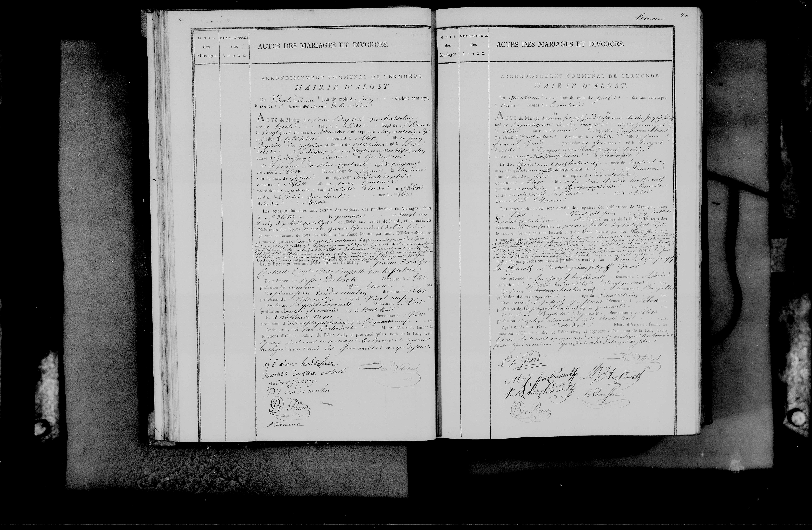

## Mariage Pierre Joseph GRARD x Marie Anne HERCHENRATH (1807)

### 1. Transcription 

ARRONDISSEMENT COMMUNAL DE TERMONDE.
MAIRIE D'ALOST.

Du vingt deuxième jour du mois de juin l'an mil huit cent sept à onze heures du matin.

ACTE DE MARIAGE de **Pierre Joseph Grard**, tailleur de pierres, âgé de vingt six ans, né à Auvelais, département de Sambre et Meuse, le vingt sept mai mil sept cent quatre vingt un, ainsi qu'il appert par son acte de naissance ci-annexé, fils majeur de feu **Jean Joseph Grard**, en son vivant tailleur de pierres, et de **Marie Thérèse Beuraus**, demeurante à Auvelais, ici présente et consentante.

Et de **Marie Anne Herchenrath**, sans profession, âgée de vingt deux ans, née à Alost, département de l'Escaut, le vingt six juin mil sept cent quatre vingt quatre, ainsi qu'il appert par son acte de naissance, fille majeure de feu **Pierre Joseph Herchenrath**, et de **Marie Anne De Wolf**, sa veuve, demeurante à Alost, ici présente et consentante.

Les préliminaires sont : les publications faites à Alost, les dimanches sept et quatorze juin courant, à l'heure de midi, conformément à la loi, sans qu'aucune opposition ne nous ait été signifiée.

Faisant droit à leur réquisition, après avoir donné lecture des pièces mentionnées ci-dessus et du chapitre six du titre du code civil intitulé du mariage, j'ai demandé au futur époux et à la future épouse s'ils veulent se prendre pour mari et pour femme ; chacun d'eux ayant répondu séparément et affirmativement, je déclare au nom de la loi que Pierre Joseph Grard et Marie Anne Herchenrath sont unis par le mariage.

Dont acte fait en présence de : 1° Joseph Deleuse, âgé de trente huit ans, profession de maçon, demeurant à Alost, cousin de l'époux ; 2° Pierre Joseph Van Der Meulen, âgé de quarante deux ans, maçon, demeurant à Alost, non parent ; 3° Jean Baptiste De Wolf, âgé de quarante ans, brasseur, demeurant à Alost, oncle de l'épouse ; 4° Adrien Jacques De Wolf, âgé de trente sept ans, brasseur, demeurant à Alost, oncle de l'épouse.

Et ont les époux, les mères des époux et les témoins signé avec nous, à l'exception de la mère de l'époux qui a déclaré ne savoir écrire.

[Signatures]
P. J. Grard | M: A: herchenrath
M. A. de wolf veuve herchenrath
P: J: van der meulen | J. B. de Wolf
Jos. Deleuse | A. J. de Wolf
L. Stevens (Maire)

---

### 2. Tableau Récapitulatif des Personnes Mentionnées

| Nom | Rôle dans l'acte | Profession / Notes |
| :--- | :--- | :--- |
| **Pierre Joseph GRARD** | Époux | Tailleur de pierres. 26 ans. Né à Auvelais (Sambre-et-Meuse). |
| **Marie Anne HERCHENRATH**| Épouse | Sans profession. 22 ans. Née à Alost (Escaut). |
| **Jean Joseph GRARD** | Père de l'époux | Décédé. Ancien tailleur de pierres. |
| **Marie Thérèse BEURAUS** | Mère de l'époux | Demeurant à Auvelais. Présente. Ne sait pas signer. |
| **Pierre Joseph HERCHENRATH**| Père de l'épouse | Décédé. |
| **Marie Anne DE WOLF** | Mère de l'épouse | Veuve. Demeurant à Alost. Présente. Signe. |
| Joseph DELEUSE | Témoin | Maçon. 38 ans. Cousin de l'époux. Domicilié à Alost. |
| Pierre J. VAN DER MEULEN | Témoin | Maçon. 42 ans. Non parent. Domicilié à Alost. |
| Jean Baptiste DE WOLF | Témoin | Brasseur. 40 ans. Oncle de l'épouse. Domicilié à Alost. |
| Adrien Jacques DE WOLF | Témoin | Brasseur. 37 ans. Oncle de l'épouse. Domicilié à Alost. |

---

### 3. Dates Clés

* **Date de l'acte (Mariage) :** 22 juin 1807
* **Date de naissance de l'époux :** 27 mai 1781
* **Date de naissance de l'épouse :** 26 juin 1784

---

### 4. Lieux Mentionnés

* **Lieu du mariage :** Alost (Mairie d'Alost, Arrondissement de Termonde, Département de l'Escaut).
* **Origine de l'époux :** Auvelais (Département de Sambre-et-Meuse).
* **Origine de l'épouse :** Alost.
* **Domiciles des témoins :** Tous résident à Alost au moment de l'acte.