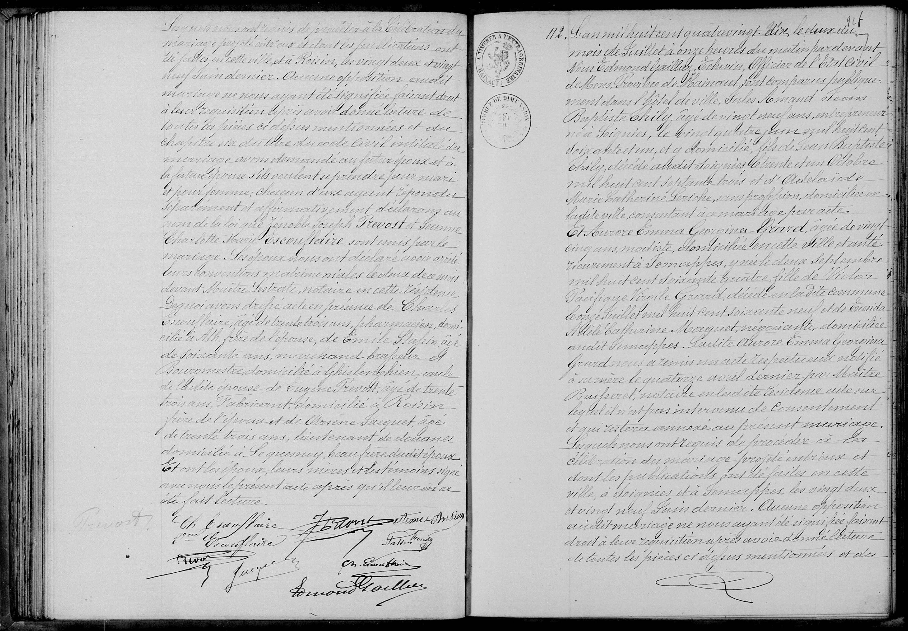
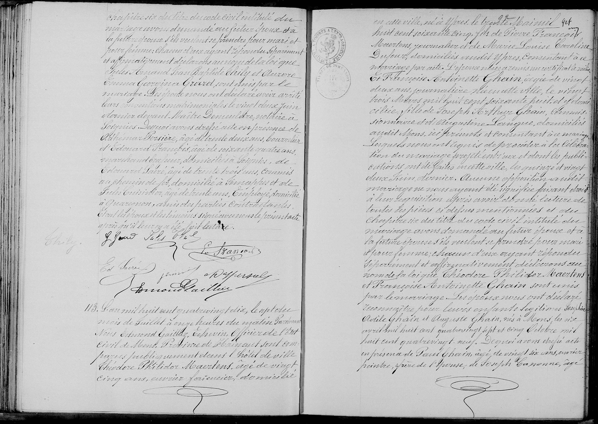

##  Mariage Jules Armand Jean Baptiste THILY x Aurore Emma Georgina GRARD (1890)

### 1. Transcription 

L’an mil huit cent quatre-vingt-dix, le deux du mois de juillet à onze heures du matin pardevant nous Edmond Gailler, Échevin, Officier de l’État civil de Mons, Province de Hainaut, ont comparu publiquement dans l’Hôtel de ville :

**Jules Armand Jean Baptiste Thily**, âgé de vingt neuf ans, entrepreneur, né à Soignies, le vingt quatre juin mil huit cent soixante et un, et y domicilié, **fils de Jean Baptiste Thily**, décédé audit Soignies le trente un octobre mil huit cent septante trois et **d’Adélaïde Marie Catherine Riche**, sans profession, domiciliée en ladite ville, consentante au mariage par acte.

Et **Aurore Emma Georgina Grard**, âgée de vingt cinq ans, modiste, domiciliée en cette ville et antérieurement à Jemappes, y née le deux septembre mil huit cent soixante quatre, fille de **Victor Pacifique Félicité Grard**, décédé en ladite commune le onze juillet mil huit cent soixante neuf et de **Brenda Adèle Catherine Mocquet**, négociante, domiciliée audit Jemappes. Ladite Aurore Emma Georgina Grard nous a remis un acte respectueux notifié à sa mère le quatorze avril dernier par Maître Puissant, notaire en ladite résidence, acte sur lequel il n’est pas intervenu de consentement et qui restera annexé au présent mariage.

Lesquels nous ont requis de procéder à la célébration du mariage projeté entre eux et dont les publications ont été faites en cette ville, à Soignies et à Jemappes, les vingt deux et vingt neuf juin dernier. Aucune opposition audit mariage ne nous ayant été signifiée.

Faisant droit à leur réquisition, après avoir donné lecture de toutes les pièces ci-dessus mentionnées et du chapitre six du titre du code civil intitulé du mariage, avons demandé au futur époux et à la future épouse s’ils veulent se prendre pour mari et pour femme ; chacun d’eux ayant répondu séparément et affirmativement déclarons au nom de la loi que Jules Armand Jean Baptiste Thily et Aurore Emma Georgina Grard sont unis par le mariage.

Les époux nous ont déclaré avoir arrêté leurs conventions matrimoniales le vingt deux juin dernier devant Maître Demeuldre, notaire à Soignies. De quoi avons dressé acte en présence de :
1° Adhémar Persière, âgé de trente deux ans, boucher ;
2° Édouard Persière, âgé de soixante quatre ans, marchand brasseur, domiciliés à Soignies ;
3° Édouard Fabri, âgé de trente trois ans, commis au chemin de fer, domicilié à Jemappes ;
4° Jules Cuisissier, âgé de trente ans, employé domicilié à Quaregnon, amis des parties contractantes.

Et ont les époux et les témoins signé avec nous le présent acte après qu’il leur en a été fait lecture.

[Signatures]
J. Thily | A. Grard | Ad. Persière
Ed Persière | Fabri | J. Cuisissier
Edmond Gailler

---

### 2. Tableau Récapitulatif des Personnes Mentionnées

| Nom | Rôle dans l'acte | Profession / Notes |
| :--- | :--- | :--- |
| **Jules Armand J. B. THILY** | Époux | Entrepreneur. 29 ans. Né et domicilié à Soignies. |
| **Aurore Emma Georgina GRARD** | Épouse | Modiste. 25 ans. Née à Jemappes, réside à Mons. |
| **Jean Baptiste THILY** | Père de l'époux | Décédé en 1873 à Soignies. |
| **Adélaïde Marie C. RICHE** | Mère de l'époux | Domiciliée à Soignies. Consentante par acte. |
| **Victor Pacifique F. GRARD** | Père de l'épouse | Décédé en 1869 à Jemappes. |
| **Brenda Adèle C. MOCQUET** | Mère de l'épouse | Négociante à Jemappes. (Refuse le consentement). |
| Adhémar PERSIÈRE | Témoin | Boucher. 32 ans. Domicilié à Soignies. |
| Édouard PERSIÈRE | Témoin | Marchand brasseur. 64 ans. Domicilié à Soignies. |
| Édouard FABRI| Témoin | Commis au chemin de fer. 33 ans. Domicilié à Jemappes. |
| Jules CUISISSIER | Témoin | Employé. 30 ans. Domicilié à Quaregnon. |

---

### 3. Dates Clés

* **Date du Mariage :** 2 juillet 1890.
* **Naissance de l'époux :** 24 juin 1861.
* **Naissance de l'épouse :** 2 septembre 1864.
* **Acte respectueux (notification) :** 14 avril 1890.

---

### 4. Lieux Mentionnés

* **Lieu du mariage :** Mons (Hainaut).
* **Origines :** Soignies (époux) et Jemappes (épouse).
* **Autres localités :** Quaregnon.

### 5. Autres actes

#### Acte de Mariage n°111 : Jonathan Joseph PROVOST x Jeanne Charlotte Marie ESCOUFFLAIRE (1890)

| Nom | Rôle dans l'acte | Profession / Notes |
| :--- | :--- | :--- |
| Jonathan Joseph PROVOST | Époux | Menuisier. 28 ans. Né et domicilié à Mons. |
| Jeanne Charlotte Marie ESCOUFFLAIRE | Épouse | 21 ans. Née et domiciliée à Mons. |
| Eugène PROVOST | Père de l'époux | Fabricant. Domicilié à Mons. |
| Adèle Joseph MONIER | Mère de l'époux | Domiciliée à Mons. |
| Charles ESCOUFFLAIRE | Père de l'épouse | Pharmacien. Domicilié à Mons. |
| Désirée Joseph DUPONT | Mère de l'épouse | Domiciliée à Mons. |
| Charles ESCOUFFLAIRE | Témoin | Pharmacien. 33 ans. Frère de l'épouse. |
| Émile STAPIN | Témoin | Marchand brasseur. 60 ans. Oncle de l'épouse. |
| Eugène PROVOST | Témoin | Fabricant. 33 ans. Frère de l'époux. |
| Arsène JACQUET** | Témoin | Lieutenant de douane. 33 ans. Beau-frère de l'époux. |

---

#### Acte de Mariage n°113 : Théodore Philidor MAERTENS x Françoise Antoinette GHAIN (1890)

| Nom | Rôle dans l'acte | Profession / Notes |
| :--- | :--- | :--- |
| Théodore Philidor MAERTENS | Époux | Ouvrier faïencier. 25 ans. Né à Ypres. |
| Françoise Antoinette GHAIN | Épouse | Journalière. 22 ans. Née à Mons. |
| Pierre François MAERTENS | Père de l'époux | Journalier. Domicilié à Ypres. Consentant par acte. |
| Marie Louise Caroline DUFOUR| Mère de l'époux | Journalière. Domiciliée à Ypres. |
| Joseph Arthur GHAIN | Père de l'épouse | Commis. Domicilié à Mons. Présent. |
| Augustine LORIQUE | Mère de l'épouse | Domiciliée à Mons. Présente. |
| Léontine Adèle GHAIN | Enfant reconnu | Née le 6 avril 1887 à Mons. |
| Auguste GHAIN | Enfant reconnu | Né le 5 octobre 1889 à Mons. |
| Paul GHAIN | Témoin | Ouvrier peintre. 26 ans. Frère de l'épouse. |
| Joseph CANONNE | Témoin | Maçon. 58 ans. Ami. |
| Édouard LECLERCQ | Témoin | Voyageur de commerce. 69 ans. Ami. |
| Félix DEFFESSELS | Témoin | Employé. 42 ans. Ami. |