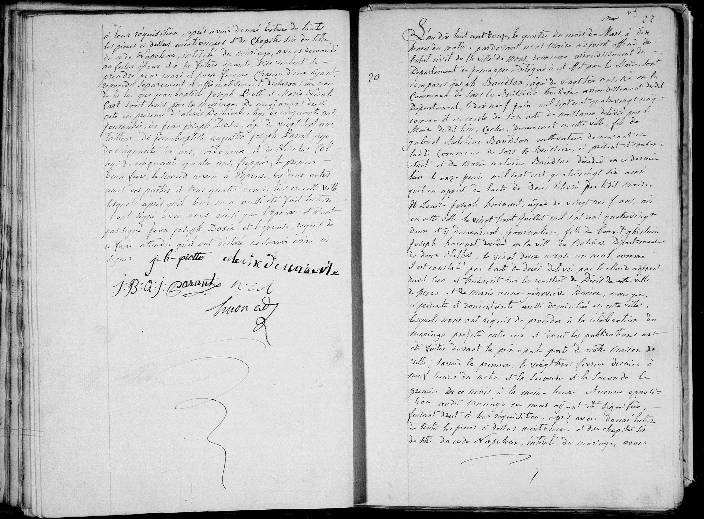
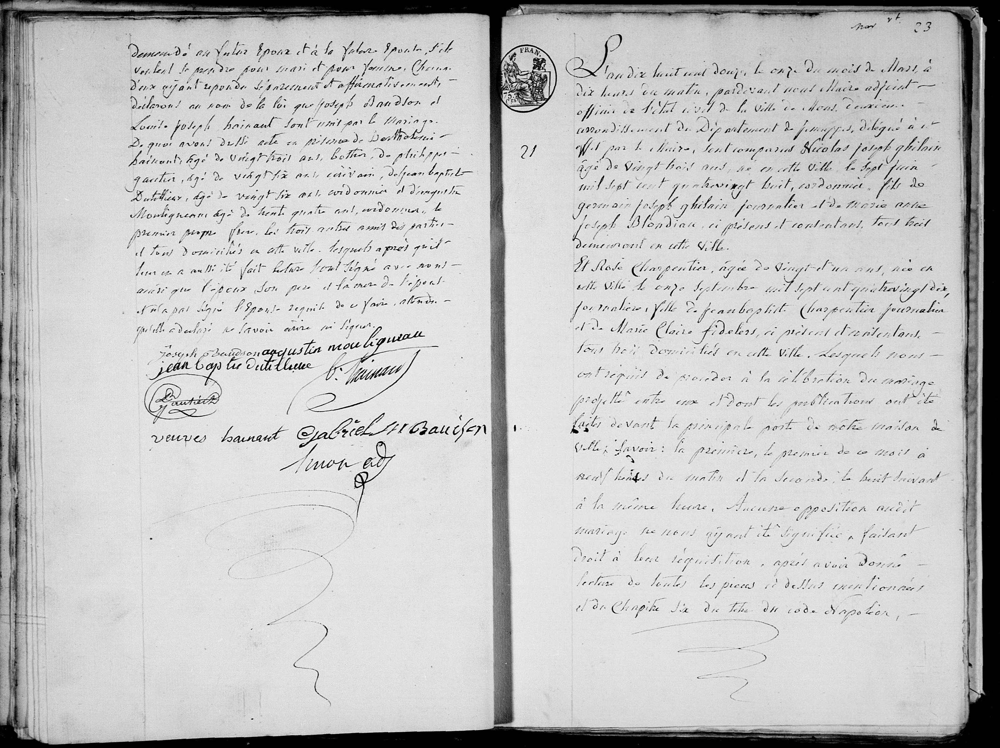

# Acte de mariage : Joseph Bandson et Louise Joseph Hainaut (1812)

L'an mil huit cent douze, le quatorze du mois de mars, à dix heures du matin, pardevant nous Maire adjoint officier de l'état civil de la ville de Mons, deuxième arrondissement du Département de Jemappes, délégué à cet effet par le Maire, sont comparus publiquement en la maison commune :

**Joseph Bandson**, âgé de vingt six ans, né en la commune de Sars la Bruyère le dix neuf juin mil sept cent quatre vingt cinq, cultivateur, domicilié en cette ville, fils de Gabriel Melchior Bandson, cultivateur, et de Marie Antoine Baudon, décédés ; 

Et **Louise Joseph Hainaut**, âgée de vingt neuf ans, née en cette ville le vingt huit juillet mil sept cent quatre vingt deux et y demeurant, fille de Benoit Ghislain Joseph Hainaut, décédé en la ville de Malines, département de deux nethes, le vingt deux nivôse an neuf ; et de Marie Anne Geneviève Dacier, ici présente et consentante au présent mariage.

Lesquels nous ont requis de procéder à la célébration du mariage projeté entre eux et dont les publications ont été faites en cette ville les premier et huit du présent mois de mars, sans opposition, ainsi qu'il résulte d'un certificat délivré par le greffier de cette municipalité. 

Faisant droit à leur réquisition, après avoir donné lecture de toutes les pièces ci-dessus mentionnées et du chapitre six du titre du Code Civil intitulé « Du Mariage », avons demandé au futur époux et à la future épouse s'ils veulent se prendre pour mari et pour femme. Chacun d'eux ayant répondu séparément et affirmativement, déclarons au nom de la loi que Joseph Bandson et Louise Joseph Hainaut sont unis par le mariage. 

Dont acte fait en présence de :
1. Jean Baptiste Dutilleux, âgé de trente huit ans, ami de l'époux, domicilié en cette ville ;
2. Barthélemy Hainaut, âgé de vingt trois ans, frère de l'épouse, domicilié en cette ville ;
3. Augustin Montigneau, âgé de trente quatre ans, ami de l'épouse, domicilié en cette ville ;
4. Pierre Joseph Dubois, âgé de trente trois ans, ami de l'épouse, domicilié en cette ville.

Et ont les époux, la mère de l'épouse et les témoins signé avec nous le présent acte, après qu'il leur en a été fait lecture.

(Signatures : Joseph Bandson, L. J. Hainaut, M. A. G. Dacier, J. B. Dutilleux, B. Hainaut, A. Montigneau, P. J. Dubois, Simon)

---

## Dates clés
* **Date de l'acte :** 14 mars 1812.
* **Date de naissance de l'épouse :** 28 juillet 1782.
* **Date de naissance de l'époux :** 19 juin 1785.
* **Date de décès du père de l'épouse (Benoit) :** 12 janvier 1801 (22 nivôse an IX).

---

## Tableau récapitulatif des personnes mentionnées

| Nom | Rôle dans l'acte | Notes |
| :--- | :--- | :--- |
| **Joseph Bandson** | Époux | 26 ans, né à Sars-la-Bruyère. |
| **Louise Joseph Hainaut** | Épouse | 29 ans, née à Mons, fille de Benoit. |
| **Gabriel Melchior Bandson** | Père de l'époux | Décédé. |
| **Marie Antoine Baudon** | Mère de l'époux | Décédée. |
| **Benoit Ghislain J. Hainaut** | Père de l'épouse | Décédé à Malines. |
| **Marie Anne Geneviève Dacier** | Mère de l'épouse | Présente et consentante. |
| **Jean Baptiste Dutilleux** | Témoin | Ami de l'époux. |
| **Barthélemy Hainaut** | Témoin | 23 ans, frère de l'épouse. |
| **Augustin Montigneau** | Témoin | Ami de l'époux. |
| **Pierre Joseph Dubois** | Témoin | Ami de l'épouse. |