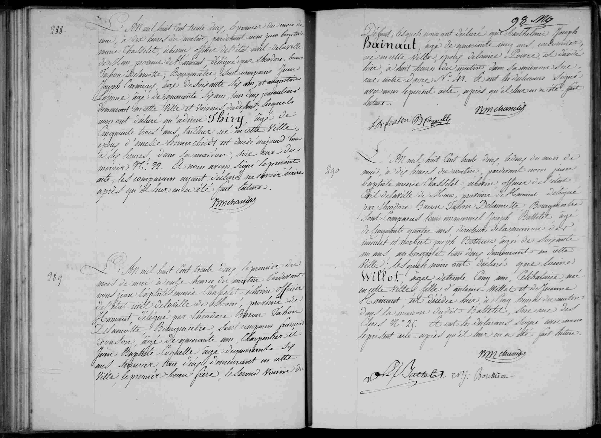

##  Barthélemi Joseph Hainaut (1832)

**289** L'An mil huit cent trente deux, le premier du mois de
mai, à onze heures du matin, pardevant nous jean baptiste
marie Chasseliet, échevin officier de l'état civil de la ville
de Mons, province de Hainaut, délégué par théodore baron
Tahon Delamotte, Bourgmestre Sont comparus françois
Fonson, âgé de quarante ans, Charpentier et
Jean Baptiste Coquelle âgé de quarante six
ans Serrurier tous deux demeurant en cette
Ville le premier beau-frère, le second voisin du
Défunt; lesquels nous ont déclaré que **Barthélemi Joseph
Hainaut**, âgé de quarante cinq ans, cordonnier,
né en cette Ville, époux de louise Poivre, et décédé
hier, à huit heures du matin dans sa maison sise,
rue notre Dame N: 11. Et ont les déclarans signé
avec nous le présent acte, après qu'il leur en a été fait
lecture.

(Signatures: f a fonson, B Coquelle, JM chasseliet)

---

### Dates clés
* **Date du document:** May 1, 1832, at 11:00 AM.
* **Date du décès:** "Hier" (Yesterday), meaning **April 30, 1832**, at 8:00 AM.

---

### Résumé des personnes mentionnées

| Nom | Rôle dans l'acte | Profession / Remarques |
| :--- | :--- | :--- |
| **Barthélemi Joseph Hainaut** | Le défunt | 45 years old, Shoemaker (*cordonnier*), lived on Rue Notre Dame No. 11 |
| **Louise Poivre** | Spouse | Wife of Barthélemi |
| **François Fonson** | Déclarant / Témoin | 40 years old, Carpenter (*Charpentier*), brother-in-law |
| **Jean Baptiste Coquelle** | Déclarant / Témoin | 46 years old, Locksmith (*Serrurier*), neighbor |
| **Jean Baptiste Marie Chasseliet** | Civil Officer | Alderman (*Échevin*) of Mons |
