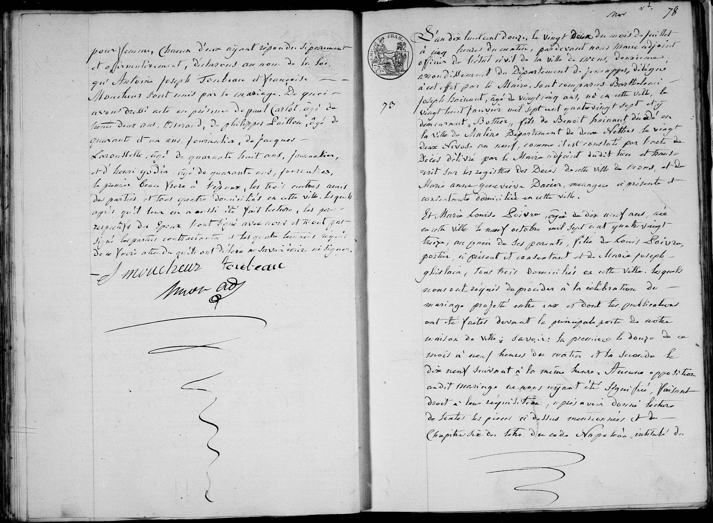
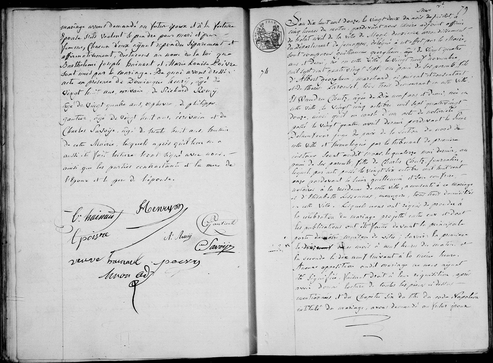

## Marriage: Barthélemi Joseph Hainaut & Marie Louise Poivre (1812)

**N° 78**

L'an dix huit cent douze, le vingt deux du mois de juillet à cinq heures du matin, pardevant nous maire adjoint officier de l'état civil de la ville de Mons, deuxième arrondissement du Département de Jemappes, délégué à cet effet par le Maire, sont comparus **Barthélemi joseph Hainaut**, âgé de vingt cinq ans, né en cette ville, le vingt huit janvier mil sept cent quatre vingt sept et y demeurant, bottier, fils de **Benoît Hainaut** décédé en la ville de Maline Département de deux Netthes le vingt deux Nivose an neuf, comme il est constaté par l'acte de Décès délivré par le Maire adjoint dudit lieu et transcrit sur les registres des Décès de cette ville de Mons, et de **Marie Anne Geneviève Dacier**, ménagère ici présente et contentante domiciliée en cette ville.

Et **Marie Louise Poivre**, âgée de dix neuf ans, née en cette ville le neuf octobre mil sept cent quatre vingt treize; au xxxx de ses parents, fille de **Louis Poivre**, postier, ici présent et consentant et de **Marie joseph ghislain**, tous trois domiciliés en cette ville. 

Lesquels nous ont requis de procéder à la célébration du mariage projeté entre eux et dont les publications ont été faites devant la principale porte de notre maison de ville; savoir: la première le douze de ce mois à neuf heures du matin et la seconde le dix neuf suivant à la même heure. Aucune opposition audit mariage ne nous ayant été signifiée, faisant droit à leur réquisition, après avoir donné lecture de toutes les pièces ci-dessus mentionnées et du Chapitre six du titre du code Napoléon, intitulé du mariage avons demandé au futur époux et à la future épouse s'ils veulent se prendre pour mari et pour femme, chacun d'eux ayant répondu séparément et affirmativement, déclarons au nom de la loi que **Barthélemi joseph Hainaut** et **Marie Louise Poivre** sont unis par le mariage. 

De quoi avons dressé acte en présence 
de **Dominique Henry**, âgé de dix huit ans, écrivain, 
de **Richard Remy**, âgé de vingt quatre ans, orfèvre, 
de **Philippe Gantier**, âgé de vingt huit ans, écrivain et 
de **Charles Savoje**, âgé de trente huit ans, huissier de cette Mairie, lesquels après qu'il leur en a aussi été fait lecture sont signés avec nous, ainsi que les parties contractantes et la mère de l'époux et le père de l'épouse.

(Signatures: C: hainaut, L Poivre, veuve hainaut, Henry, R: Remy, Gantier, Savoje, XXXX adjt)

---

| Name | Role in the Record |
| :--- | :--- |
| **Barthélemi Joseph Hainaut** | Groom (25 years old) |
| **Marie Louise Poivre** | Bride (19 years old) |
| **Benoît Hainaut** | Deceased father of the groom |
| **Marie Anne Geneviève Dacier** | Mother of the groom (Present & consenting) |
| **Louis Poivre** | Father of the bride (Postman, present & consenting) |
| **Marie Joseph Ghislain** | Mother of the bride |
| **Dominique Henry** | Witness (Writer/Clerk, 18 years old) |
| **Richard Remy** | Witness (Goldsmith, 24 years old) |
| **Philippe Gantier** | Witness (Writer/Clerk, 28 years old) |
| **Charles Savoje** | Witness (Bailiff of the town hall, 38 years old) |
| **XXXX** | Deputy Officer (Adjoint) representing the Mayor |