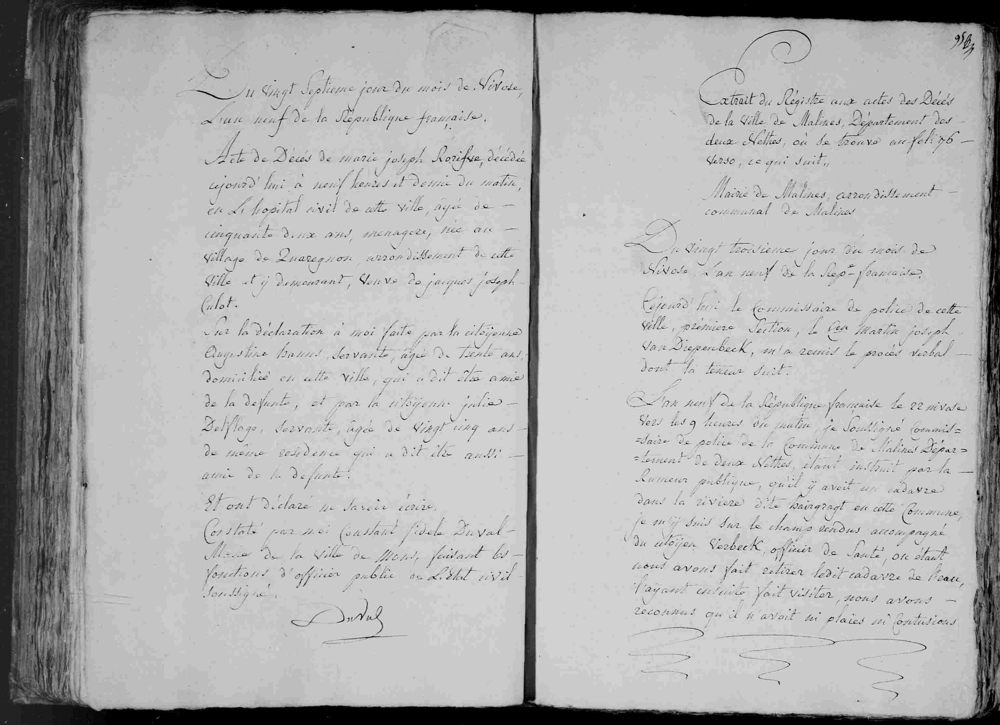
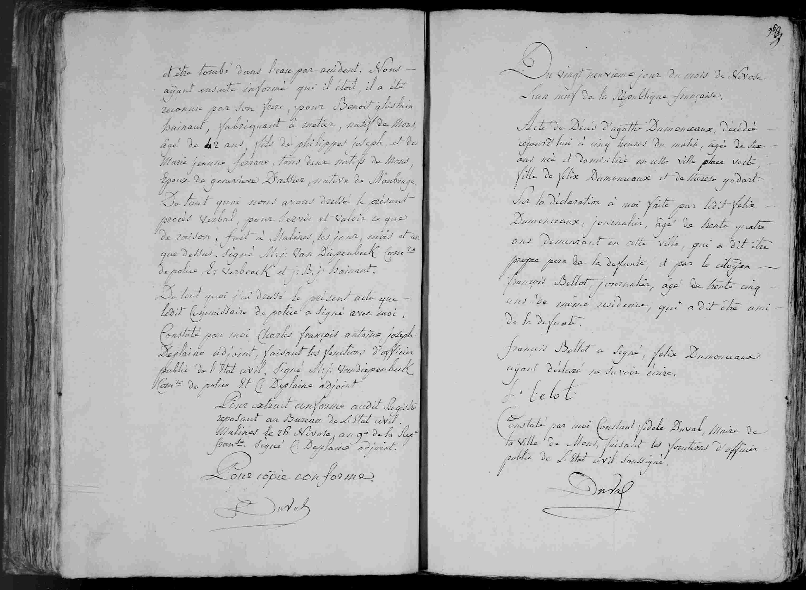

## Benoît Ghislain Hainaut (An IX / 1801)

Extrait du Régistre aux actes des Décès
de la Ville de Malines, Département des
deux Netthes, où se trouve au foli: 76 -
verso, ce qui Suit,

Mairie de Malines, arrondissement
communal de Malines

Du vingt troisième jour du mois de
Nivose l'an neuf de la Rep: française.
Aujourd'hui le Commissaire de police de cette
ville, premiere Section, le Cen Martin joseph
Van Diepenbeek, m'a remis le procès verbal
dont la teneur suit.

L'an neuf de la République française le 22 nivose
vers les 9 heures du matin, je soussigné Commissaire
de police de la Commune de Malines Département de deux Netthes, étant instruit par la
rumeur publique, qu'il y avoit un cadavre
dans la riviere dite baingragt en cette Commune,
je m'y suis sur le champ rendu accompagné
du citoyen Verbeck, officier de Santé, où étant
nous avons fait retirer ledit cadavre de l'eau,
l'ayant ensuite fait visiter, nous avons
reconnu qu'il n'avoit ni plaies ni contusions

   ...
et etre tombé dans l'eau par accident. Nous -
ayant ensuite informé qui il etoit, il a été
reconnu par son frere, pour **Benoit ghislain**
**Hainaut**, fabriquant à metier, natif de Mons,
âgé de 42 ans, fils de **philippes joseph** et de
**Marie jeanne ferard**, tous deux natifs de Mons,
Epoux de **genevieve Dacier**, native de Maubeuge.
De tout quoi nous avons dressé le présent
procès verbal, pour servir et valoir ce que
de raison, fait à Malines, les jour, mois et an
que dessus. Signé **M: J: Van Diepenbeek** Comre
de police **D: Verbeeck** et **J: B: j: Hainaut**.
De tout quoi j'ai dressé le présent acte que
ledit Commissaire de police a signé avec moi.
Constaté par moi **Charles françois antoine joseph**
**Deplaine** adjoint, faisant les fonctions d'officier
public de l'etat civil. Signé **M: j: Vandiepenbeek**
Comre de police et **C Deplaine** adjoint

Pour extrait conforme audit Registre
reposant au Bureau de L'Etat civil.
Malines le 26 Nivose, an 9e de la Repre
franse. Signé **C Deplaine** adjoint.

Pour copie conforme.
**Duval**

---

### Dates clés
* **22 Nivôse Year IX:** Date the body was found (January 12, 1801)
* **23 Nivôse Year IX:** Date the report was recorded (January 13, 1801)
* **26 Nivôse Year IX:** Date this official copy was certified in Malines (January 16, 1801).

---

### Résumé des personnes mentionnées

| Nom | Rôle dans l'acte |
| :--- | :--- |
| **Martin Joseph Van Diepenbeek** | Police Commissioner of the first section of Malines |
| **Verbeck** | Health Officer (Doctor) who examined the body |
| **Unknown Deceased** | Unnamed corpse found in the Baingragt river (Date matches Benoît Hainaut from previous documents) |
| **Benoît Ghislain Hainaut** | The deceased (42 years old, weaver, born in Mons) |
| **J. B. J. Hainaut** | Brother of the deceased who identified the body |
| **Philippe Joseph [Hainaut]** | Père de la défunte (Originaire de Mons) |
| **Marie Jeanne Ferard** | Mère de la défunte (Originaire de Mons) |
| **Geneviève Dacier** | Wife of the deceased (Native of Maubeuge) |
| **M. J. Van Diepenbeek** | Police Commissioner in Malines |
| **D. Verbeeck** | Health Officer in Malines |
| **Charles François Antoine Joseph Deplaine** | Deputy Civil Officer of Malines |
| **Duval** | Mayor of Mons, who transcribed the copy into the Mons registers |

---