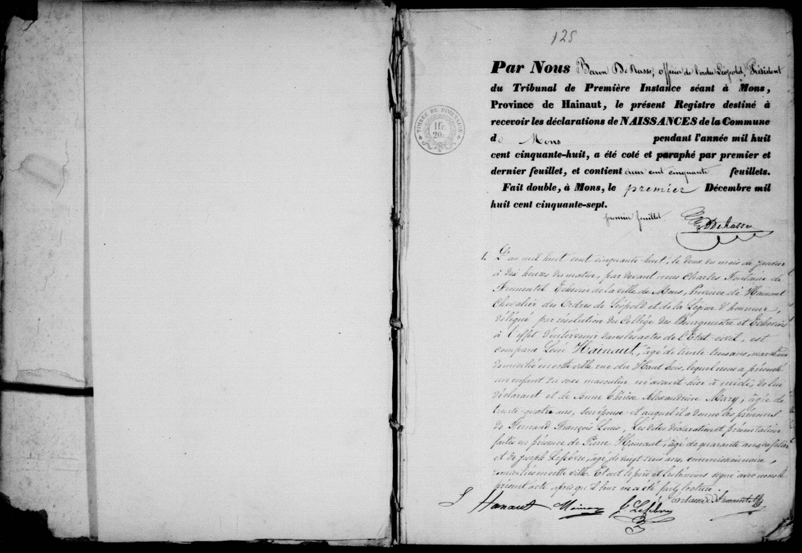

## Naissance de Fernand François Louis Hainaut (1858)

**1.** L'an mil huit cent cinquante-huit, le deux du mois de janvier
à dix heures du matin, par devant nous Charles Fontaine de
Fromentel, Échevin de la ville de Mons, Province de Hainaut,
Chevalier de l'ordre de Léopold et de la Légion d'honneur,
délégué par résolution du Collège des Bourgmestre et Échevins
à l'effet d'intervenir dans les actes de l'État civil, est
comparu **Léon Hainaut**, âgé de trente trois ans, marchand,
domicilié en cette ville rue du Haut bois, lequel nous a présenté
un enfant du sexe masculin, né avant-hier à midi, de lui
déclarant et de **Anne Thérèse Alexandrine Mary**, âgée de
trente quatre ans, son épouse; auquel il a donné les prénoms
de **Fernand François Louis**; Les dites déclaration et présentation
faites en présence de **Pierre Hainaut**, âgé de quarante cinq ans, fourier,
et de **Joseph Lefebvre**, âgé de vingt trois ans, commissionnaire,
domiciliés en cette ville. Et ont le père et les témoins signé avec nous le
présent acte après qu'il leur en a été fait lecture.

(Signatures: L Hainaut, P. Hainaut, J Lefebvre, Fontaine de Fromentel)

---

### Dates clés
* **Date du document:** January 2, 1858, à 10:00 AM.
* **Date de naissance:** "Avant-hier", cad **Dec. 31, 1857**, à 12:00 PM (midi).

---

### Résumé des personnes mentionnées

| Nom | Rôle dans l'acte | Profession / Remarques |
| :--- | :--- | :--- |
| **Fernand François Louis Hainaut** | Nouveau-né | Born Dec 31, 1857 |
| **Léon Hainaut** | Père | 33 years old, marchand, vivant Rue du Haut Bois |
| **Anne Thérèse Alexandrine Mary** | Mère | 34 ans, épouse de Léon |
| **Pierre Hainaut** | Témoin | 45 ans, fourier|
| **Joseph Lefebvre** | Témoin | 23 ans, commissionnaire |
| **Charles Fontaine de Fromentel** | Civil Officer | Alderman/Échevin de Mons |