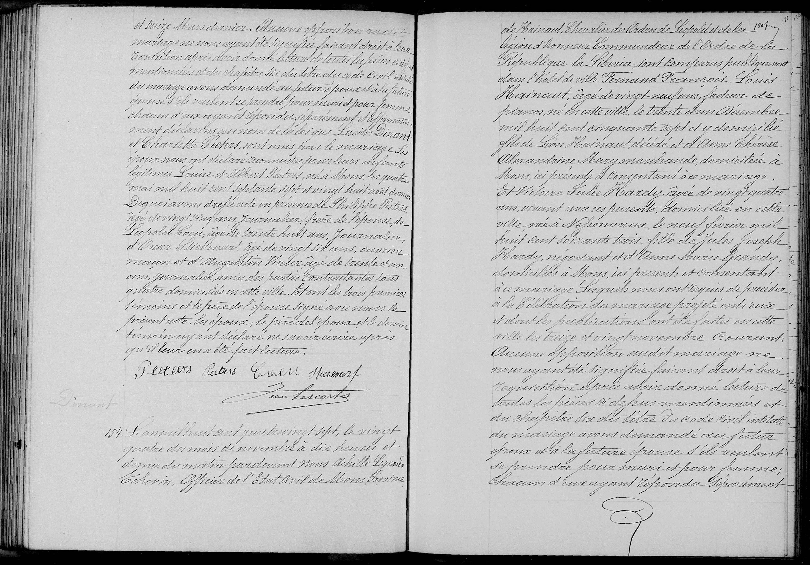

**Ville de Mons — État Civil**
**Acte n° 154**

L’an mil huit cent quatre-vingt-sept, le vingt-quatre du mois de novembre à dix heures et demie du matin, par-devant Nous, Achille Legrand, Échevin, Officier de l’État Civil de Mons, province de Hainaut, Chevalier de l’Ordre de Léopold et de la Légion d’Honneur, Commandeur de l’Ordre de la République du Libéria, sont comparus publiquement dans l’hôtel de ville :

**L'ÉPOUX :**
**Fernand François Louis Hainaut**, âgé de vingt-neuf ans, facteur de pianos, né en cette ville le trente et un décembre mil huit cent cinquante-sept et y domicilié, fils de Léon Hainaut, décédé, et d’Anne Thérèse Alexandrine Mary, marchande domiciliée à Mons, ici présente et consentant au mariage.

**L'ÉPOUSE :**
**Victoire Julie Hardy**, âgée de vingt-quatre ans, vivant avec ses parents, domiciliée en cette ville, née à Nessonvaux le neuf février mil huit cent soixante-trois, fille de **Jules Joseph Hardy**, négociant, et d’**Anne Marie Grandry**, domiciliés à Mons, ici présents et consentant au mariage.

Lesquels nous ont requis de procéder à la célébration du mariage projeté entre eux et dont les publications ont été faites en cette ville les treize et vingt novembre courant. Aucune opposition audit mariage ne nous ayant été signifiée, faisant droit à leur réquisition, après avoir donné lecture de toutes les pièces ci-dessus mentionnées et du chapitre six du titre du Code Civil intitulé « Du Mariage », avons demandé au futur époux et à la future épouse s’ils veulent se prendre pour mari et pour femme.

Chacun d’eux ayant répondu séparément et affirmativement, déclarons au nom de la loi que **Fernand François Louis Hainaut** et **Victoire Julie Hardy** sont unis par le mariage. Les époux nous ont déclaré avoir arrêté leurs conventions matrimoniales devant Maître Cardinal, notaire en cette résidence.

**TÉMOINS :**
1. **Pierre Simon François Poivre**, âgé de quatre-vingt-quatre ans, commissaire de police, Chevalier de l’Ordre de Léopold, domicilié à Frameries, grand-oncle de l’époux.
2. **Edmond Hainaut**, âgé de vingt-huit ans, candidat notaire, domicilié à Mons, frère dudit époux.
3. **Jules Choquet**, âgé de trente-quatre ans, négociant, domicilié à Tournai, beau-frère de l’épouse.
4. **Nicolas Degotte**, âgé de trente-neuf ans, industriel domicilié à Liège, cousin de ladite épouse.

Dont les époux, la mère de l’époux, la mère de l’épouse, le père de l’épouse et les témoins ont signé avec nous le présent acte après qu’il leur en a été fait lecture.

*(Signatures)*
F. Hainaut ; V. Hardy ; A. Mary ; J. Hardy ; A. Grandry ; 
P. S. Poivre ; Edm. Hainaut ; J. Choquet ; N. Degotte ; 
Achille Legrand

