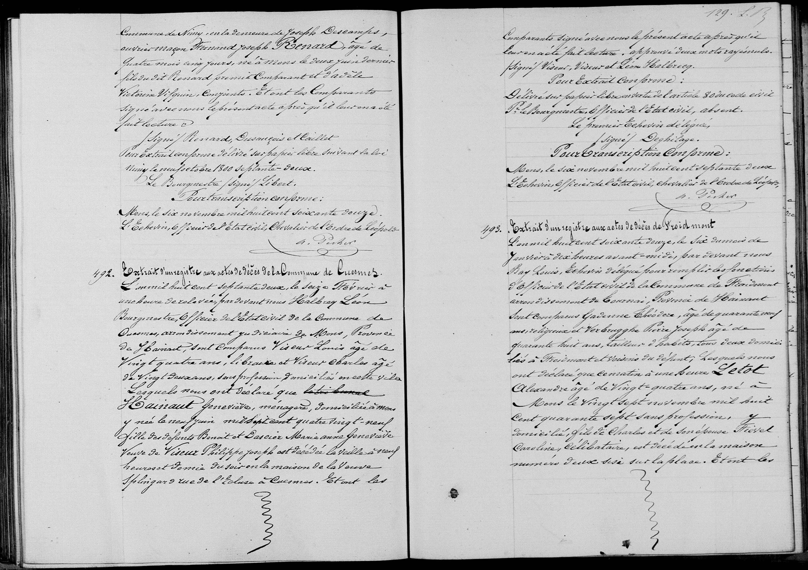

## Décès de Geneviève Hainaut (1872)

**492**

Extrait d’un registre aux actes de décès de la commune de Cuesmes.

L’an mil huit cent septante deux, le seize février à une heure de relevée, par devant nous Halbert Léon, Bourgmestre, Officier de l’état civil de la commune de Cuesmes, arrondissement de Mons, Province de Hainaut, sont comparus Viseur Louis, âgé de vingt quatre ans, libraire, et Viseur Charles, âgé de vingt deux ans, sans profession, domiciliés en cette ville. Lesquels nous ont déclaré que la dite **Hainaut Geneviève**, ménagère, domiciliée à Mons, y née le seize juin mil sept cent quatre vingt neuf, fille des défunts Benoit et Dacier Marie Anne Geneviève, veuve de Viseur Philippe Joseph, est décédée la veille à neuf heures et demie du soir en la maison de la veuve Splingar, rue de l'Église à Cuesmes.

---

### Key Dates
* **Record 492 (Geneviève Hainaut):** Death occurred on February 15, 1872, at 9:30 PM. Documented on February 16, 1872.

---

### Summary of People Mentioned

| Name | Role in the Record | Occupation / Notes |
| :--- | :--- | :--- |
| **Hainaut, Geneviève** | Deceased (492) | 82 years old, Housewife, widow of Philippe Joseph Viseur. |
| **Viseur, Louis** | Informant (492) | 24 years old, Bookseller. |
| **Viseur, Charles** | Informant (492) | 22 years old, No profession. |
| **Hainaut, Benoit** | Father of Deceased | Deceased. |
| **Dacier, Marie Anne G.** | Mother of Deceased | Deceased. |
| **Viseur, Philippe Joseph**| Spouse of Deceased | Deceased. |

---

** 493**

Extrait d'un registre aux actes de décès de Froidmont.

L’an mil huit cent septante deux, le six du mois de janvier à dix heures avant-midi, par devant nous [Name unclear]... [Officer]... Sont comparus Gadenne Théodore, âgé de quarante ans, religieux, et Verbugghe Marie Joseph, âgé de quarante huit ans, tailleur d'habits, tous deux domiciliés à Froidmont et voisins du défunt; lesquels nous ont déclaré que ce matin à une heure Letot Alexandre, âgé de vingt-quatre ans, né à Mons le vingt sept novembre mil huit cent quarante sept, sans profession, y domicilié, fils de Charles et de son épouse Triel Caroline, célibataire, est décédé en la maison numéro deux sise sur la place.
