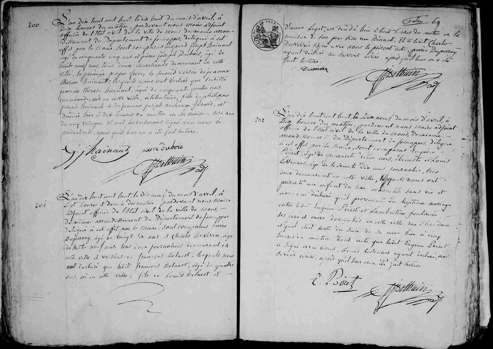

## Acte de décès : Jeanne Thérèse Hainaut (1808)

### Transcription (Texte original)
L'an mil huit cent huit, le dix huit du mois d'avril, à dix heures du matin, pardevant nous Maire adjoint officier de l'Etat civil de la ville de Mons, deuxième arrondissement du Département de Jemappes, délégué à cet effet par le Maire, sont comparus Gaspard Joseph Hainaut, âgé de cinquante cinq ans et Pierre Joseph Dubois, âgé de vingt neuf ans, tous deux marchands demeurant en cette ville, le premier propre frère, le second voisin de **Jeanne Therese Hainaut**, lesquels nous ont déclaré que laditte Jeanne Therese Hainaut, âgée de cinquante quatre ans, marchande, née en cette ville, célibataire, fille de Philippes Joseph Hainaut et de Jeanne Joseph Archange Ferand, est décédée hier à deux heures du matin en sa maison sise rue de cinq villages. Et ont les déclarants signé avec nous le présent acte, après qu'il leur en a été fait lecture.

(Signatures : G. J. Hainaut, Pierre Dubois, J. Bethuin)

---

### Dates clés
* **Date de l'acte :** 18 avril 1808, à 10h00.
* **Date du décès :** 17 avril 1808, à 02h00 du matin ("hier").
* Date de naissance: ~1754

---

### Tableau récapitulatif des personnes mentionnées

| Nom | Rôle dans l'acte | Notes |
| :--- | :--- | :--- |
| **Jeanne Thérèse Hainaut** | Défunte | 54 ans, marchande, née à Mons, célibataire. |
| **Gaspard Joseph Hainaut** | Déclarant / Frère | 55 ans, marchand, frère de la défunte. |
| **Pierre Joseph Dubois** | Déclarant / Voisin | 29 ans, marchand, voisin de la défunte. |
| **Philippes Joseph Hainaut** | Père de la défunte | Décédé. |
| **Jeanne Joseph Archange Ferand** | Mère de la défunte | Décédée. |
| **J. Bethuin** | Officier d'état civil | Maire adjoint. |