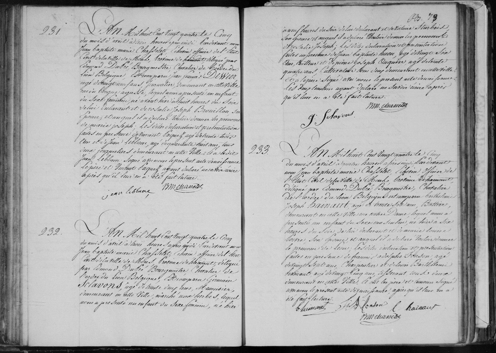

## Naissance de Léon Hainaut (1824)

**233**

L'An Mil huit cent vingt quatre le Cinq du mois d'avril à quatre heures après midi Pardevant nous Jean baptiste marie Chasseliet, Échevin officier de l'État Civil de la ville de Mons, Province de Hainaut, délégué par Edmond Dubié, Bourgmaistre Chevalier de l'ordre du lion Belgique est comparu **Barthélemi joseph Hainaut**, âgé de trente six ans, bottier, demeurant en cette Ville rue notre Dame, lequel nous a présenté un enfant du sexe masculin, né hier à six heures du soir, de lui déclarant et de **Marie Louise Poivre**, son épouse, et auquel il a déclaré vouloir donner le prénom de **Léon**; Les dites déclaration et présentation faites en présence de **françois adolphe Fonson**, âgé de vingt sept ans, Charpentier, et de **Louis Barthélemi Hainaut**, âgé de vingt cinq ans, tisserand, tous deux demeurant en cette Ville; Et ont les père et témoins signé avec nous le présent acte de naissance, après qu'il leur en a été fait lecture.

(Signatures: bhainaut, F A Fonson, l hainaut, JM Chasseliet)

---

### Dates clés
* **Date du document:** April 5, 1824, at 4:00 PM.
* **Date de naissance:** April 4, 1824 ("né hier"), at 6:00 PM.

---

### Résumé des personnes mentionnées

| Nom | Rôle dans l'acte | Profession / Remarques |
| :--- | :--- | :--- |
| **Léon Hainaut** | The Newborn | Born April 4, 1824 |
| **Barthélemi Joseph Hainaut** | Père | 36 years old, Bootmaker (*bottier*), living on Rue Notre Dame |
| **Marie Louise Poivre** | Mère | Wife of Barthélemi |
| **François Adolphe Fonson** | Témoin | 27 years old, Carpenter (*Charpentier*) |
| **Louis Barthélemi Hainaut** | Témoin, brother | 25 years old, Weaver (*Tisserand*) |
| **Jean Baptiste Marie Chasseliet** | Civil Officer | Alderman (*Échevin*) of Mons |
