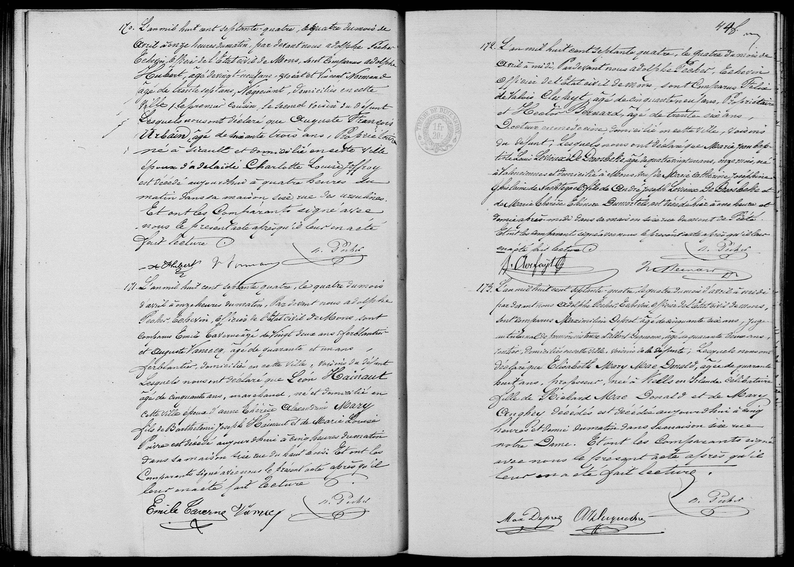

##  Léon Hainaut (1874)

**171.** L'an mil huit cent septante-quatre, le quatre du mois de avril à onze heures du matin, Pardevant nous adolphe Pecher Echevin, officier de l'etat civil de Mons, sont comparus Emile Caverne âgé de vingt deux ans ferblantier et Auguste Vanney, âgé de quarante et un ans ferblantier, domiciliés en cette Ville, voisins du défunt Lesquels nous ont déclaré que **Léon Hainaut** âgé de cinquante ans, marchand, né et domicilié en cette Ville époux d'**anne Thérèse Alexandrine Mary** fils de **Barthélemi Joseph Hainaut** et de **Marie Louise Poivre** est décédé aujourd'hui à cinq heures du matin dans sa maison sise rue du haut bois. Et ont les Comparants signé avec nous le présent acte après qu'il leur en a été fait lecture.

(Signatures: Emile Caverne, Vanney, A. Pecher)

---

### Key Dates
* **Date of Document:** April 4, 1874, at 11:00 AM.
* **Date of Death:** April 4, 1874 ("aujourd'hui"), at 5:00 AM.

---

### Summary of People Mentioned

| Name | Role in the Record | Occupation / Notes |
| :--- | :--- | :--- |
| **Léon Hainaut** | The Deceased | 50 years old, Merchant (*Marchand*), died at Rue du Haut Bois |
| **Anne Thérèse Alexandrine Mary** | Spouse | Wife of Léon |
| **Barthélemi Joseph Hainaut** | Father | Deceased father of Léon |
| **Marie Louise Poivre** | Mother | Mother of Léon |
| **Emile Caverne** | Informant / Witness | 22 years old, Tinsmith (*Ferblantier*), neighbor |
| **Auguste Vanney** | Informant / Witness | 41 years old, Tinsmith (*Ferblantier*), neighbor |
| **Adolphe Pecher** | Civil Officer | Alderman (*Échevin*) of Mons |