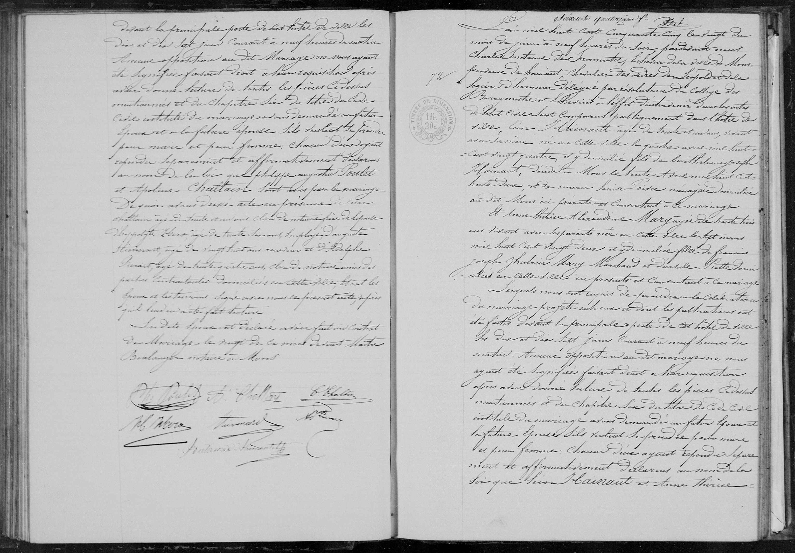
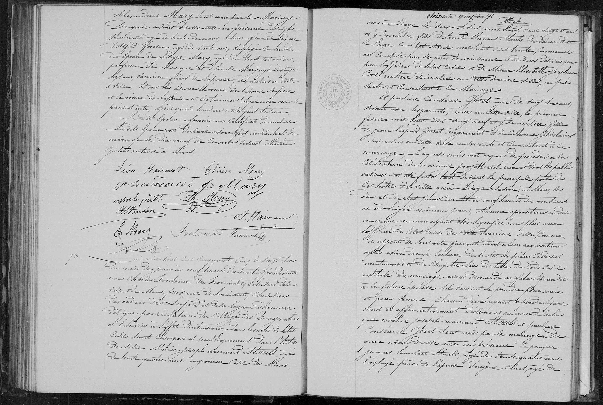

## Marriage de Léon Hainaut & Anne Thérèse Alexandrine Mary (1855)

**N° 100**

L’an mil huit cent cinquante-cinq, le vingt du mois de Juin à neuf heures du soir. Pardevant nous **Charles Fontaine de Fromentel, Chevalier de l'Ordre de Léopold**, Échevin, délégué aux fonctions d’Officier de l’État Civil de la ville de Mons, Province de Hainaut, sont comparus:

**Léon Hainaut**,  âgé de trente-un ans, résidant avec sa mere, né en cette ville le quatre Avril mil huit cent vingt-quatre, y domicilié, fils de **Barthélemi Joseph Hainaut**, décédé à Mons le trente Avril mil huit cent trente-deux, et de **Marie Louise Poivre**, ménagère, domiciliée au dit Mons, ici présente et consentant à ce mariage.

Et **Anne Thérèse Alexandrine Mary**, âgée de trente-trois ans vivant avec ses parents, née en cette ville le sept Mars mil huit cent vingt-deux et y domiciliée, fille de **François Joseph Ghislain Mary**, marchand, et de **Désirée Piette**, sans profession, domiciliés en cette ville, ici présents et consentant à ce mariage.

Lesquels nous ont requis de procéder à la célébration du mariage projeté entre eux et dont les publications ont été faites devant la principale porte de cette ville les  dix et dix-sept juin courant à neuf heure du matin. Aucune opposition au dit mariage ne nous ayant été signifiée faisant droit de leur réquisition, apres avoir donné lecture de toutes les pieces ci-dessus mentionnées et du chapitre six du titre du code civil intitulé  du mariage avons demandé au futur époux et à la future épouse s’ils veulent se prendre pour mari et pour femme; chacun d’eux ayant répondu séparément et affirmativement, nous déclarons au nom de la loi que **Léon Hainaut** et **Anne Thérèse Alexandrine Mary** sont unis par le mariage.

De quoi avons dressé acte en présence de **Adolphe Hainaut**, âgé de trente-deux ans, relieur, frère de l’époux; d’**Alfred Fonson**, âgé de trente ans, employé, cousin des époux; de **Philippe Mary**, âgé de trente et un ans, professeur de musique et d’**Emile Mary**, âgé de vingt-sept ans, vannier, frères de l’épouse, domiciliés en cette ville. 

Et ont les époux, la mère de l’époux, le père et la mère de l’épouse et les témoins signé avec nous le présent acte, après qu’il leur en a été fait lecture. Le dit époux a fourni un certificat de milice. Les dits époux on déclaré avoir fait un contrat de mariage le dix-neuf de ce mois devant maitre Gérard notaire a Mons.

(Signatures: Léon Hainaut, Thérèse Mary, M. Hainaut, F. J. Mary, vve. Piette, Ph. Mary, A. Jonson, A. Hainaut, E. Mary, Fontaine de Fromentel)

---

| Nom | Rôle dans l'acte |
| :--- | :--- |
| **Léon Hainaut** | Marié (Fabricant de brosses, Âge 31) |
| **Anne Thérèse Alexandrine Mary** | Mariée (Âge 33) |
| **Barthélemi Joseph Hainaut** | Père décédé du marié |
| **Marie Louise Voire** | Mère du marié (Présente & consentante) |
| **François Joseph Ghislain Mary** | Père de la mariée (Marchand, présent & consentant) |
| **Désirée Piette** | Mère de la mariée (Présente & consentante) |
| **Adolphe Hainaut** | Témoin (Frère du marié, Relieur) |
| **Alfred Jonson** | Témoin (Cousin du couple, Employé) |
| **Philippe Mary** | Témoin (Frère de l'épouse, Professeur de musique) |
| **Emile Mary** | Témoin (Frère de l'épouse, Vannier) |
| **Maître Gérard** | Notary in Mons (Marriage contract) |
| **Charles Fontaine de Fromentel** | Chevalier de l'Ordre de Léopold, Alderman and Civil Officer |