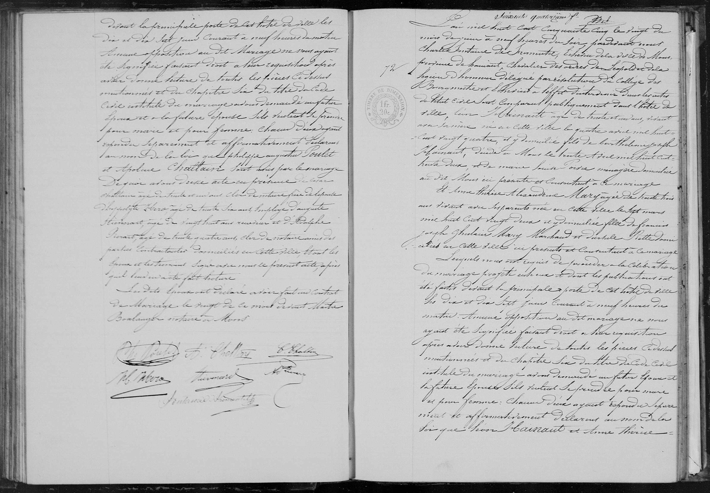
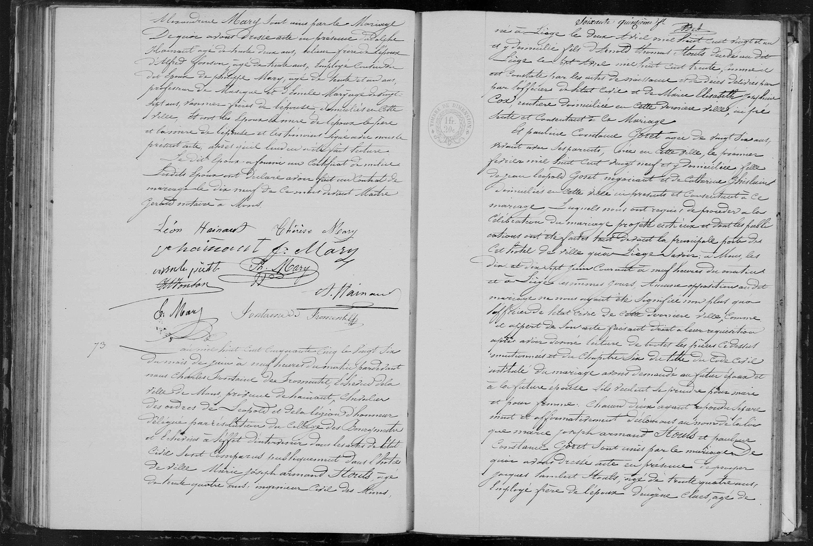

## Marriage de Léon Hainaut & Anne Thérèse Alexandrine Mary (1855)

L'an mil huit cent cinquante-cinq, le vingt du mois de juin, à neuf heures du soir, pardevant nous Charles Fontaine Des Frennettes, échevin de la ville de Mons, province de Hainaut, délégué par résolution du collège des bourgmestres et échevins à l'effet d'instrumenter dans les actes de l'état civil, sont comparus publiquement dans l'hôtel de ville :

**Léon Hainaut**, âgé de trente-deux ans, né à Mons le quatre avril mil huit cent vingt-quatre, y domicilié, fils de Barthélémy Joseph Hainaut, décédé à Mons le trente avril mil huit cent trente-deux, et de Marie Louise Poivre, ménagère domiciliée audit Mons, présente et consentante à ce mariage.

Et **Anne Thérèse Alexandrine Mary**, âgée de trente-trois ans, née en cette ville le sept mars mil huit cent vingt-deux, y domiciliée, fille de François Joseph Ghislain Mary, marchand, et d'Ursule Piette, domicilies en cette ville, ici présents et consentant a ce mariage.

Lesquels nous ont requis de procéder à la célébration du mariage projeté entre eux et dont les publications ont été faites devant la principale porte de cet hôtel de ville, les dix et dix-sept juin courant à neuf heures du matin. Aucune opposition audit mariage ne nous ayant été signifiée, faisant droit à leur réquisition, après avoir donné lecture de toutes les pièces ci-dessus mentionnées et du chapitre six du titre du Code civil intitulé du mariage, avons demandé au futur époux et à la future épouse s'ils veulent se prendre pour mari et pour femme. Chacun d'eux ayant répondu séparément et affirmativement, déclarons au nom de la loi que Léon Hainaut et Anne Thérèse [page] Alexandrine Mary sont unis par le mariage.

De quoi avons dressé acte en présence de : 
Adolphe Hainaut, âgé de trente-quatre ans, relieur, frère de l'époux ;
Alfred Fonson, âgé de trente ans, employé, cousin du dit époux ;
Philippe Mary, âgé de trente et un ans, professeur de musique, frère de l'épouse ;
et Emile Mary, âgé de vingt-sept ans, vannier, frère de l'épouse, tous domiciliés en cette ville.
Et ont les époux, la mère de l’époux, le père et la mère de l’épouse et les témoins signé avec nous le présent acte, après qu’il leur en a été fait lecture.

Les dits époux ont déclaré avoir fait un contrat de mariage le dix-neuf de ce mois devant Maître Gérard, notaire à Mons. Après lecture, les comparants et témoins ont signé avec nous.

---

### Tableau récapitulatif : Mariage Hainaut-Mary (1855)

| Nom | Rôle | Informations |
| :--- | :--- | :--- |
| **Léon Hainaut** | Époux | 32 ans, né à Mons (1824) |
| **Anne Thérèse Alexandrine Mary** | Épouse | 33 ans, née à Mons (1822) |
| Barthélémy Joseph Hainaut | Père de l'époux | Décédé (1832) |
| Marie Louise Poivre | Mère de l'époux | Présente et consentante |
| François Joseph Ghislain Mary | Père de l'épouse | Décédé |
| Ursule Piette | Mère de l'épouse | Décédée |
| Adolphe Hainaut | Témoin | Employé, frère de l'époux |
| Alfred Fonson | Témoin | Employé, ami de l'époux |
| Philippe Mary | Témoin | Professeur de musique, frère de l'épouse |
| Emile Mary | Témoin | Caunier, frère de l'épouse |

---
