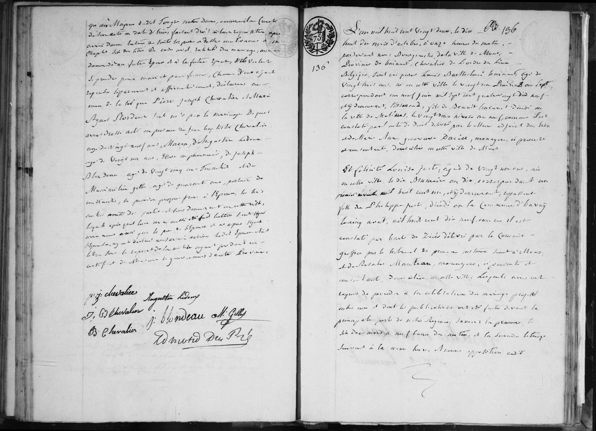
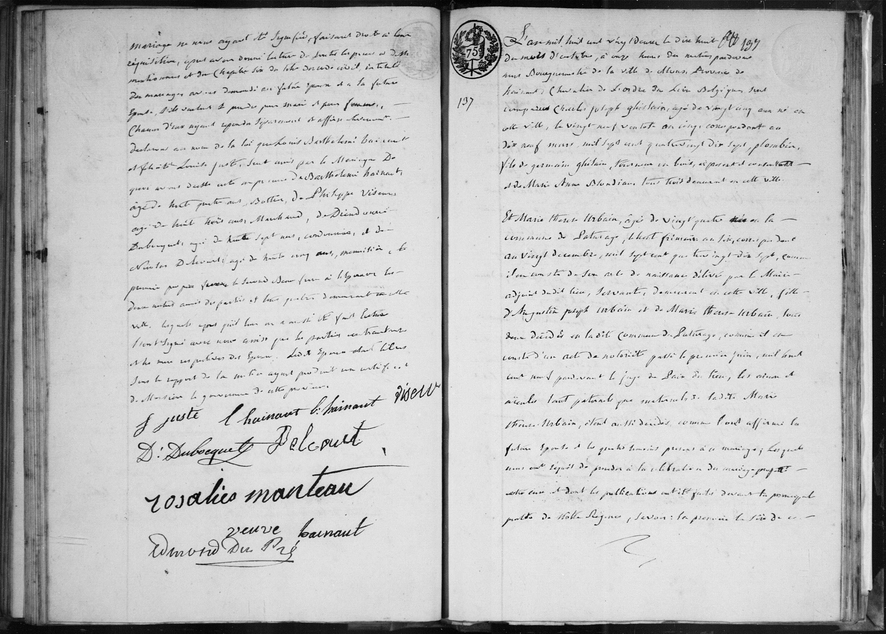

# Acte de mariage : Louis Barthélémi Hainaut et Félicité Louise Juste (1822)

## Transcription intégrale

L'an mil huit cent vingt deux, le dix huit du mois d'octobre, à onze heures du matin, pardevant nous Bourgmestre de la ville de Mons, province de Hainaut, Chevalier de l'Ordre du Lion Belgique, sont comparus **Louis Barthélémi Hainaut**, âgé de vingt huit ans, né en cette ville le vingt un Prairial an sept, correspondant au neuf juin mil sept cent quatre vingt dix neuf, et y demeurant, tisserand, fils de Benoit Hainaut décédé en la ville de Malines, le vingt deux Nivôse an neuf, comme il est constaté par acte de décès délivré par l'officier adjoint de la dite ville, et Marie Anne Geneviève Dacier, ménagère, ici présente et consentante, domiciliée en cette ville de Mons.

Et **Félicité Louise Juste**, âgée de vingt un ans, née en cette ville le dix Brumaire an dix, correspondant au premier novembre mil huit cent un, et y demeurant, filatière, fille de Philippe Just, décédé en la commune de Bavay le cinq août, mil huit cent dix neuf, comme il est constaté par l'acte de décès délivré par le commissaire près le tribunal de première instance séant à Bavay, et de Rosalie Manteau, ménagère, ici présente et consentante, domiciliée en cette ville.

Lesquels nous ont requis de procéder à la célébration du mariage projeté entre eux et dont les publications ont été faites devant la principale porte de notre Régence, savoir : la première, le dix du mois à neuf heures du matin, et la seconde le treize suivant à la même heure. Aucune opposition audit mariage ne nous ayant été signifiée, faisant droit à leur requête, après avoir donné lecture de toutes les pièces ci-dessus mentionnées et du Chapitre six du titre du code civil, intitulé du mariage, avons demandé au futur époux et à la future épouse s'ils veulent se prendre pour mari et pour femme. Chacun d'eux ayant répondu séparément et affirmativement, déclarons au nom de la loi que Louis Barthélémi Hainaut et Félicité Louise sont unis par le mariage.

De quoi avons dressé acte en présence de Pierre Joseph Chevalier, âgé de vingt ans, marchand ; de Augustin Ledoux, âgé de vingt ans, clerc en pharmacie ; de Joseph Blondeau, âgé de vingt cinq ans, tonnelier ; et de Maximilien Gelle, âgé de quarante ans, batteur de cuivre, le premier propre frère de l'époux, les trois autres amis des parties et tous quatre domiciliés en cette ville.

Lesquels après qu'il leur en a aussi été fait lecture ont signé avec nous, ainsi que les parties contractantes, le père de l'époux et la mère de l'épouse.

---

## Dates clés
* **Date de l'acte :** 18 octobre 1822.
* **Date de naissance de l'époux :** 9 juin 1799 (21 Prairial an VII).
* **Date de naissance de l'épouse :** 1er novembre 1801 (10 Brumaire an X).
* **Date de décès du père de l'époux (Benoit) :** 12 janvier 1801 (22 Nivôse an IX).
* **Date de décès du père de l'épouse (Philippe Just) :** 5 août 1819.

---

## Tableau récapitulatif des personnes mentionnées

| Nom | Rôle dans l'acte | Notes |
| :--- | :--- | :--- |
| **Louis Barthélémi Hainaut** | Époux | 28 ans, tisserand. |
| **Félicité Louise** | Épouse | 21 ans, filatière. |
| **Benoit Hainaut** | Père de l'époux | Décédé à Malines. |
| **Marie Anne Geneviève Dacier** | Mère de l'époux | Présente et consentante. |
| **Philippe Just** | Père de l'épouse | Décédé à Bavay. |
| **Rosalie Manteau** | Mère de l'épouse | Présente et consentante. |
| **Pierre Joseph Chevalier** | Témoin | Frère de l'époux. |
| **Augustin Ledoux** | Témoin | Ami des parties. |
| **Joseph Blondeau** | Témoin | Ami des parties. |
| **Maximilien Gelle** | Témoin | Ami des parties. |