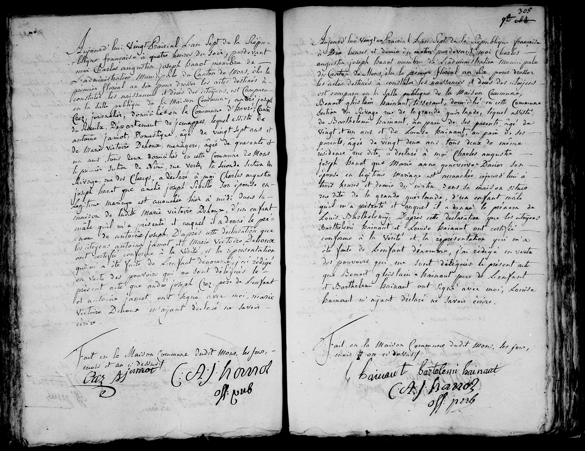

## Acte de naissance : Louis Barthélemy Hainaut (1799)

Aujourd'hui vingt un prairial l'an sept de la République française à dix heures et demie du matin pardevant moi Charles augustin joseph Banot membre de l'administration municipale du Canton de Mons, élu le premier floréal an six, pour dresser les actes destinés à constater les naissances et décès des citoyens est comparu en la salle publique de la Maison Commune, **Benoit ghislain hainaut**, tisserand, domicilié en cette commune section du rivage rue de la grande quirlarde, lequel assisté de Barthelemi hainaut, au pain de ses parents âgé de vingt et un ans, et de Louise hainaut, au pain de ses parents, âgée de vingt deux ans tous deux de même résidence me dite, a déclaré à moi Charles augustin joseph Banot que **Marie anne geneviève Dacier** son épouse en légitime mariage est accouchée aujourd'hui à trois heures et demie du matin dans sa maison située rue dite de la grande quirlarde, d'un enfant mâle qu'il m'a présenté et auquel il a donné le prénom de **Louis Barthélemy**. D'après cette déclaration que les citoyens Barthelemi hainaut et Louise hainaut ont certifié conforme à la vérité et la représentation qui m'a été faite de l'enfant dénommé, j'ai rédigé en vertu des pouvoirs qui me sont délégués le présent acte que Benoit ghislain hainaut père de l'enfant et Barthelemi hainaut ont signé avec moi; Louise hainaut m'ayant déclaré ne savoir écrire.

Fait en la Maison Commune dudit Mons, les jour, mois et an ci dessus.
(Signatures : Hainaut, Barthelemi hainaut, C A J Banot off pub)

---

### Dates clés
* **Date de l'acte :** 21 prairial an VII (9 juin 1799).
* **Date de naissance :** 21 prairial an VII (9 juin 1799).

### Tableau récapitulatif des personnes mentionnées

| Nom | Rôle dans l'acte | Notes |
| :--- | :--- | :--- |
| **Louis Barthélemy Hainaut** | Enfant | Nouveau-né. |
| **Benoit Ghislain Hainaut** | Père | Tisserand, domicilié rue de la grande quirlarde. |
| **Marie Anne Geneviève Dacier** | Mère | Épouse de Benoit Ghislain Hainaut. |
| **Barthelemi Hainaut** | Témoin | 21 ans, au pain de ses parents. |
| **Louise Hainaut** | Témoin | 22 ans, au pain de ses parents. |
| **Charles Augustin Joseph Banot** | Officier d'état civil | Membre de l'administration municipale du Canton de Mons. |