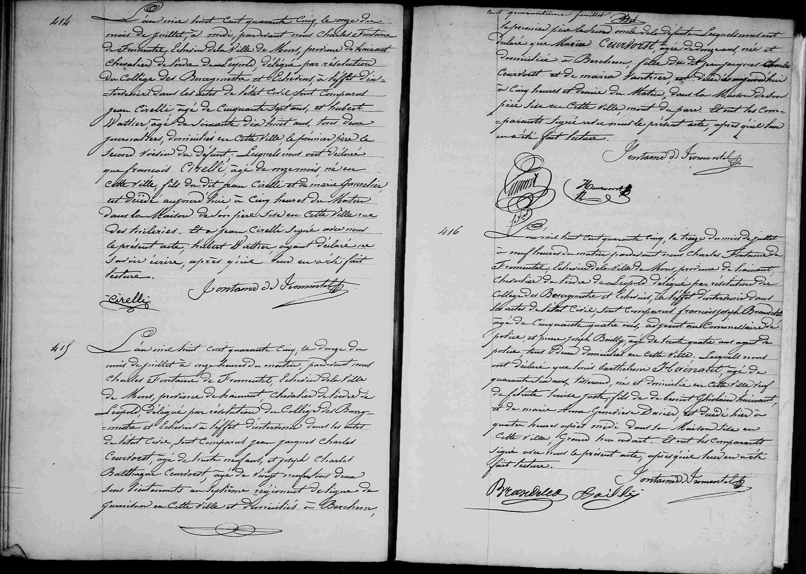

## Acte de décès : Louis Barthélemy Hainaut (1845)

L'an mil huit cent quarante cinq, le treize du mois de juillet à neuf heures du matin pardevant nous Charles Fontaine de Fromentel, Echevin de la ville de Mons, province de Hainaut, Chevalier de l'ordre de Léopold, délégué par résolution du Collège des Bourgmestre et Echevins à l'effet d'intervenir dans les actes de l'état civil, sont comparus François Joseph Brandelet, âgé de quarante huit ans, adjoint au commissaire de police et Pierre Joseph Bailly, âgé de trente quatre ans, agent de police tous deux domiciliés en cette ville. Lesquels nous ont déclaré que **Louis Barthélemy Hainaut**, âgé de quarante six ans, tisserand, né et domicilié en cette ville, fils de défunt Benoit Ghislain Hainaut et de Marie Anne Geneviève Dacier est décédé hier à quatre heures après midi dans sa maison sise en cette ville Grand rue. Et ont les comparants signé avec nous le présent acte, après qu'il leur en a été fait lecture.

(Signatures : Brandelet, Bailly, Fontaine de Fromentel)

---

### Dates clés
* **Date de l'acte :** 13 juillet 1845, à 09h00.
* **Date du décès :** 12 juillet 1845, à 16h00 ("hier à quatre heures après midi").

---

### Tableau récapitulatif des personnes mentionnées

| Nom | Rôle dans l'acte | Notes |
| :--- | :--- | :--- |
| **Louis Barthélemy Hainaut** | Défunt | 46 ans, tisserand, né et domicilié à Mons. |
| **Benoit Ghislain Hainaut** | Père du défunt | Décédé. |
| **Marie Anne Geneviève Dacier** | Mère du défunt | Décédée. |
| **François Joseph Brandelet** | Déclarant | 48 ans, adjoint au commissaire de police. |
| **Pierre Joseph Bailly** | Déclarant | 34 ans, agent de police. |
| **Charles Fontaine de Fromentel** | Officier d'état civil | Échevin de la ville de Mons. |