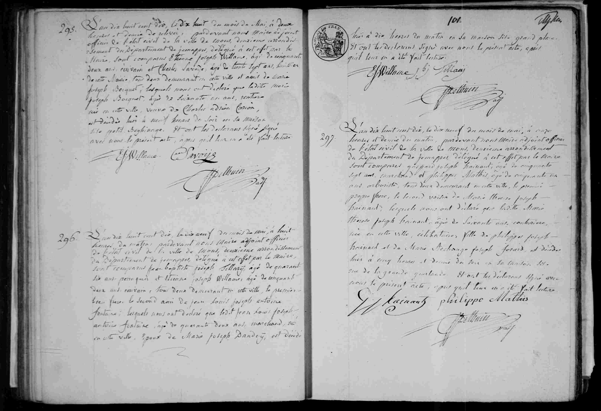

## Acte de décès : Marie Thérèse Joseph Hainaut (1810)

L'an dix huit cent dix, le dix neuf du mois de mai, à onze heures et demie du matin, pardevant nous Maire adjoint officier de l'état civil de la ville de Mons, deuxième arrondissement du Département de Jemappes, délégué à cet effet par le Maire, sont comparus Gaspard Joseph Hainaut, âgé de cinquante sept ans, marchand et Philippe Mathis, âgé de cinquante un ans, arboriste, tous deux demeurant en cette ville, le premier propre frère, le second voisin de Marie Therese Joseph Hainaut ; lesquels nous ont déclaré que laditte **Marie Therese Joseph Hainaut**, âgée de soixante ans, couturière, née en cette ville, célibataire, fille de Philippes Joseph Hainaut et de Marie Archange Joseph Ferard, est décédée hier à cinq heures et demie du soir en sa maison sise rue de la grande quirlarde. Et ont les déclarants signé avec nous le présent acte, après qu'il leur en a été fait lecture.

(Signatures : G. J. Hainaut, Philippe Mathis, J. Bethuin)

---

### Dates clés
* **Date de l'acte :** 19 mai 1810, à 11h30.
* **Date du décès :** 18 mai 1810, à 17h30 ("hier à cinq heures et demie du soir").
* Date de naissance: ~1850.

---

### Tableau récapitulatif des personnes mentionnées

| Nom | Rôle dans l'acte | Notes |
| :--- | :--- | :--- |
| **Marie Thérèse Joseph Hainaut** | Défunte | 60 ans, couturière, née à Mons, célibataire. |
| **Gaspard Joseph Hainaut** | Déclarant / Frère | 57 ans, marchand, frère de la défunte. |
| **Philippe Mathis** | Déclarant / Voisin | 51 ans, arboriste, voisin de la défunte. |
| **Philippes Joseph Hainaut** | Père de la défunte | Décédé. |
| **Marie Archange Joseph Ferard** | Mère de la défunte | Décédée. |
| **J. Bethuin** | Officier d'état civil | Maire adjoint. |