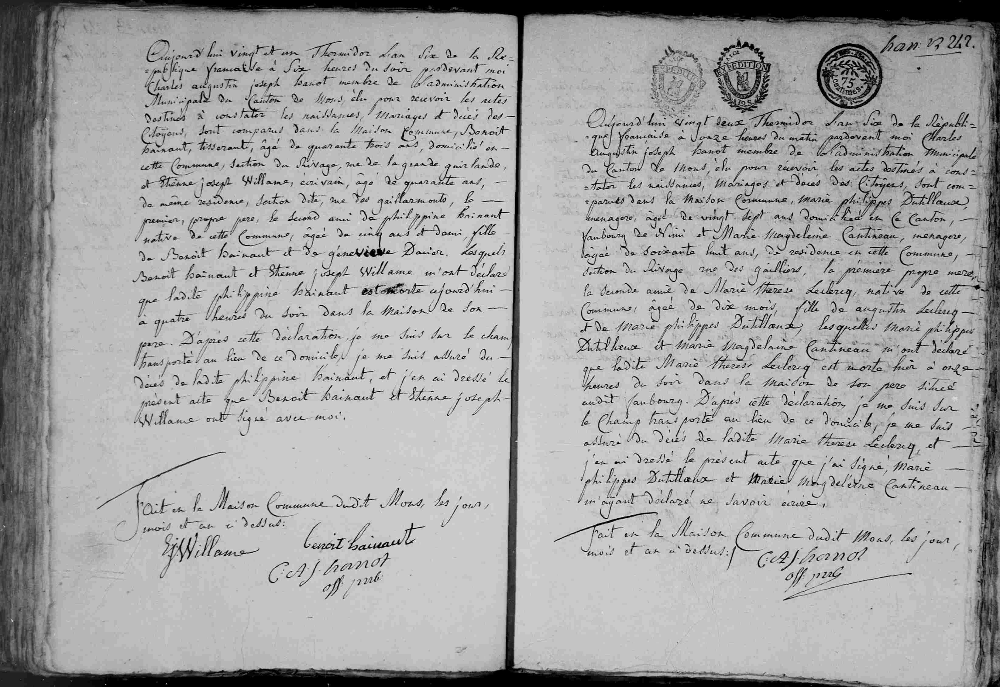

##  Philippine Hainaut (An VI / 1798)

Aujourd'hui vingt et un Thermidor L'an Six de la Re=
publique francaise à Six heures du soir pardevant moi
Charles augustin joseph hanot membre de l'administration
Municipale du Canton de Mons, élu pour recevoir les actes
destinés à constater les naissances, Mariages et décès des
Citoyens, sont comparus dans la Maison Commune, Benoit
hainaut, tisserand, âgé de quarante trois ans, domicilié en
cette Commune, Section du Rivage, rue de la grande guirlande,
et Etienne joseph Willame, ecrivain, âgé de quarante ans,
de même residence, section dite, rue des gaillarmonts, le
premier, propre pere, le second ami de philippine Hainaut
native de cette Commune, âgée de cinq ans et demi, fille
de Benoît hainaut et de genevieve Dacier. Lesquels
Benoit hainaut et Etienne joseph Willame m'ont déclaré
que ladite philippine Hainaut est morte aujourd'hui
à quatre heures du soir dans la Maison de Son
pere. D'après cette déclaration, je me suis sur le champ
transporté au lieu de ce domicile, je me suis assuré du
décès de ladite philippine Hainaut, et j'en ai dressé le
présent acte que Benoit hainaut et Etienne joseph
Willame ont signé avec moi.

Fait en la Maison Commune dudit Mons, les jour,
mois et an ci-dessus:

(Signatures: Ej Willame, benoit hainaut, C A J hanot off: pub:)

---

### Dates clés
* **21 Thermidor An VI:** Date de l'acte et du décès (8 août 1798).

---

### Résumé des personnes mentionnées

| Nom | Rôle dans l'acte |
| :--- | :--- |
| **Philippine Hainaut** | The deceased (5 and a half years old, daughter of Benoit and Geneviève) |
| **Benoît Hainaut** | Père de la défunte (43 ans, tisserand, déclarant) |
| **Geneviève Dacier** | Mère de la défunte |
| **Etienne Joseph Willame** | Friend of the family (40 years old, writer/clerk, informant) |
| **Charles Augustin Joseph Hanot** | Municipal officer of Mons |