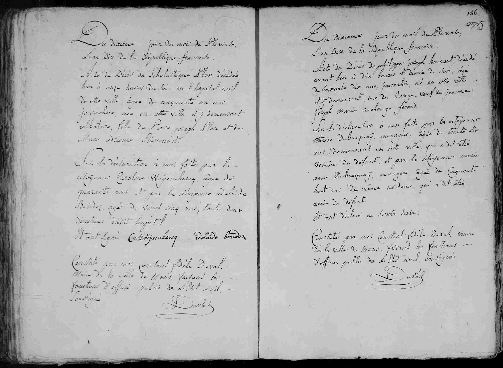

## Philippes Joseph Hainaut (An X / 1802)

Du dixieme jour du mois de Pluviose,
L'an Dix de la République française.

Acte de Décès de **Philippes joseph Hainaut** décédé
avant hier à dix heures et demie du soir, âgé
de soixante dix ans, journalier, né en cette ville
et y demeurant, rue du Rivage, veuf de **jeanne
joseph marie archange ferard**.

Sur la déclaration à moi faite par la citoyenne
therese Dubrecquoy, menagere, âgée de trente six
ans, demeurant en cette ville, qui a dit être
voisine du défunt; et par la citoyenne marie
anne Dubrecquoy, menagere, âgée de cinquante
huit ans, de meme residence, qui a dit être
amie du défunt.

Et ont déclaré ne savoir écrire.
Constaté par moi Constant fidele Duval, maire
de la ville de Mons, faisant les fonctions
d'officier public de L'Etat civil soussigné.
(Signature: Duval)

---

### Dates
* **Document Date:** 10 Pluviôse Year X (January 30, 1802)
* **Date of Death:** "Avant hier" (Day before yesterday), meaning **8 Pluviôse Year X (January 28, 1802)** at 10:30 PM.

---

| Name | Role in the Record | Occupation / Notes |
| :--- | :--- | :--- |
| **Philippes Joseph Hainaut** | The Deceased | 70 years old, Day laborer (*journalier*), lived on Rue du Rivage |
| **Jeanne Joseph Marie Archange Ferard** | Deceased Spouse | Predeceased wife of Philippes Joseph |
| **Thérèse Dubrecquoy** | Informant | 36 years old, Housewife (*ménagère*), neighbor |
| **Marie Anne Dubrecquoy** | Informant | 58 years old, Housewife (*ménagère*), friend |
| **Constant Fidèle Duval** | Civil Officer | Mayor of Mons |