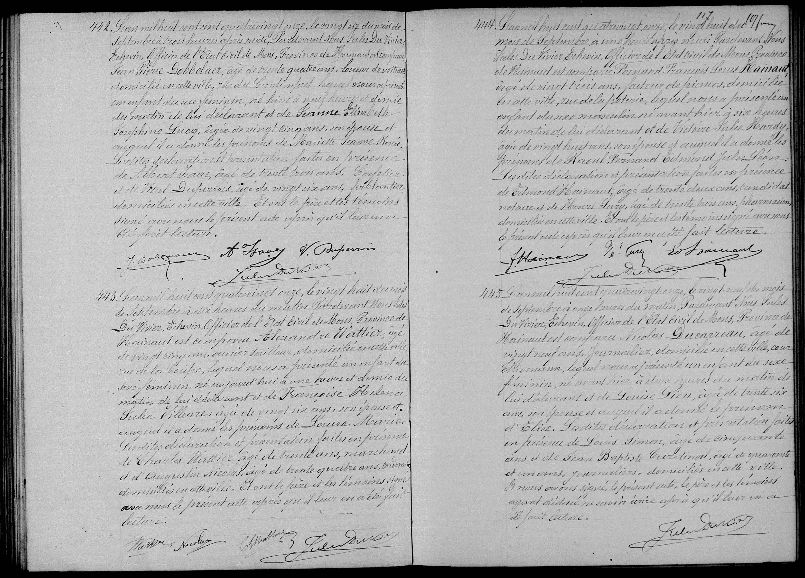

## Birth Record Transcription: Raoul Fernand Edmond Jules Léon Hainaut (1891)

### Original French Transcription
**444.**
L’an mil huit cent quatre-vingt-onze, le vingt-huit du mois de Septembre à une heure après midi Pardevant Nous Jules Du Vivier, Echevin, Officier de l’État Civil de Mons, Province de Hainaut est comparu **Fernand François Louis Hainaut**, âgé de vingt trois ans, facteur de pianos, domicilié en cette ville, rue de la poterie, lequel nous a présenté un enfant du sexe masculin né avant hier à six heures du matin de lui déclarant et de **Victoire Julie Hardy**, âgée de vingt huit ans, son épouse et auquel il a donné les prénoms de **Raoul Fernand Edmond Jules Léon**.

Les dites déclaration et présentation faites en présence de **Edmond Hainaut**, âgé de trente deux ans, candidat notaire et de **Henri Bury**, âgé de trente trois ans, pharmacien, domiciliés en cette ville. Et ont le père et les témoins signé avec nous le présent acte après qu’il leur en a été fait lecture.
(Signatures: F. Hainaut, H. Bury, Ed. Hainaut, Jules Du Vivier)

---

### Summary of People Mentioned

| Name | Role in the Record |
| :--- | :--- |
| **Raoul Fernand Edmond Jules Léon Hainaut** | The newborn child (Subject) |
| **Fernand François Louis Hainaut** | Father and declarant (Piano maker/tuner) |
| **Victoire Julie Hardy** | Mother |
| **Edmond Hainaut** | First witness (Candidate Notary) |
| **Henri Bury** | Second witness (Pharmacist) |
| **Jules Du Vivier** | Alderman and Civil Officer of Mons |
