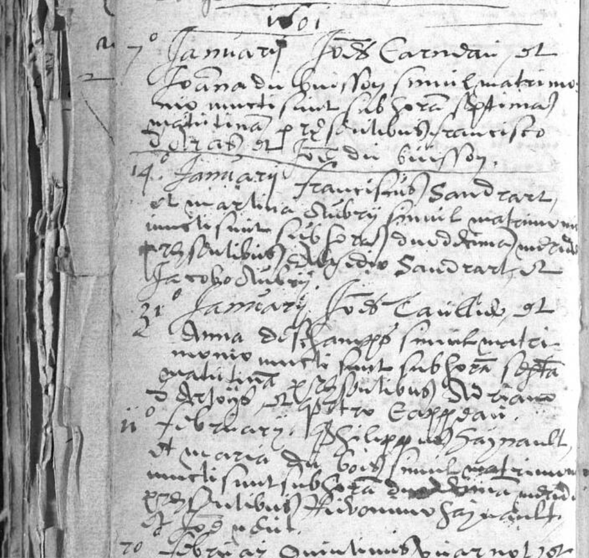

# Mariage de Philippe HAYNAULT et Marie DU BOIS	11/02/1601

## Registre de mariage de la Paroisse Saint-Nicolas-en-Havré

### Transcription
**1601**

**7^a Januarij** Jo[ann]es Carndau et 
Joanna du Buisson simul matrimo-
nio iuncti sunt sub hora septima 
matutina p[raesentibus] Huberto Francisco
Debat et Petro du Buisson.

**14. Januarij** Franciscus Sandrart
et Martina Aubry simul matrimo-
nio iuncti sunt sub hora duodecima meridie
p[raesentibus] Aegidio Sandrart et 
Jacobo Aubry.

**21^o Januarij** Jo[ann]es Caulie et
Anna Deschamps simul matri-
monio iuncti sunt sub hora sexta
matutina p[raesentibus] Nic[ola]o De-
schamps et Petro Carpen.

**11^a februarij** **Philippus Haynault
et Maria du Bois** simul matrimonion
iuncti sunt sub hora duodecima meridie
p[raesentibus] Hieronymo Haynault
et Jo[ann]e du Bois.

**20 februarij** Quintinus Warnot... [page cuts off]

---

### Key Dates (Gregorian Calendar)
* **Record 1:** January 7, 1601 (7:00 AM)
* **Record 2:** January 14, 1601 (12:00 PM)
* **Record 3:** January 21, 1601 (6:00 AM)
* **Record 4 (Philippe):** February 11, 1601 (12:00 PM)

---

### Summary of People Mentioned (Alphabetical)

| Name | Role in the Record | Source Record | Notes |
| :--- | :--- | :--- | :--- |
| Aubry, Jacobo | Témoin | Record 2 | Témoin pour Martina Aubry. |
| Aubry, Martina | Mariée | Record 2 | Maié Franciscus Sandrart. |
| Carndau, Joannes | Marié | Record 1 | Maié Joanna du Buisson. |
| Carpen, Petro | Témoin | Record 3 | Témoin pour Joannes Caulie. |
| Caulie, Joannes | Marié | Record 3 | Maié Anna Deschamps. |
| De[s]champs, Anna | Mariée | Record 3 | Maié Joannes Caulie. |
| De[s]champs, Nicolaus | Témoin | Record 3 | Témoin pour Anna Deschamps. |
| Debat, Huberto Francisco**| Témoin | Record 1 | Témoin pour Joannes Carndau. |
| **Du Bois, Joannes** | Témoin | Record 4 | Témoin pour Maria du Bois. |
| **Du Bois, Maria** | Mariée | Record 4 | Maié Philippe Haynault. |
| Du Buisson, Joanna | Mariée | Record 1 | Maié Joannes Carndau. |
| Du Buisson, Petro | Témoin | Record 1 | Témoin pour Joanna du Buisson. |
| **Haynault, Hieronymo** | Témoin | Record 4 | Témoin pour Philippe Haynault. |
| **Haynault, Philippus** | Marié | Record 4 | Maié Maria du Bois. |
| Sandrart, Aegidio | Témoin | Record 2 | Témoin pour Franciscus Sandrart. |
| Sandrart, Franciscus | Marié | Record 2 | Maié Martina Aubry. |
| Warnot, Quintinus | Marié | Record 5 | incomplet |

Merci à Patrick Hainaut pour ce trésor!