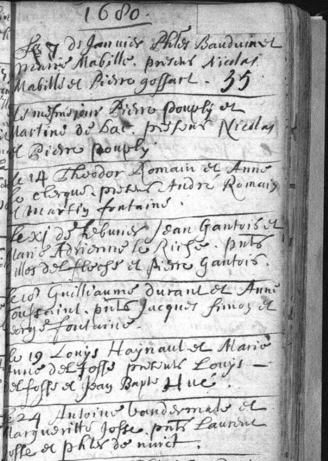

# Mariage de Louys Haynaut & Marie Anne Delfosse 19 janvier 1680

## Registre de mariage de la Paroisse Saint-Nicolas-en-Havré

###  Transcription
**1680**

Le 7 de Janvier Phles Bauduin et
Marie Mabille, p[rese]nts Nicolas
Mabille et Pierre Gossart.

Le mesme jour Pierre Pouply et
Martine de Bac, p[rese]nts Nicolas
et Pierre Pouply.

Le 14 Theodor Romain et Anne
Le Clerque, p[rese]nts André Romain
et Marty Fontaine.

Le XI de Febvrier Jean Gantois et
Marie Adrienne Le Riche, p[rese]nts
Nicolas de Floise et Pierre Gantois.

Le 17 Guilliaume Durant et Anne
Toussaint, p[rese]nts Jacques Simon et
Denys Fontaine.

Le 19 **Louys Haynault** et **Marie
Anne Delfosse**, p[rese]nts **Louys
Delfosse** et **Jean Bap[tis]te Hue**.

Le 24 Antoine Vandermale et
Margueritte Josse, p[rese]nts Lauren[t]
Josse et Phles de Nuict.

---

### Key Dates
* Philippe Bauduin & Marie Mabille: Jan 7, 1680.
* Pierre Pouply & Martine de Bac: Jan 7, 1680.
* Theodor Romain & Anne Le Clerque: Jan 14, 1680.
* Jean Gantois & Marie Adrienne Le Riche: Feb 11, 1680.
* Guilliaume Durant & Anne Toussaint: Feb 17, 1680.
* **Louys Haynault & Marie Anne Delfosse:** Feb 19, 1680.
* Antoine Vandermale & Margueritte Josse: Feb 24, 1680.

---

### Summary of People Mentioned (Alphabetical)

| Name | Role in the Record | Source Record | Notes |
| :--- | :--- | :--- | :--- |
| Bauduin, Phles (Philippe) | Groom | Record 1 | Married Marie Mabille. |
| De Bac, Martine | Bride | Record 2 | Married Pierre Pouply. |
| De Floise, Nicolas | Witness | Record 4 | Witness for Jean Gantois. |
| De Nuict, Phles (Philippe) | Witness | Record 7 | Witness for Antoine Vandermale. |
| **Delfosse, Louys** | Witness | Record 6 | Witness for Louys Haynault/Marie Anne Delfosse. |
| **Delfosse, Marie Anne** | Bride | Record 6 | Married Louys Haynault. |
| Durant, Guilliaume | Groom | Record 5 | Married Anne Toussaint. |
| Fontaine, Denys | Witness | Record 5 | Witness for Guilliaume Durant. |
| Fontaine, Marty | Witness | Record 3 | Witness for Theodor Romain. |
| Gantois, Jean | Groom | Record 4 | Married Marie Adrienne Le Riche. |
| Gantois, Pierre | Witness | Record 4 | Witness for Jean Gantois. |
| Gossart, Pierre | Witness | Record 1 | Witness for Phles Bauduin. |
| **Haynault, Louys** | Groom | Record 6 | Married Marie Anne Delfosse. |
| Hue, Jean Baptiste | Witness | Record 6 | Witness for Louys Haynault. |
| Josse, Lauren[t] | Witness | Record 7 | Witness for Antoine Vandermale. |
| Josse, Margueritte | Bride | Record 7 | Married Antoine Vandermale. |
| Le Clerque, Anne | Bride | Record 3 | Married Theodor Romain. |
| Le Riche, Marie Adrienne | Bride | Record 4 | Married Jean Gantois. |
| Mabille, Marie | Bride | Record 1 | Married Phles Bauduin. |
| Mabille, Nicolas | Witness | Record 1 | Witness for Marie Mabille. |
| Pouply, Nicolas | Witness | Record 2 | Witness for Pierre Pouply. |
| Pouply, Pierre | Groom | Record 2 | Married Martine de Bac. |
| Pouply, Pierre | Witness | Record 2 | Witness (duplicate name) for Pierre Pouply. |
| Romain, André | Witness | Record 3 | Witness for Theodor Romain. |
| Romain, Theodor | Groom | Record 3 | Married Anne Le Clerque. |
| Simon, Jacques | Witness | Record 5 | Witness for Guilliaume Durant. |
| Toussaint, Anne | Bride | Record 5 | Married Guilliaume Durant. |
| Vandermale, Antoine | Groom | Record 7 | Married Margueritte Josse. |

Merci à Patrick Hainaut pour ce document!