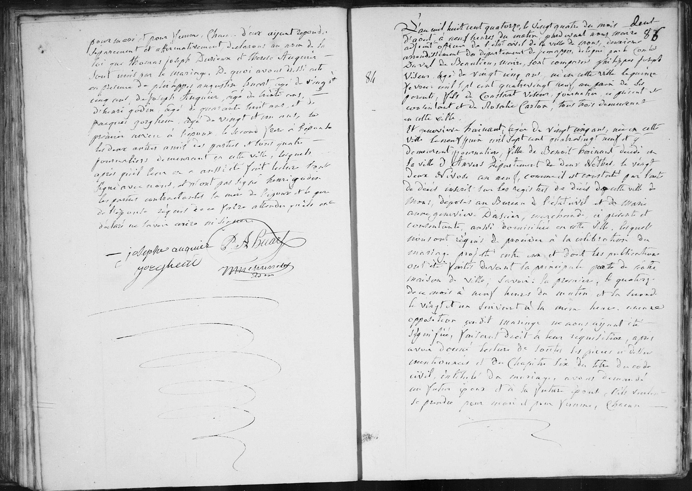
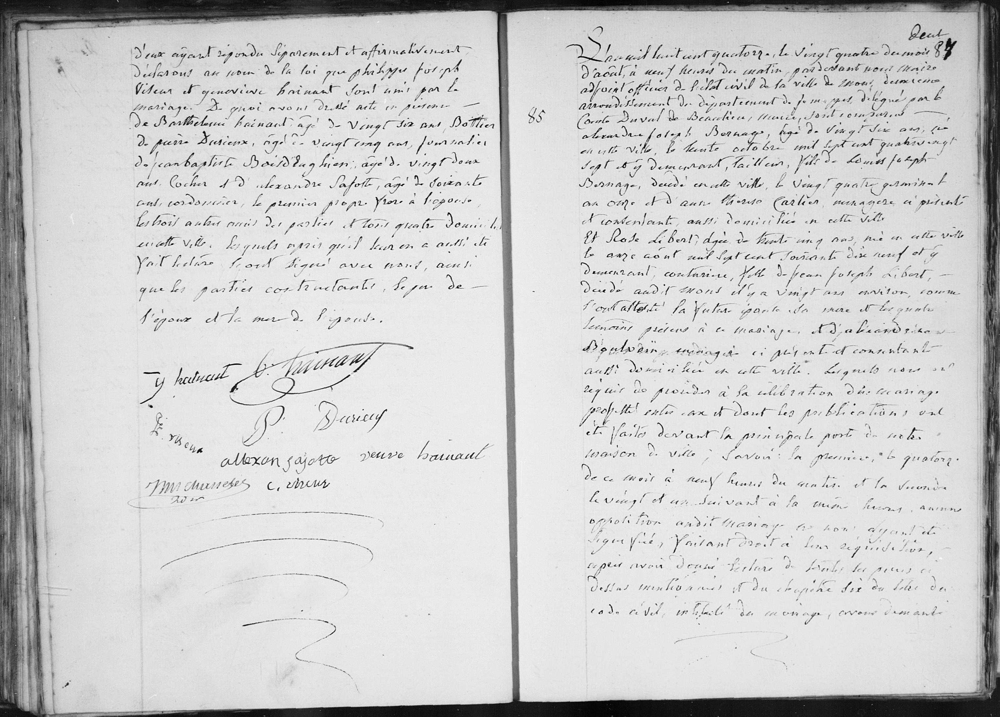

# Acte de mariage : Philippe Joseph Viseur et Genevieve Hainaut (1814)

## Transcription intégrale

D'an mil huit cent quatorze, le vingt quatre du mois d'aout, à neuf heures du matin, pardevant nous Maire adjoint officier de l'état civil de la ville de Mons, deuxième arrondissement du département de Jemappes, délégué par le comte Duval de Beaulieu, maire, sont comparus **Philippes Joseph Viseur** âgé de vingt neuf ans, né en cette ville le quinze juin mil sept cent quatre vingt neuf, au pain de ses parents, fils de Constant Viseur, journalier, ci présent et consentant, et de Rosalie Carton, tous trois demeurant en cette ville.

Et **Genevieve Hainaut**, âgée de vingt cinq ans, née en cette ville le vingt juin mil sept cent quatre vingt neuf et y demeurant, journalière, fille de Benoit Hainaut décédé en la ville d'Anvers département de deux Nethes, le vingt deux nivôse an neuf, comme il est constaté par l'acte de décès inscrit sur les registres de décès de cette ville de Mons, déposé au Bureau de l'état civil et de Marie Anne Geneviève Dacier, marchande, ci présente et consentante, aussi domiciliée en cette ville. 

Lesquels nous ont requis de procéder à la célébration du mariage projeté entre eux et dont les publications ont été faites devant la principale porte de notre maison de ville, savoir: la première, le quatorze de ce mois à neuf heures du matin et la seconde le vingt et un suivant à la même heure, aucune opposition audit mariage ne nous ayant été signifiée, faisant droit à leur réquisition, après avoir donné lecture de toutes les pièces ci dessus mentionnées et du Chapitre six du titre du code civil, intitulé du mariage, avons demandé au futur époux et à la future épouse s'ils veulent se prendre pour mari et pour femme, chacun d'eux ayant répondu séparément et affirmativement déclarons au nom de la loi que Philippe Joseph Viseur et Genevieve Hainaut sont unis par le mariage. 

De quoi avons dressé acte en présence de Barthelemy Hainaut âgé de vingt six ans, bottier, de Pierre Durieux, âgé de vingt cinq ans, journalier, de Jean Baptiste Boiddaghien, âgé de vingt deux ans, cocher, et Alexandre Safotte, âgé de soixante ans, cordonnier, le premier propre frère de l'épouse, les trois autres amis des parties et tous quatre domiciliés en cette ville. 

Lesquels après qu'il leur en a aussi été fait lecture ont signé avec nous, ainsi que les parties contractantes, le père de l'époux et la mère de l'épouse.

---

## Dates clés
* **Date de l'acte :** 24 août 1814.
* **Date de naissance de l'époux :** 15 juin 1789.
* **Date de naissance de l'épouse :** 20 juin 1789.
* **Date de décès du père de l'épouse (Benoit) :** 12 janvier 1801 (22 Nivôse An IX).

---

## Tableau récapitulatif des personnes mentionnées

| Nom | Rôle dans l'acte | Notes |
| :--- | :--- | :--- |
| **Philippe Joseph Viseur** | Époux | 29 ans, né à Mons. |
| **Genevieve Hainaut** | Épouse | 25 ans, née à Mons. |
| **Constant Viseur** | Père de l'époux | Présent et consentant. |
| **Rosalie Carton** | Mère de l'époux | |
| **Benoit Hainaut** | Père de l'épouse | Décédé à Anvers. |
| **Marie Anne Geneviève Dacier** | Mère de l'épouse | Présente et consentante. |
| **Barthelemy Hainaut** | Témoin | 26 ans, frère de l'épouse. |
| **Pierre Durieux** | Témoin | Ami des parties. |
| **Jean Baptiste Boiddaghien** | Témoin | Ami des parties. |
| **Alexandre Safotte** | Témoin | Ami des parties. |