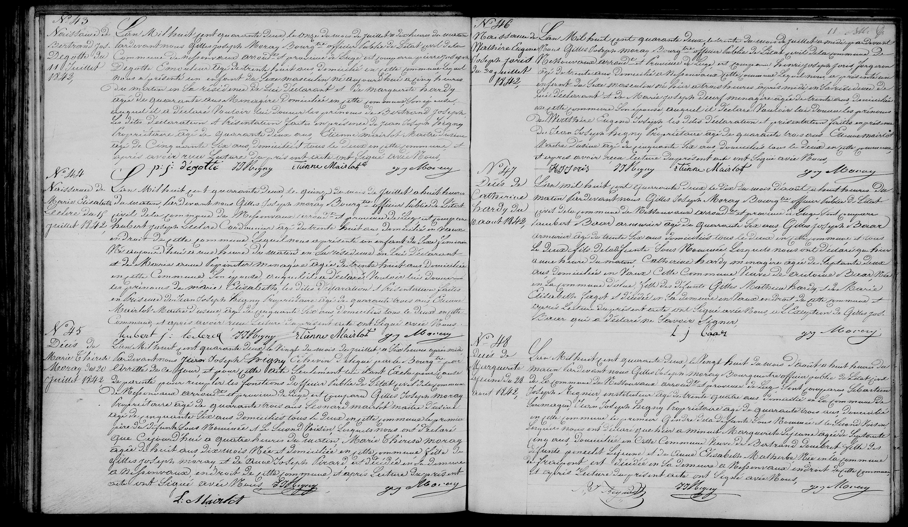

  N° 47
  Décès de Catherine Hardy du 22 août 1842

L’an mil huit cent quarante deux, le vingt deux du mois d’août à huit heures du 
matin, par-devant nous Gilles Joseph Maray Bourgmestre officier public de l’état 
civil de la commune de Nessonvaux, arrondissement et province de Liège, sont comparus 
Lambert Beco armurier âgé de quarante six ans, Gilles Joseph Berar 
armurier âgé de trente six ans, domiciliés tous les deux en cette commune, et tous 
le deux fils de la défunte sous-nommée lesquels nous ont déclaré qu’hier 
à une heure du matin, Catherine Hardy ménagère âgée de septante deux 
ans domiciliée au Vaux cette commune veuve de Antoine Berar dit 
en son vivant Beco fille des défunts Gilles Mathieu Hardy et de Marie 
Elisabeth Larget est décédée en sa demeure au Vaux endroit de cette commune et 
après lecture du présent acte ont signé avec nous à l’exception de Gilles Jos. 
Berar qui a déclaré ne savoir signer.

L J Beco      G J Maray
