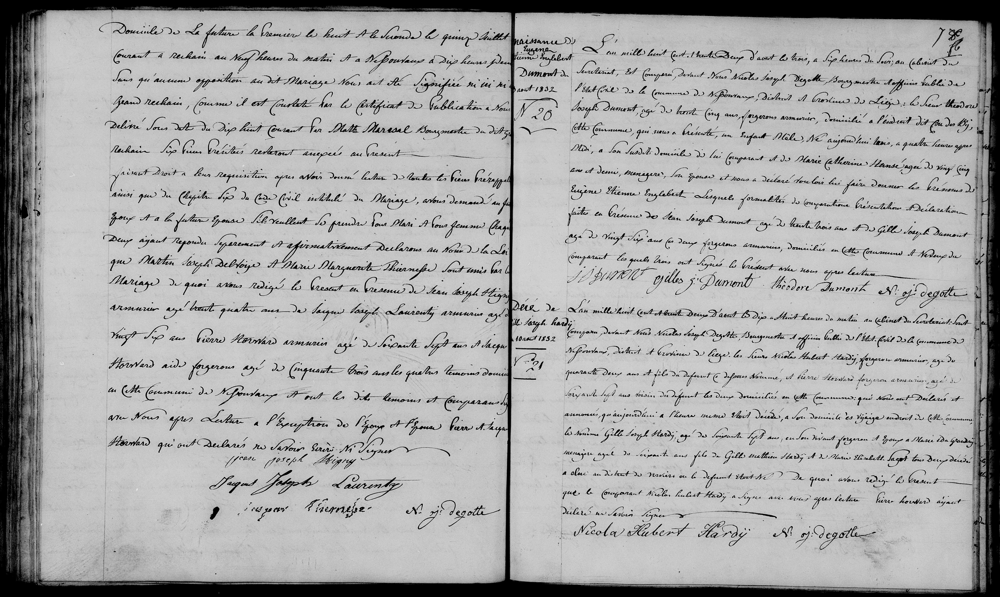

# 1832

N° 21  
Décès de  
Gilles Joseph Hardy  
18 août 1832

L’an mille huit cent trente deux d’août le dix-huit à onze heures du matin au Cabinet de l’Etat civil de la
commune de Nessonvaux District de Verviers Pr de Liège; Sont comparus devant Nous Nicolas Joseph Degotte,
Bourgmestre et officier public de l’Etat-Civil de la commune de Nessonvaux, District et Province de Liège, 
le Sieur __Nicolas Hubert Hardy__, forgeron armurier, âgé de quarante deux ans et fils du défunt ci-après nommé, 
et le Sieur __Léonard Hardy__, forgeron armurier, âgé de soixante sept ans voisin du défunt les deux domiciliés 
en cette Commune; lesquels nous ont déclaré et annoncé qu’aujourd’hui à l’heure susdite était décédé, à son 
domicile au Visage endroit de cette Commune, le Sieur __Gilles Joseph Hardy__, âgé de septante sept ans, en 
son vivant forgeron et époux de __Marie Ida Grandry__, ménagère âgée de septante ans, fils de __Gilles Mathieu 
Hardy et de Marie Elisabeth Larget__ tous deux décédés; de quoi avons rédigé le présent acte dont lecture au 
déclarant et au témoin. De quoi avons rédigé le présent acte que le comparant Nicolas Hubert Hardy a signé 
avec nous après lecture, l'autre témoin ayant déclaré ne savoir signer.

Nicola Hubert Hardy        N. Jos. Degotte
