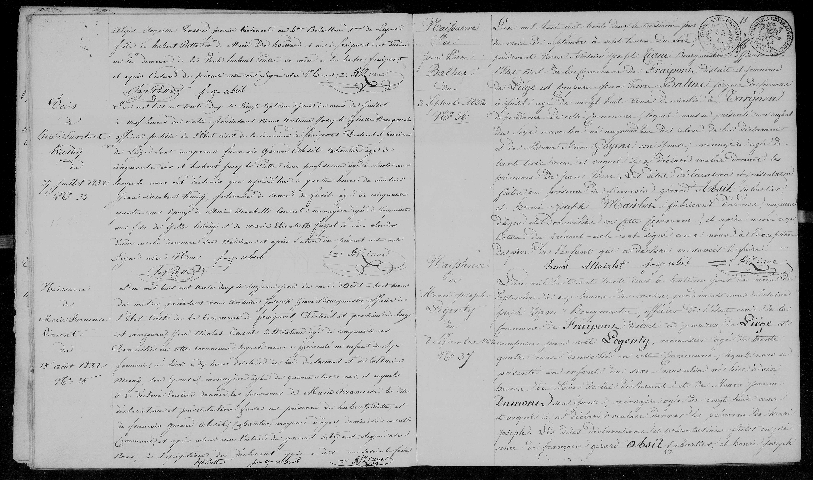
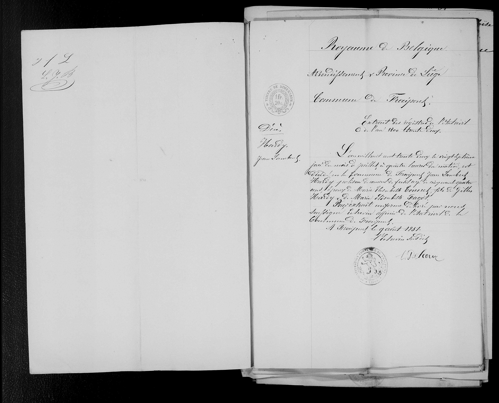

N° 33
    Décès de Jean Lambert Hardy
    du 27 juillet 1832

L'an mil huit cent trente deux le vingt septième jour du mois de juillet 
à neuf heures du matin par devant Nous Antoine Joseph Liane Bourgmestre 
officier public de l'état civil de la commune de Fraipont District et province 
de Liège sont comparus françois gérard Absil cabaretier âgé de 
cinquante ans et hubert joseph Piette sans profession âgé de trente ans 
lesquels nous ont déclarés que aujourd'hui à quatre heures du matin 
Jean Lambert Hardy, polisseur d'armes de fusil âgé de cinquante 
quatre ans époux de Marie Elisabeth Counet ménagère âgée de cinquante 
ans fils de Gilles Hardy et de marie Elisabeth faget est décédé 
en la demeure dudit Balleur et après l'avoir lu les déclarants ont 
signé avec Nous. f. g. absil        H J Piette
                                   Liane

    Royaume de Belgique
    Arrondissement & Province de Liège
    Commune de Fraipont
    
    Extrait des registres de l'état civil 
    de l'an mil huit trente deux
    
    L'an mil huit cent trente deux le vingt septième 
    jour du mois de juillet à quatre heures du matin, est 
    décédé en la commune de Fraipont Jean Lambert 
    Hardy polisseur d'armes de fusil âgé de cinquante quatre 
    ans époux de Marie Elisabeth Counet fils de Gilles 
    Hardy et de Marie Elisabeth Fagot.
    Pour extrait conforme délivré par nous 
    soussigné échevin officier de l'état civil de la 
    commune de Fraipont.
    A Fraipont le 9 août 1851.
    L'echevin de l'état civil
    (Signature)
