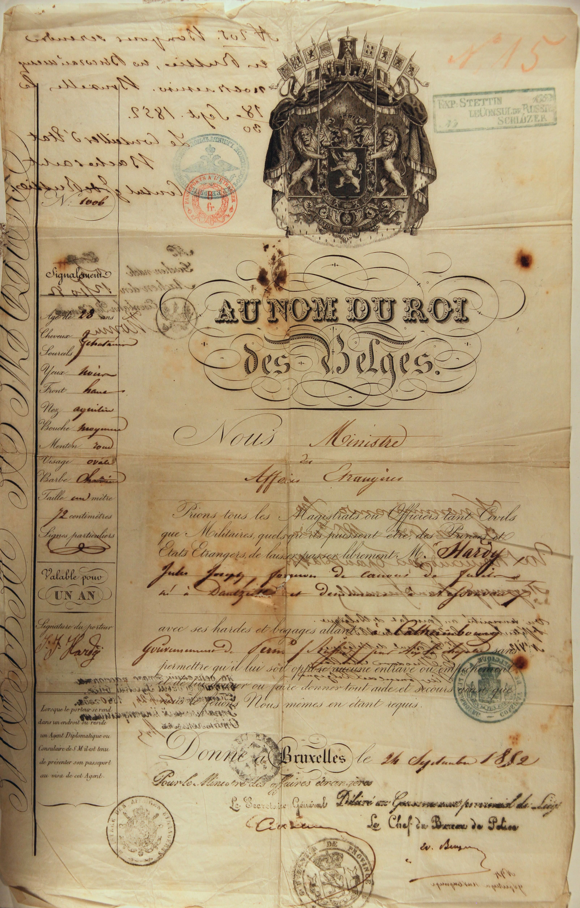

# Passeport de Jules Joseph Hardy

 - [Verso](HardyJulesJ_passport_FLIP.jpg)

AU NOM DU ROI des Belges. 

_Nous Ministre des Affaires Etrangères,  
Prions tous les Magistrats ou Officiers tant Civils que Militaires,   
quels qu'ils puissent être, des Princes et Etats Etrangers, de laisser   
passer librement Mr. Hardy Jules Joseph, forgeron de canons de fusils,  
né à Dantzig et demeurant à Nessonvaux, avec ses hardes et bagages  
allant à Catherinbourg (Ekaterinburg)  
Gouvernement de Perm (Russie) par Aix-la-Chapelle sans  
permettre qu’il lui soit opposé aucune entrave ou empêchement  
et de lui donner ou faire donner tout aide et secours ainsi que  
Nous mêmes en étant requis_  

_Donné à Bruxelles le 24 Septembre 1852.  
Pour le Ministre des affaires étrangères  
Le Secrétaire Général (Signature illisible)  
Délivré au Gouvernement provincial de Liège  
Le Chef du Bureau de Police (Signature : W. Berger)_

(Gouvernement de Perm (Russie): province administrative de  Ekaterinburg )

_Signalement_

- Âge : 28 ans
- Taille : 1 mètre 72 centimètres
- Cheveux : Châtains 
- Sourcils : Idem
- Yeux : Noirs 
- Front : Haut 
- Nez : Aquilin 
- Bouche : Moyenne
- Menton : Rond 
- Visage : Ovale 
- Teint : Coloré 
- Barbe: Chatain
- Taille un metre 72 centimètres
-  Signes particuliers : Néant
_Valable pour UN AN_

_Lorsque le porteur se rend dans un endroit ou reside un Agent Diplomatique ou Consulaire de S.M. il est tenu de présenter son passeport au visa de cet Agent._

Timbres:

- Rectangle vert:  
    _Exp: STETTIN  xxx  
    Le Consul de Russie  
    SCHLÖZER_

    Stettin (now Szczecin, Poland) was the major port for the Baltic sea. He likely took a ship from there to Saint Petersburg.

Verso:

- Note Manuscripte  
  _Gültig zur Reise nach Stettin über Berlin  
  mit der Eisenbahn_  
  Valid for travel to Stettin via Berlin
  by the railway

  Prussian Transit Authorization;  Stettin (Szczecin) was the primary gateway for travelers heading to Saint Petersburg.
  If he were caught in a different city (like the industrial centers of the Ruhr), his passport would be considered invalid.

- Note Manuscripte et timbre ovale bleu  
    _N 205. Bon pour se rendre en Russie,_  
    _по Высочайшему повелению_  (By Imperial Command).     
    _Bruxelles le_
    _18/30 Sept. 1852._  (Gregorian/Julian calendar)  
    _Le Conseiller d'Etat_  
    _Bacheracht_  
    _Consul gal de Russie_

    _Россійскаго Генеральнаго Консульства въ Бельгіи_  
    Consulat General de Russie en Belgique

- Italique noir: Gendarmerie Prussienne  
    _Gesehen nach Aachen  
    den 12/10 52  
    Eisenbahn Pass-Revision  
    (Signature)  
    Visé à Aix, le 12 Octobre '52; verification des passeports par les autorités des chemins de fer    

- Manuscript au milieu a gauche, Visa d'entrée de la police imperiale de Russie   
  Кронштадтъ. Октября 21 дня 1852. Явился.  
  _Kronstadt. October 21, 1852. Presented [himself]._

  19th-century Russian cursive.  
  Kronstadt was the fortified island seaport of Saint Petersburg and the primary point of entry for all maritime passengers arriving from the West.
  
  Since he entered at Kronstadt, he definitely took a steamship from Stettin (Prussia). If he had traveled entirely by land, he would have entered via a land border station like Wirballen (Kybartai).

- Au milieu a droite, timbre cursive encre noir  
  _на основаніи этаго паспорта	
  Выданъ годовой Путевой билеть  
  С. Петербургъ, Октября 24, 1852 года  
  Управляющій иностранною
  Отдѣленіемъ  
  Signature_ 

  On the basis of this passport  
  A one-year Travel Ticket [Visa] is issued  
  St. Petersburg, October 24, 1852.  
  Manager [Director] of Foreign...
  Department [Section]

- Manuscript en bas a gauche:  
  _Vu enregistré au Consulat de Belguique  
  St.Pétersbourg le 20/1n Octobre 1858  
  No 412   P. Le Consul de Belgique  
  E.Théodore Mollerz  
  Vice Consul de Belgique  
  E. Théodore Malloz

  Édouard Theodore Malloz: Chancelier de la Légation  
  sous le Ministre Résident M. le Vicomte de Jonghe d'Ardoye

- en bas a gauche  
  _No 4_  
  _у Бригера на квартирѣ_   
  Chez Brieger dans son logement  
  Foreigners were required by law to report their exact address to the Adresnyi Stol (Address Desk) of the Saint Petersburg Police within 24 hours of arrival.

  In the 1850s, Brieger (likely Karl or Johann Brieger) operated a known "Chastniye Kvartiry" (Private Lodgings) or a small "Inn" type establishment. Most Belgian and German industrial specialists stayed in the 1st District of the Admiralty (1-ya Admiralteyskaya Chast) or on Vasilievsky Island. These areas were the hub for foreigners, close to the Western embassies and the steamship docks.
  

---

### Journal de voyage

**From Nessonvaux, Belgium to the Imperial Russian Urals**

| Date (Gregorian) | Date (Julian/Russian) | Location | Event / Authority | Document Reference |
|:---|:---|:---|:---|:---|
| **Sept 24** | Sept 12 | **Nessonvaux, BE** | Passport Issuance | Main Belgian Passport Page |
| **Sept 30** | Sept 18 | **Brussels, BE** | Imperial Russian Visa | Blue Oval Stamp (Double Eagle) |
| **Oct 12** | Sept 30 | **Aachen/Cologne, PR** | Frontier Rail Entry | "Eisenbahn Pass-Revision" |
| **Oct 16–20** | Oct 4–8 | **Baltic Sea** | Maritime Transit | SS Wladimir (Stettin to Kronstadt) |
| **Nov 2** | **Oct 21** | **Kronstadt, RU** | Port of Entry | Manuscript: "Кронштадтъ... Явился" |
| **Nov 3** | **Oct 22** | **St. Petersburg, RU** | Local Residency | Manuscript: "№ 4 у Бригера на кварт." |
| **Nov 4** | **Oct 23** | **St. Petersburg, RU** | Belgian Registration | Signed: "E. Théodore Malloz" (No. 412) |
| **Nov 5** | **Oct 24** | **St. Petersburg, RU** | Internal Transit Visa | Smeared Stamp: "Путевой билеть" |
| **Nov–Dec** | Nov–Dec | **En Route** | Siberian Highway | Transit to Ekaterinburg (approx. 20 days) |

**Key Professional Status:** * **Role:** Forgeron de canons (Barrel Smith / Arms Master)
* **Employer:** Imperial Russian Government (Ministry of War)
* **Transit Method:** Rail (Prussia), Steamship (Baltic), Horse-drawn Sledge/Tarantass (Russia)