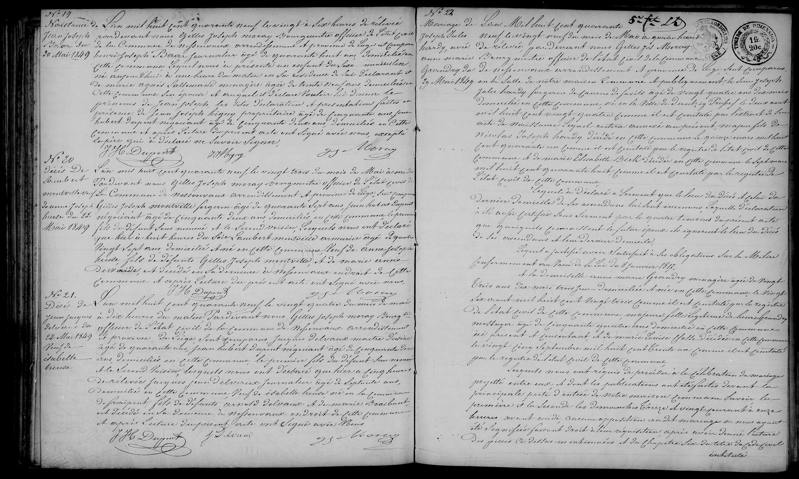

# 1849

#### No. 19: Birth of Jean Joseph Bacher

L’an mil huit cent quarante neuf le vingt de Mai à six heures de relevée...
est comparu Jean Joseph Bacher journalier âgé de quarante huit ans...
présenté un enfant de sexe masculin né aujourd'hui à une heure du matin... 
de lui et de Marie Catherine Salomon ménagère...
prénoms de Jean Joseph.

#### No. 20: Death of Lambert Montulet 

L’an mil huit cent quarante neuf le vingt trois du mois de Mai...
sont comparus Gilles Joseph Montulet forgeron âgé de quarante sept ans...
Jean Hubert Dupont négociant âgé de cinquante deux ans...
ont déclaré qu’hier à huit heures du soir Lambert Montulet journalier âgé de quatre
vingt sept ans... veuf de Anne Joseph Heuse...

#### No. 21: Death of Jacques Joseph Delvaux 

L’an mil huit cent quarante neuf le vingt quatre du mois de Mai...
sont comparus Jacques Delvaux maître d’école âgé de quarante ans...
Jean Hubert Dupont négociant âgé de cinquante deux ans...
ont déclaré que hier à cinq heures de relevée Jacques Joseph Delvaux journalier âgé de septante huit ans... veuf de Isabelle Heuse...

## N° 22 Mariage de Hardy Jules Joseph avec Grandry Anne Marie  
Le 29 Avril 1849  

L’an Mil huit cent quarante neuf le vingt neuf du mois de Mai à quatre heures
après midi, par devant nous Gilles Joseph Maray bourgmestre officier de l'état civil de
la Commune de Nessonvaux, arrondissement et province de Liège, sont comparus
en la salle de notre maison Commune et publiquement, le Sieur __Jules
Joseph Hardy__ forgeron de forme de faux âgé de vingt quatre ans révolus
domicilié en cette commune, né en la Ville de Dantzig (Prusse) le deux avril
mil huit cent vingt quatre comme il est constaté par l'extrait de son
acte de naissance, lequel restera annexé aux présentes; fils majeur de feu
__Nicolas Hubert Hardy__ décédé en cette commune le quinze mars mil huit
cent quarante et un ainsi qu'il est constaté par le registre de l'état civil de cette
commune, et de __Marie Elisabeth Beck__ décédée en cette commune le sept mars
mil huit cent quarante huit comme il est constaté par le registre de
l'état civil de cette commune.
[...]
Et la Demoiselle __Anne Marie Grandry__ ménagère âgée de vingt
trois ans deux mois treize jours domiciliée à Nessonvaux fille mineure, née le seize
mars mil huit cent vingt six comme il est constaté par le registre
de l'état civil de cette commune, fille de feu __Lambert Grandry__
en son vivant forgeron âgé de cinquante ans domicilié en cette commune
où il est décédé et de __Marie Louise Spatta__ décédée en cette commune
le vingt cinq septembre mil huit cent trente six comme il est constaté
par le registre de l'état civil de cette commune.

---

| Name | Profession | Role | Record No. |
| :--- | :--- | :--- | :--- |
| **Jules Joseph Hardy** | Forgeron de forme de faux (Scythe-blade smith) | **The Groom** (Born 1824, Danzig) | 22 |
| **Anne Marie Grandry** | Ménagère (Housekeeper) | **The Bride** | 22 |
| **Nicolas Hubert Hardy** | (Deceased) | Father of the Groom (Died Mar 15, 1841) | 22 |
| **Marie Elisabeth Beck** | (Deceased) | Mother of the Groom (Died Mar 7, 1848) | 22 |
| **Lambert Grandry** | Forgeron (Blacksmith) | Deceased Father of the Bride | 22 |
| **Marie Louise Spatta** | (Deceased) | Deceased Mother of the Bride | 22 |
| **Gilles Joseph Maray** | Bourgmestre (Mayor) | Civil Officer | All |
| **Jean Joseph Bacher** | Journalier (Day Laborer) | Father of newborn | 19 |
| **Marie Catherine Salomon** | Ménagère (Housekeeper) | Mother of newborn | 19 |
| **Lambert Montulet** | Journalier (Day Laborer) | The Deceased (Age 87) | 20 |
| **Gilles Joseph Montulet** | Forgeron (Blacksmith) | Informant (Son of deceased) | 20 |
| **Jean Hubert Dupont** | Négociant (Merchant) | Witness | 20, 21 |
| **Jacques Joseph Delvaux** | Journalier (Day Laborer) | The Deceased (Age 78) | 21 |
| **Jacques Delvaux** | Maître d'école (Schoolmaster) | Informant (Son of deceased) | 21 |
| **Isabelle Heuse** | (Deceased) | Late wife of Jacques Delvaux | 21 |
| **Anne Joseph Heuse** | (Deceased) | Late wife of Lambert Montulet | 20 |
