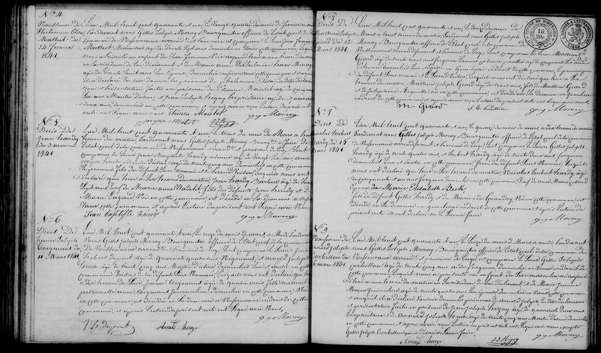

# 1887 Mort de Nicolas Joseph Hardy (junior)

## N° 21: Nicolas Joseph Hardy

L'AN MIL HUIT CENT QUATRE-VINGT-sept, le quatorzième jour du mois de Décembre à cinq heures du soir, par devant nous Louis Noirfalise, Bourgmestre, officier public de l'état civil de la commune de Nessonvaux arrondissement judiciaire de Liège, Province de Liège sont comparus Jean-Léonard Heuze, cordonnier, âgé de trente un ans, domicilié à Olne, et Ferdinand Soukheur, plafonneur, âgé de trente quatre ans, domicilié en cette commune, respectivement gendre et voisin du défunt ci-après dénommé lesquels nous ont déclaré que aujourd’hui à dix heures du soir est décédé en cette commune au lieu dit « Gommetivay » __Nicolas-Joseph Hardy__, ouvrier peintre, âgé de soixante neuf ans, né à Lantremange, domicilié en cette commune, époux d’Éléonore Dinges, ménagère, âgée de cinquante ans, fils des défunts __Nicolas-Joseph Hardy et Marie Elisabeth Beeck__. Et après avoir donné lecture du présent acte aux comparants, ils ont signé avec nous.

---

### N° 19: Marie-Jeanne Laboule

L'AN MIL HUIT CENT QUATRE-VINGT-sept, le dixième jour du mois de Novembre à sept heures du soir, par devant nous Louis Noirfalise, Bourgmestre, officier public de l'état civil de la commune de Nessonvaux arrondissement judiciaire de Liège, Province de Liège sont comparus Joseph Lacrosse, menuisier, âgé de quarante deux ans, et Toussaint-Joseph Verfré, secrétaire communal, âgé de quarante deux ans, domiciliés en cette commune, tous les deux connaissances de la défunte ci-après dénommée lesquels nous ont déclaré que aujourd’hui à trois heures de relevée est décédée en cette commune au lieu dit « La Cornette » Marie-Jeanne Laboule, sans profession, âgée de quatre-vingt-dix ans, domiciliée en cette Commune, née en celle de Louveigné, fille des défunts Lambert Laboule et Jeanne Leloup. Et après avoir donné lecture du présent acte aux comparants, ils ont signé avec nous.

### N° 20: Henri Joseph Mosbeux

L'AN MIL HUIT CENT QUATRE-VINGT-sept, le treizième jour du mois de Novembre à onze heures de relevée par devant nous Louis Noirfalise, Bourgmestre, officier public de l'état civil de la commune de Nessonvaux arrondissement judiciaire de Liège, Province de Liège sont comparus Denis Viteux, journalier, âgé de soixante ans et Toussaint-Joseph Verfré, secrétaire communal âgé de quarante deux ans, domiciliés en cette commune, respectivement beau frère et connaissance du défunt ci-après dénommé lesquels nous ont déclaré que aujourd’hui à huit heures du matin est décédé en cette commune au lieu dit « Grand-Bastard » (ou « Grand-Ry ») Henri-Joseph Mosbeux, cloutier, âgé de quarante-sept ans, domicilié en cette commune, né en celle d’Olne, époux de Marie Cortenraad, négociante, âgé de quarante-sept ans, fils des défunts Henri-Joseph Mosbeux et Marie Redeker. Et après avoir donné lecture du présent acte aux comparants, ils ont signé avec nous, excepté le Sieur Denis Viteux qui a déclaré ne savoir le faire.

### N° 22: Jean Nicolas Semoine

L'AN MIL HUIT CENT QUATRE-VINGT-sept, le vingt-sixième jour du mois de Décembre à deux heures de relevée par devant nous Louis Noirfalise, Bourgmestre, officier public de l'état civil de la commune de Nessonvaux arrondissement judiciaire de Liège, Province de Liège sont comparus Joseph Lemoine, tailleur de pierres, âgé de trente neuf ans, et Mathieu Throuet, boulanger, âgé de trente quatre ans, le premier domicilié à Fraipont, le second à Nessonvaux, respectivement fils et gendre du défunt ci-après dénommé lesquels nous ont déclaré que aujourd’hui à onze heures du soir est décédé en cette commune au lieu dit « Sous le Bois » Jean-Nicolas Semoine, tailleur de pierres, âgé de soixante neuf ans, né et domicilié en cette commune, fils des défunts Jean Semoine et Jeanne Crutz, veuf de Marie-Félix Pierre, époux de Catherine Weber, ménagère. Et après avoir donné lecture du présent acte aux comparants, ils ont signé avec nous.
