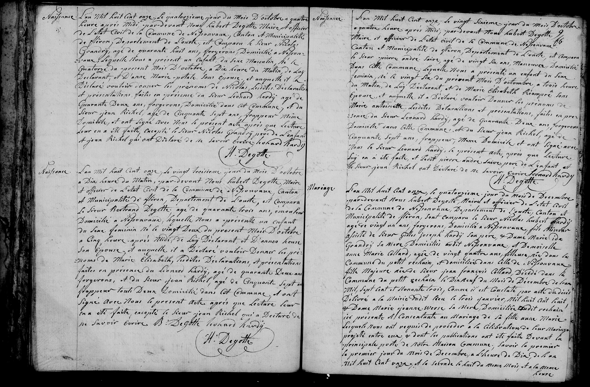

# 1811

## 4 Nicolas Hubert Hardy & Anne Marie Collard

Mariage.

L’an Mil huit cent onze, le quatorzième jour du Mois de Decembre 
par-devant Nous Hubert Degotte, Maire et officier de l’Etat Civil 
de la Commune de Nessonvaux, Departement de l’Ourte, Canton et 
Municipalité de Fléron, Sont comparu le Sieur __Nicolas Hubert Hardy__ 
âgé de vingt un ans, forgeron, domicilié a Nessonvaux, fils Mineur 
assisté de Sieur __Gilles Joseph Hardy Son pere, et Dame Marie Ida 
Grandry Sa Mere__, Domiciliés audit Nessonvaux. Et Demoiselle 
__Anne Marie Collard__, âgée de vingt quatre ans, filleuse née dans la 
Commune du petit Rechain, et domiciliée dans Celle de Nessonvaux 
fille Majeure de feu Sieur jean françois Collard Décédé dans la 
Commune de petit Rechain le Dix neuf du Mois de Décembre de l’an 
Mil Sept cent et Nonante trois, Comme il est Constaté par acte de décès 
Délivré a la Mairie dudit lieu le trois janvier Mil huit Cent huit 
et Dame Marie Jeanne Werse Sa Mere, Domiciliée audit Rechain 
ici présente et Consentante au Mariage de Sa fille Anne Marie 
lesquels Nous ont requis de procéder à la Celebration de leur Mariage 
projetté entre eux et dont les publications ont été faite Devant la 
principale porte de Notre Maison Commune. Savoir le premier 
le premier jour du Mois de Decembre, a l’heure de Dix de l’an 
Mil huit Cent onze, et la seconde le huit du même Mois et a la meme Heure.

---

#### 1 Nicolas Grandry
Naissance. 

L’an Mil huit cent onze, le quatorzième jour du Mois d’octobre à quatre
heures après Midi, par-devant Nous Hubert Degotte, Maire et officier
de l’Etat Civil de la Commune de Nessonvaux, Canton et Municipalité
de Fléron, Département de l’Ourte, est comparu le Sieur __Nicolas
Grandry__, âgé de quarante huit ans, forgeron, domicilié à Nesson-
vaux, lequel Nous a présenté un enfant de sexe Masculin, né le
quatorze du présent mois d’Octobre, à dix heures du matin, de lui
Déclarant, et d’Anne Marie potale son épouse; et auquel il a 
Déclaré vouloir donner les prénoms de Nicolas. Lesdites déclarations
et présentations faites en présence du Sieur Léonard Hardy âgé de
Quarante deux ans, forgeron, domicilié dans cet Commune, et du
Sieur jean Richel, âgé de Cinquante sept ans, frappeur, même
domicile, et ont signé avec Nous le présent acte après que lecture
leur en a été faite, excepté le Sieur Nicolas Grandry père de l'enfant
et jean Richel qui ont déclaré de ne savoir écrire. Léonard Hardy
                                              H. Degotte

#### 2 Marie Elisabeth Degotte
Naissance.

L’an Mil huit cent onze, le vingt troisième jour du Mois d’octobre 
à Dix heures du Matin, par-devant Nous Hubert Degotte, Maire 
et officier de l’Etat Civil de la Commune de Nessonvaux, Canton 
et Municipalité de Fléron, Departement de l’Ourte, est comparu 
le Sieur Bertrand Degotte, âgé de quarante trois ans, emouteur 
domicilié à Nessonvaux, lequel Nous a présenté un enfant 
du sexe féminin né le vingt deux du présent Mois d’Octobre 
à Cinq heures après Midi, de lui Déclarant, et d’Anne Heuse 
son épouse et auquel il a Déclaré vouloir donner les pré-
noms de Marie Elisabeth. Lesdites Déclarations et présentations 
faites en présence de Léonard Hardy, âgé de quarante deux ans 
forgeron, et du Sieur jean Richel, âgé de Cinquante sept ans 
frappeur toute deux domiciliés dans cet Commune, et ont 
Signé avec Nous le présent acte après que lecture leur 
en a été faite, excepté le Sieur jean Richel qui a Déclaré de 
ne savoir écrire.   B. Degotte   Léonard Hardy
                                   H. Degotte

#### 3 Marie Antoinette André

Naissance.

L’an Mil huit cent onze, le vingt Sixième jour du Mois d’octobre 
à quatre heures après Midi, par-devant Nous Hubert Degotte, 
Maire et officier de l’état civil de la Commune de Nessonvaux, 
Canton et Municipalité de Fléron, Departement de l’Ourte, est comparu 
le Sieur Pierre André Saive, âgé de vingt six ans, manoeuver domicilié 
dans cette Commune, lequel Nous a présenté un enfant du sexe 
féminin, né le vingt Six du présent Mois d’octobre, à trois heures 
du Matin, de lui Déclarant, et de Marie Elisabeth Riompré Son 
épouse, et auquel il a Déclaré vouloir donner les prénoms de 
Marie Antoinette. Lesdites Déclarations et présentations, faites en pré-
sence du Sieur Léonard Hardy, âgé de quarante deux ans, forgeron 
domicilié dans cette Commune, et du Sieur jean Richel, âgé de 
Cinquante sept ans, frappeur, même Domicile et ont Signé avec 
Nous le Sieur Léonard Hardy, le présent acte après que lecture 
lui en a été faite, et ledit pierre André Saive père de l’enfant et 
le Sieur jean Richel ont Déclaré de ne savoir écrire.   Léonard Hardy
                                                       H. Degotte
---

### People Mentioned in the Nessonvaux Civil Register (Oct–Dec 1811)

| Name | Profession | Role | Record Location |
| :--- | :--- | :--- | :--- |
| **Nicolas Hubert Hardy** | Forgeron (Blacksmith) | **The Groom** (Age 21; Son of Gilles) | Bottom Right (Marriage) |
| **Anne Marie Collard** | Filleuse (Spinner) | **The Bride** (Age 24; 1st Wife) | Bottom Right (Marriage) |
| **Gilles Joseph Hardy** | — | Father of the Groom (Consent provider) | Bottom Right (Marriage) |
| **Marie Ida Grandry** | — | Mother of the Groom | Bottom Right (Marriage) |
| **Léonard Hardy** | Forgeron (Blacksmith) | **Witness** (Age 42; Primary Signatory) | Top Left, Bottom Left, Top Right |
| **Nicolas Grandry** | Forgeron (Blacksmith) | Father of newborn; Witness | Top Left (Birth) |
| **Anne Marie Potale** | — | Mother of newborn | Top Left (Birth) |
| **Nicolas Grandry** (Infant) | — | Newborn Child (born Oct 14, 1811) | Top Left (Birth) |
| **Jean Richel** | Frappeur (Striker/Hammerman) | Witness (Age 57; Illiterate) | Top Left, Bottom Left, Top Right |
| **Bertrand Degotte** | Emouteur (Grinder) | Father of newborn | Bottom Left (Birth) |
| **Anne Heuse** | — | Mother of newborn | Bottom Left (Birth) |
| **Marie Elisabeth Degotte** | — | Newborn Child (born Oct 22, 1811) | Bottom Left (Birth) |
| **Pierre André Saive** | Manoeuvre (Laborer) | Father of newborn | Top Right (Birth) |
| **Marie Elisabeth Riompré** | — | Mother of newborn | Top Right (Birth) |
| **Marie Antoinette André** | — | Newborn Child (born Oct 26, 1811) | Top Right (Birth) |
| **Jean François Collard** | — | Deceased Father of the Bride | Bottom Right (Marriage) |
| **Marie Jeanne Werse** | — | Mother of the Bride (Present/Consent) | Bottom Right (Marriage) |
| **Hubert Degotte** | Maire (Mayor) | Civil Officer (Signs all records) | All Records |
