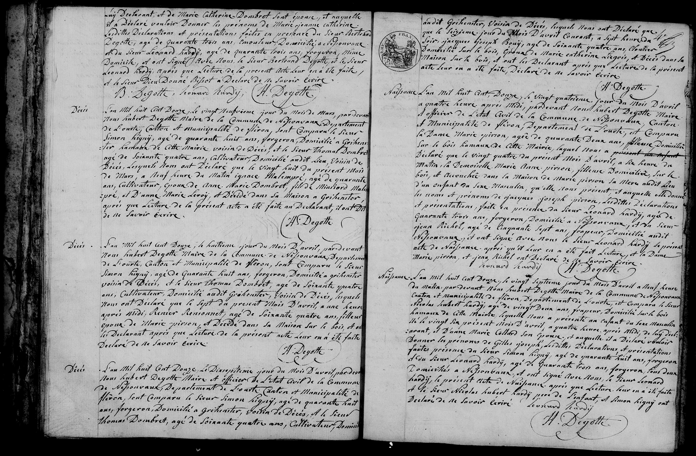
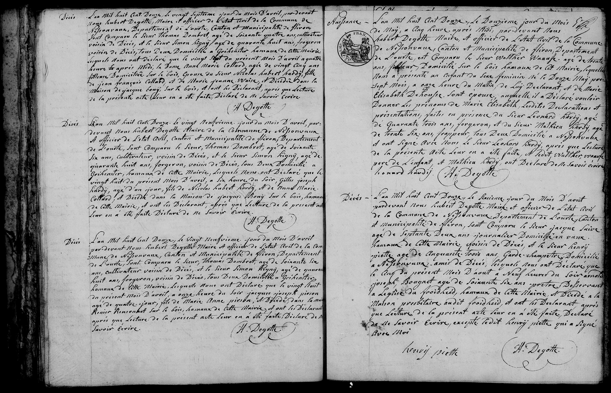

#### 1 Naissance de Gilles Joseph Hardy

Naissance: L’an Mil huit Cent Douze, le vingt Septième jour du mois d'Avril à Neuf heures 
du Matin, par-devant Nous Hubert Degotte, Maire et officier de l'Etat Civil de la Commune 
de Nessonvaux, Canton et municipalité de Fléron, Departement de l’Ourte, est Comparu le Sieur 
_Nicolas Hubert Hardy_, âgé de vingt deux ans, frapeur, Domicilié sur le bois 
hameau de cette Mairie, lequel Nous a présenté un enfant du sexe Masculin 
né le vingt Six du présent Mois d’avril, à quatre heures après Midi, de lui décl-
arant, et d’_Anne Marie Collard_ son épouse; et auquel il a Déclaré vouloir 
donner les prénoms de _Gilles Joseph_. Lesdites Déclarations et présentations 
faites en présence du Sieur Simon Signy, âgé de quarante huit ans, forgeron 
et du Sieur Léonard Hardy, âgé de Quarante trois ans, forgeron, tous deux 
Domiciliés à Nessonvaux, et ont Signé avec Nous, le Sieur Léonard 
Hardy le présent acte de Naissance après que Lecture leur en a été faite 
et le Sieur Nicolas Hubert Hardy père de l'enfant et Simon Signy ont 
Déclaré de ne Savoir écrire.   Léonard Hardy
                                   H. Degotte

        -->

#### 1 Décès de Anne Marie Collard 

Décès: L’an Mil huit Cent Douze le vingt Septième jour du mois d'Avril... sont comparus le Sieur Thomas Dombrot, âgé de Soixante quatre ans, cultivateur... et le Sieur Simon Signy âgé de quarante huit ans, forgeron... lesquels nous ont déclaré que le vingt Sept du présent mois d'Avril à quatre heures après Midi, la Dame __Anne Marie Collard__, âgée de vingt Cinq ans, filleuse Domiciliée sur le bois, Epouse du Sieur Nicolas Hubert _Hardy_, fille de Jean François Collard, et de Marie Jeanne Werse, est Décédée dans la Maison de jacques bony...

#### 2 Décès de  Gilles Joseph Hardy (Infant) 

Décès: L’an Mil huit Cent Douze le vingt Neuvième jour du mois d'Avril... lesquels nous ont Déclaré que le vingt huit du présent mois d'Avril, à six heures du soir, Gilles Joseph Hardy, âgé d'un jour, fils de Nicolas Hubert Hardy et de Anne Marie Collard, est Décédé dans la Maison de jacques Bony sur le bois...

##### (3 Birth of Marie Elisabeth Saive )

Naissance: L’an Mil huit Cent Douze le Douzième jour du mois de May... est comparu le Sieur Walther Saive âgé de trente ans, faucheur... lequel nous a présenté un enfant du sexe féminin né le Douze May... de lui Déclarant et de Marie Elisabeth Deheuse son épouse, laquelle il a Déclaré vouloir Donner les prénoms de Marie Elisabeth. Lesdites Déclarations et présentations faites en présence du Sieur _Léonard Hardy_, âgé de Quarante trois ans, forgeron, et du Sieur _Mathieu Hardy_, âgé de trente six ans, frappeur, tous Deux Domicilié a Nessonvaux...

---

| Name | Profession | Role | Record |
| :--- | :--- | :--- | :--- |
| **Anne Marie Collard** | Filleuse (Spinner) | **The Deceased** (Wife of Nicolas Hubert) | Death (Apr 27) |
| **Nicolas Hubert Hardy** | Forgeron (Blacksmith) | Husband of deceased / Father of deceased infant | Death (Apr 27/29) |
| **Gilles Joseph Hardy** | — | **The Deceased** (Infant, 1 day old) | Death (Apr 29) |
| **Léonard Hardy** | Forgeron (Blacksmith) | Witness (Age 43) | Birth (May 12) |
| **Mathieu Hardy** | Frappeur (Striker) | Witness (Age 36) | Birth (May 12) |
| **Thomas Dombrot** | Cultivateur (Farmer) | Witness (Age 64/66) | Death (Apr 27/29) |
| **Simon Signy** | Forgeron (Blacksmith) | Witness (Age 48) | Death (Apr 27/29) |
| **Walther Saive** | Faucheur (Mower) | Father of newborn | Birth (May 12) |
| **Marie Elisabeth Deheuse**| — | Mother of newborn | Birth (May 12) |
| **Jacques Saive** | Journalier (Day laborer)| The Deceased (Age 72) | Death (Aug 6) |
| **Arnolde Joseph Bougaert**| Prêtre (Priest) | The Deceased (Age 66) | Death (Aug 5) |
| **Hubert Degotte** | Maire (Mayor) | Civil Officer | All |
