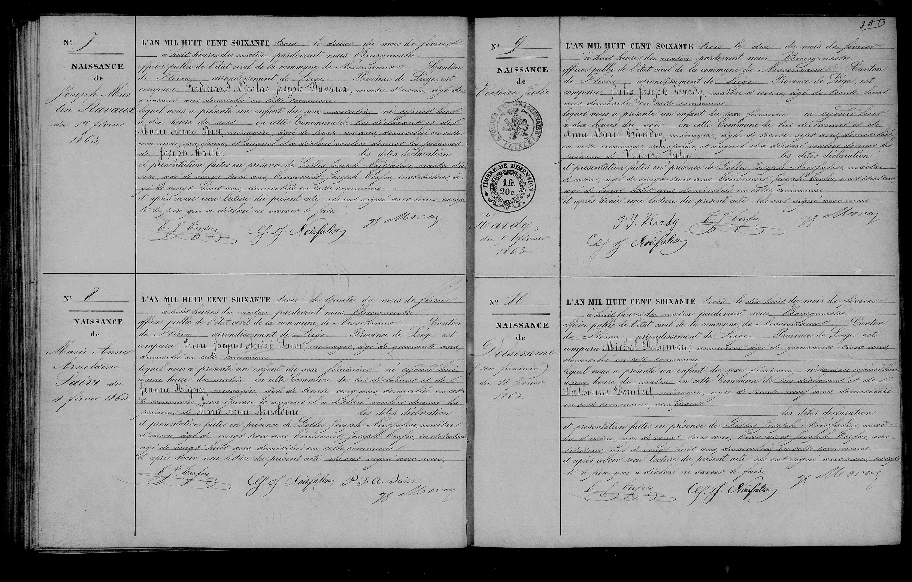

### Original French Transcription
**N° 9**
**NAISSANCE de Victoire Julie Hardy du 9 février 1863**

L’AN MIL HUIT CENT SOIXANTE trois le dix du mois de février à huit heures du matin pardevant nous Bourgmestre officier public de l’état civil de la commune de Nessonvaux, Canton de Fléron arrondissement de Liège Province de Liège, est comparu **Jules Joseph Hardy**, maître d'usine, âgé de trente huit ans domicilié en cette commune; lequel nous a présenté un enfant du sexe féminin, né aujourd’hui à dix heures du soir en cette commune de lui déclarant et de **Marie Anne Grandry**, ménagère, âgée de trente sept ans,  domiciliée en cette commune, son épouse, et auquel il a déclaré vouloir donner les prénoms de **Victoire Julie**; les dites déclaration et présentation faites en présence de **Gilles Joseph Noirfalise**, maître d’usine, âgé de vingt trois ans et **Tossaint Joseph Terfue**, instituteur, âgé de vingt huit ans domiciliés en cette commune.
Et après avoir reçu lecture du présent acte ils ont signé avec nous .

---