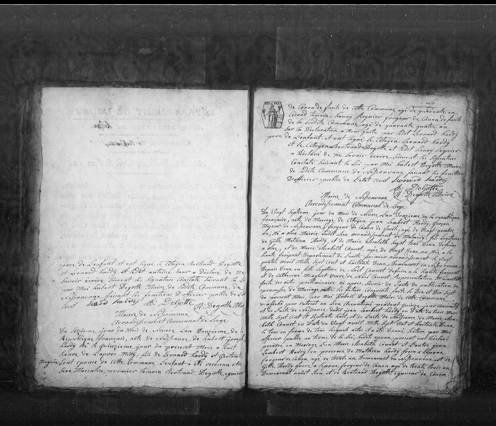

## Mariage de Jean Lambert Hardy et Marie Elisabeth Counet

Mairie de Nessonvaux  
Arrondissement Communal de Liège  

Du vingt septième jour du mois de Nivôse l’an douzième de la République  
Française, acte de mariage de citoyen __Jean Lambert Hardy__, garçon  
majeur de Nessonvaux, forgeron de canon de fusil, âgé de vingt quatre  
ans, né à Olne mairie dudit lieu arrondissement de Malmédy __fils légitime  
de Gilles Mathieu Hardy et de Marie Elisabeth Fagot__ tous deux défunts  
à Olne, et de __Marie Elisabeth Counet__, âgée de vingt deux ans née à la  
Haute-Fraipont département de l’Ourte mairies arrondissement le vingt  
quatre avril mille sept cent quatre vingt deux, demeurant en Nessonvaux  
depuis deux ans __fille légitime de Noël Counet__ défunt à la Haute Fraipont   
__et de Catherine Moughet__ veuve de Noël Counet, . . .   

. . . ledit Jean Lambert Hardy en date du trois mars  
mille sept cent septante huit, et de l’acte de naissance de Marie Elisa-  
-beth Counet en date du vingt avril mille sept cent quatre vingt deux. . .  

. . . ledit époux présent ont déclaré   
prendre en mariage l'un Marie Elisabeth Counet et l'autre Jean  
Lambert Hardy en présence de Mathieu Hardy frère à l’époux  
forgeron de canon âgé de trente ans demeurant en Nessonvaux et de  
__Gilles Hardy frère à l’époux__ forgeron de canon âgé de trente trois ans  
demeurant audit lieu . . .

- 16 Nivôse An XII	Birth (Hubert Joseph Hardy)	January 7, 1804
- 27 Nivôse An XII	Marriage (Jean Lambert Hardy)	January 18, 1804

---

## Leonard Hardy

(pas de connection conue a la famille)

Mairie de Nessonvaux  
Arrondissement Communal de Liège  

Le seizième jour du mois de Nivôse l’an douzième de la  
République française, acte de naissance de __Hubert Joseph   
Hardy__ né le quinzième jour du présent mois à huit  
heures de l’après midy, fils de __Léonard Hardy__ et Gertrude  
Pingnée son épouse de cette commune. L’enfant a été reconnu être   
sexe masculin, premier témoin Bertrand Degotte équisseur  

(Transition to top of right page)  

de canon de fusils de cette commune âgé de quarante ans,  
second témoin, Henry Regnier forgeron de canon de fusils  
de la susdite commune âgé de quarante quatre ans.  
Sur la déclaration à nous faite par ledit Léonard Hardy  
père de l’enfant et ont signé le Citoyen Léonard Hardy  
et le Citoyen Bertrand Degotte et dit Henry Regnier  
a déclaré ne savoir écrire suivant les signatures  
constatée suivant la loi par moi Hubert Degotte Maire  
de ladite commune de Nessonvaux faisant les fonctions  
d’officier public de l’état civil.  
Léonard Hardy     B: Degotte  
            H: Degotte Maire  

Léonard Hardy (born c. 1765) is a generation older than Nicolas Hubert (born 1790) and appears as a constant mentor and witness in almost every major family event across four decades of your records.

---
