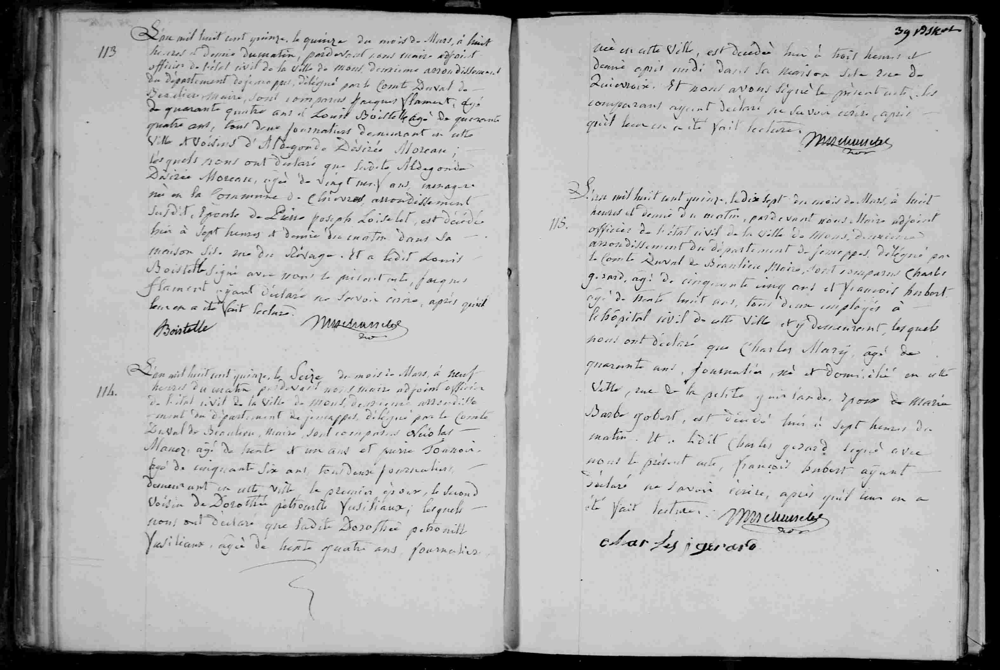

# Décès de Charles Mary (1815)

### Transcription de l'acte n° 115

L'an mil huit cent quinze, le dix sept du mois de Mars, à huit heures et demie du matin, pardevant nous Maire adjoint officier de l'état civil de la ville de Mons, deuxième arrondissement du département de Jemappes, délégué par le Comte Duval de Beaulieu Maire, sont comparus Charles Gérard, agé de cinquante cinq ans et François Hubert agé de trente huit ans, tous deux employés à l'hôpital civil de cette ville et y demeurant, lesquels nous ont déclaré que **Charles** Mary, agé de quarante ans, journalier, né et domicilié en cette ville, rue de la petite guirlande, époux de Marie Barbe Gobert, est décédé hui à sept heures du matin. Et a ledit Charles Gérard signé avec nous le présent acte, François Hubert ayant déclaré ne savoir écrire, après qu'il leur en a été fait lecture. [Signatures]

### Tableau récapitulatif

| Nom | Rôle dans l'acte | Occupation / Notes |
| :--- | :--- | :--- |
| Charles Mary | Défunt | Journalier, 40 ans, domicilié rue de la petite guirlande à Mons |
| Marie Barbe Gobert | Épouse du défunt | - |
| Charles Gérard | Déclarant | Employé à l'hôpital civil de Mons, 55 ans |
| François Hubert | Déclarant | Employé à l'hôpital civil de Mons, 38 ans |
| Comte Duval de Beaulieu | Maire | Mentionné en qualité de déléguant |

### Dates clés

* **Date de l'acte :** 17 mars 1815
* **Date du décès :** 17 mars 1815

### Lieux mentionnés

* **Ville :** Mons (département de Jemappes)
* **Adresse précise :** Rue de la petite guirlande, Mons
* **Institution :** Hôpital civil de Mons

---

### Tableau récapitulatif : Acte n° 113

| Nom | Rôle dans l'acte | Occupation / Notes |
| :--- | :--- | :--- |
| Aldegonde Désirée Moreau | Défunte | 27 ans, ménagère, domiciliée à Chièvres |
| Lié Joseph Loiselet | Époux de la défunte | - |
| Jacques Flament | Déclarant | 44 ans, journalier, voisin |
| Louis Boistelle | Déclarant | 44 ans, journalier, voisin |
| Comte Duval de Beaulieu | Maire | Mentionné en qualité de déléguant |

---

### Tableau récapitulatif : Acte n° 114

| Nom | Rôle dans l'acte | Occupation / Notes |
| :--- | :--- | :--- |
| Dorothée Pétronille Jusiliaux | Défunte | 24 ans, journalière |
| Nicolas Maner | Déclarant | 56 ans, journalier, époux de la défunte |
| Comte Duval de Beaulieu | Maire | Mentionné en qualité de déléguant |