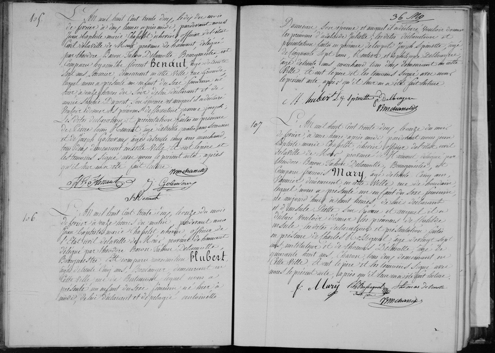

# Naissance de Clotide Mary (1822)

n° 107

L'an mil huit cent trente deux, le onze du mois de février, à une heure après midi, pardevant nous Jean Baptiste Marie Chapelet, échevin officier de l'état civil de la ville de Mons, province de Hainaut, délégué par Theodore Baron Tabor Delamotte, Bourgmestre, est comparu François Mary, agé de trente cinq ans, fermier demeurant en cette ville rue de Houdain, lequel nous a présenté un enfant du sexe féminin, né aujourd'hui à huit heures, de lui déclarant et d'Ursule Piette son épouse et auquel il a déclaré vouloir donner les prénoms de **Clotilde Ursule**, les dites déclarations et présentation faites en présence de Charles Rossignol, agé de vingt sept ans, instituteur et de Thomas Delmotte, agé de quarante huit ans, charon, tous deux demeurant en cette ville, dont le père et les témoins signé avec nous le présent acte, après qu'il leur en a été fait lecture. [Signatures]

---

### Tableau récapitulatif

| Nom | Rôle dans l'acte | Occupation / Notes |
| :--- | :--- | :--- |
| Clotilde Ursule Mary | Enfant (naissance) | - |
| François Mary | Père | 35 ans, fermier, domicilié rue de Houdain à Mons |
| Ursule Piette | Mère | Épouse de François Mary |
| Charles Rossignol | Témoin | 27 ans, instituteur, domicilié à Mons |
| Thomas Delmotte | Témoin | 48 ans, charon, domicilié à Mons |
| Jean Baptiste Marie Chapelet | Officier d'état civil | Échevin délégué par le Bourgmestre |

---

### Dates clés

* **Date de l'acte :** 11 février 1832
* **Date de naissance :** 11 février 1832

### Lieu mentionné

* **Localisation :** Rue de Houdain, Mons, province de Hainaut, Belgique.

---

### Tableau récapitulatif : Acte n° 105

| Nom | Rôle dans l'acte | Occupation / Notes |
| :--- | :--- | :--- |
| Florentine Jeanne Joseph | Enfant (naissance) | - |
| Hyacinthe Florent Bénaut | Père | 38 ans, armurier, domicilié à Mons (rue Grande) |
| Anne Sophie Dupont | Mère | Épouse de Hyacinthe Florent Bénaut |
| Pierre Louis Hénault | Témoin | 44 ans, marchand |
| Joseph Golemy | Témoin | 55 ans, marchand |
| Jean Baptiste Marie Chapelet | Officier d'état civil | Échevin délégué par le Bourgmestre |

---

### Tableau récapitulatif : Acte n° 106

| Nom | Rôle dans l'acte | Occupation / Notes |
| :--- | :--- | :--- |
| Clotilde | Enfant (naissance) | - |
| Maximilien Hubert | Père | 35 ans, boulanger, domicilié rue de la Bute-mont |
| Pélagie Antonelle | Mère | Épouse de Maximilien Hubert |
| Adélaïde Juliette | Enfant (prénoms donnés) | - |
| Léopold Joseph Spinette | Témoin | 57 ans, rentier |
| Jean Baptiste Delbruyère | Témoin | 38 ans, marchand |
| Jean Baptiste Marie Chapelet | Officier d'état civil | Échevin délégué par le Bourgmestre |