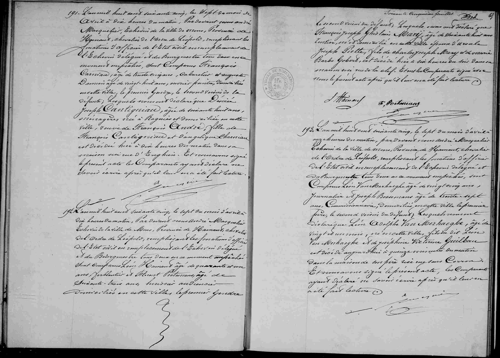

# Déces de François Joseph Mary (1865)

n° 192

L'an mil huit cent soixante cinq, le sept du mois d'avril à dix heures du matin, pardevant nous André Masquelier, Echevin de la ville de Mons, Province de Hainaut, chevalier de l'Ordre de Léopold, remplissant les fonctions d'officier de l'Etat civil en remplacement de l'Echevin délégué et du Bourgmestre tous deux en ce moment empêchés, sont comparus **Léon Hainaut**, agé de quarante et un ans, ferblantier et Florent Portemans, agé de soixante trois ans, huissier audiencier, domiciliés en cette ville, le premier gendre le second voisin du défunt; lesquels nous ont déclaré que François Joseph Ghislain Mary, agé de soixante huit ans, rentier, né et domicilié en cette ville, époux d'Ursule Joseph Piette, fils de Charles Joseph Mary et de Marie Barbe Gobert, est décédé hier à six heures du soir dans sa maison sise rue de la Clef. Et ont les comparants signé avec nous le présent acte après qu'il leur en a été fait lecture.

---

### Tableau récapitulatif : Acte n° 192

| Nom | Rôle dans l'acte | Occupation / Notes |
| :--- | :--- | :--- |
| François Joseph Ghislain Mary | Défunt | 68 ans, rentier, né et domicilié à Mons, rue de la Clef |
| Ursule Joseph Piette | Épouse du défunt | - |
| Charles Joseph Mary | Père du défunt | - |
| Marie Barbe Gobert | Mère du défunt | - |
| Léon Hainaut | Déclarant | 41 ans, ferblantier, gendre du défunt |
| Florent Portemans | Déclarant | 63 ans, huissier audiencier, voisin du défunt |
| André Masquelier | Officier d'état civil | Échevin de la ville de Mons |

---

### Dates clés

* **Date de l'acte :** 7 avril 1865
* **Date du décès :** 6 avril 1865 (décédé "hier")

### Lieux mentionnés

* **Ville :** Mons, province de Hainaut, Belgique.
* **Adresse précise :** Rue de la Clef, Mons.

---

### Tableau récapitulatif : Acte n° 191

| Nom | Rôle dans l'acte | Occupation / Notes |
| :--- | :--- | :--- |
| Désirée Joseph Cantigniau | Défunte | 68 ans, ménagère, née à Ragnies, domiciliée à Mons |
| François Cantigniau | Père de la défunte | - |
| Angélique Charniau | Mère de la défunte | - |
| François Carniau | Déclarant | 34 ans, cabaretier, gendre de la défunte |
| Auguste Damien | Déclarant | 28 ans, ouvrier peintre, voisin de la défunte |
| André Masquelier | Officier d'état civil | Échevin de la ville de Mons |

---

### Tableau récapitulatif : Acte n° 193

| Nom | Rôle dans l'acte | Occupation / Notes |
| :--- | :--- | :--- |
| Léon Adolphe Van Merhaeghe | Défunt | 1 mois, né à Mons |
| Léon Van Merhaeghe | Père du défunt | 25 ans, journalier, domicilié rue sans Couron |
| Joséphine Victorine Guilbau | Mère du défunt | - |
| Léon Van Merhaeghe | Déclarant | 25 ans, journalier, père du défunt |
| Joseph Bossemans | Déclarant | 37 ans, commissionnaire, voisin du défunt |
| André Masquelier | Officier d'état civil | Échevin de la ville de Mons |