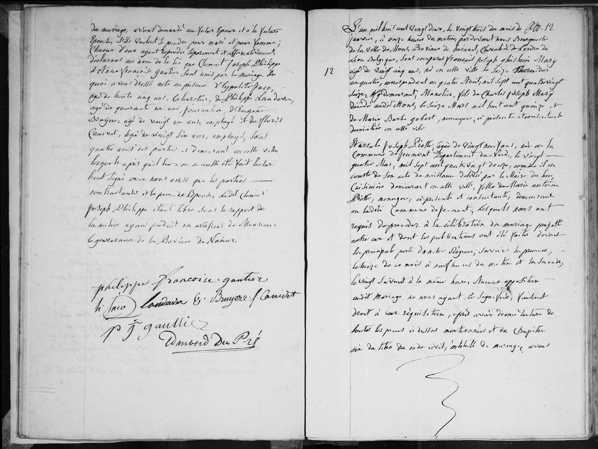
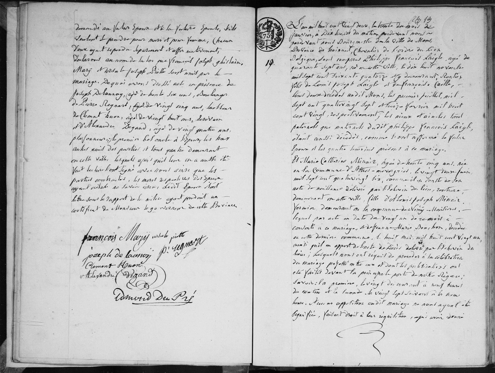

### Transcription de l'acte de mariage (n° 12)

L'an mil huit cent vingt deux, le vingt trois du mois de janvier, à onze heures du matin, pardevant nous Bourgmestre de la Ville de Mons, Province de Hainaut, Chevalier de l'Ordre de Lion Belgique, sont comparus **François Joseph Ghislain Mary**, agé de vingt ans, né en cette ville le seize Thermidor an quatre, correspondant au quatorze août, mil sept cent quatre vingt seize, demeurant à Mons, fils de Charles Joseph Mary, décédé audit Mons, le seize Mars, mil huit cent quinze et de Marie Barbe Gobert, ménagère, ici présente et consentante, domiciliée en cette ville.

Et **Ursule Joseph Piette**, agée de vingt neuf ans, née à la commune de Feignies, Département du Nord, le vingt quatre Mai, mil sept cent quatre vingt douze, comme il en conste de son acte de naissance délivré par le Maire du lieu, célibataire demeurant en cette ville, fille de Marie Antoine Piette, ménagère, ici présente et consentante, demeurant en ladite commune de Feignies; lesquels nous ont requis de procéder à la célébration du mariage projeté entre eux et dont les publications ont été faites devant la principale porte de notre Régence; savoir: la première, le douze de ce mois à neuf heures du matin et la seconde, le vingt suivant à la même heure. Aucune opposition audit mariage ne nous ayant été signifiée, faisant droit à leur réquisition, après avoir donné lecture de toutes les pièces ci-dessus mentionnées et du chapitre six du titre du code civil, intitulé du mariage... [suite sur la page suivante] ... demandés au futur époux et à la future épouse, s'ils veulent se prendre pour mari et pour femme; chacun d'eux ayant répondu séparément et affirmativement, déclarons au nom de la loi que François Joseph Ghislain Mary et Ursule Joseph Piette sont unis par le mariage. 

De quoi avons dressé acte en présence de Joseph Delannoy, agé de trente six ans, boulanger, de Pierre Regnart, agé de vingt cinq ans, tailleur, de Clément Houze, agé de vingt huit ans, tisserand et d'Alexandre Degand, agé de vingt quatre ans, plafonneur, le premier bel-oncle de l'époux, les trois autres amis des parties et tous quatre demeurant en cette ville, lesquels après qu'il leur en a été fait lecture ont signé avec nous ainsi que les parties contractantes, les mères des époux ayant déclaré ne savoir écrire, ledit époux étant libre sous le rapport de la milice ayant produit un certificat de Monsieur le gouverneur de cette Province.

---

### Tableau récapitulatif : Acte n° 12 (Mariage Mary-Piette)

| Nom | Rôle dans l'acte | Occupation / Notes |
| :--- | :--- | :--- |
| François Joseph Ghislain Mary | Époux | 20 ans, né à Mons le 14/08/1796 |
| Ursule Joseph Piette | Épouse | 29 ans, née à Feignies |
| Charles Joseph Mary | Père de l'époux | Décédé le 16/03/1815 |
| Marie Barbe Gobert | Mère de l'époux | Ménagère, présente et consentante |
| Marie Antoine Piette | Mère de l'épouse | Ménagère, présente et consentante |
| Joseph Delannoy | Témoin | 36 ans, boulanger, bel-oncle de l'époux |
| Pierre Regnart | Témoin | 25 ans, tailleur |
| Clément Houze | Témoin | 28 ans, tisserand |
| Alexandre Degand | Témoin | 24 ans, plafonneur |---

### Tableaux récapitulatifs : Autres actes présents

#### Acte n° 12 (Suite de l'acte précédent - Témoins)
| Nom | Rôle dans l'acte | Occupation / Notes |
| :--- | :--- | :--- |
| Clément Joseph Philippe | Témoin | 35 ans, cabaretier |
| Philippe Landavar | Témoin | 44 ans, journalier |
| ... de Bruyère | Témoin | 21 ans, employé |
| ... Clinet | Témoin | 26 ans, employé |

#### Acte n° 19 (Mariage Laigle-Minair)
| Nom | Rôle dans l'acte | Occupation / Notes |
| :--- | :--- | :--- |
| Philippe François Laigle | Marié | 47 ans, rentier, veuf |
| Marie Catherine Minair | Mariée | 35 ans, rentière, née à Athies |
| Louis Joseph Laigle | Père du marié | Décédé |
| Françoise Caille | Mère du marié | Décédée |
| Louis Joseph Minair | Père de la mariée | Fermier, demeurant à la commune de Vimy-Maison |
| Anne Marie Donchon | Mère de la mariée | Décédée à Vimy-Maison le 08/05/1821 |
| Joseph Delannoy | Témoin | 36 ans, boulanger |
| Pierre Regnart | Témoin | 25 ans, tailleur |
| Clément Houze | Témoin | 28 ans, tisserand |
| Alexandre Degand | Témoin | 24 ans, plafonneur |

---

### Dates et Lieux

* **Date du mariage (Mary-Piette) :** 23 janvier 1822
* **Date du mariage (Laigle-Minair) :** 30 janvier 1822
* **Lieux mentionnés :** Mons (Hainaut), Feignies (Département du Nord), Athies, Vimy-Maison.