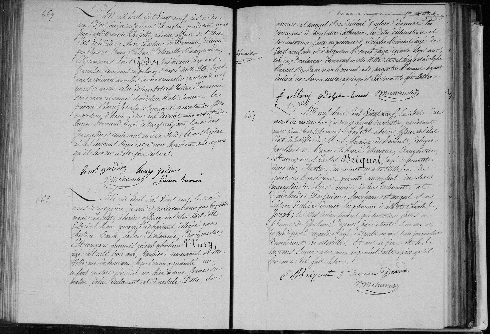

# Naissance de Hortense Mary (1829)

n° 668

L'an mil huit cent vingt neuf, le six du mois de novembre, à midi, pardevant nous Jean Baptiste Marie Chapelet, échevin officier de l'état civil de la Ville de Mons, province de Hainaut, délégué par Theodore Baron Tabor Delamotte, Bourgmestre, est comparu François Joseph Ghislain Mary, agé de trente trois ans, caunier demeurant en cette ville, rue de Houdain, lequel nous a présenté un enfant du sexe féminin, né hier à une heure du matin, de lui déclarant et d'Ursule Piette, son épouse et auquel il a déclaré vouloir donner les prénoms d'Hortense Catherine, les dites déclarations et présentation faites en présence d'Adolphe Hemant, agé de vingt neuf ans et d'Augustin Hemant, agé de trente sept ans, tous deux boulangers, demeurant en cette ville, dont le père et Adolphe Hemant signé avec nous le présent acte, Augustin Hemant, ayant déclaré ne savoir écrire, après qu'il leur en a été fait lecture.

---

### Tableau récapitulatif : Acte n° 668

| Nom | Rôle dans l'acte | Occupation / Notes |
| :--- | :--- | :--- |
| Hortense Catherine Mary | Enfant (naissance) | - |
| François Joseph Ghislain Mary | Père | 33 ans, caunier, domicilié rue de Houdain |
| Ursule Piette | Mère | Épouse de François Joseph Mary |
| Adolphe Hemant | Témoin | 29 ans, boulanger |
| Augustin Hemant | Témoin | 37 ans, boulanger |
| Jean Baptiste Marie Chapelet | Officier d'état civil | Échevin délégué par le Bourgmestre |

---

### Tableaux récapitulatifs : Autres actes présents

#### Acte n° 667
| Nom | Rôle dans l'acte | Occupation / Notes |
| :--- | :--- | :--- |
| Henri | Enfant (naissance) | - |
| Louis Godin | Père | 30 ans, journalier, domicilié au faubourg Baré |
| Catherine Henniau | Mère | Épouse de Louis Godin |
| Louis Godin | Témoin | 33 ans, journalier |
| Henry Godin | Témoin | 29 ans, journalier |

#### Acte n° 669
| Nom | Rôle dans l'acte | Occupation / Notes |
| :--- | :--- | :--- |
| Albert Charles Joseph | Enfant (naissance) | - |
| Charles Briquet | Père | 44 ans, chartier, domicilié rue de querre |
| Adélaïde Dujardin | Mère | Épouse de Charles Briquet |
| Ghislain Depans | Témoin | 33 ans, journalier |
| Philippe Dujardin | Témoin | 31 ans, journalier |