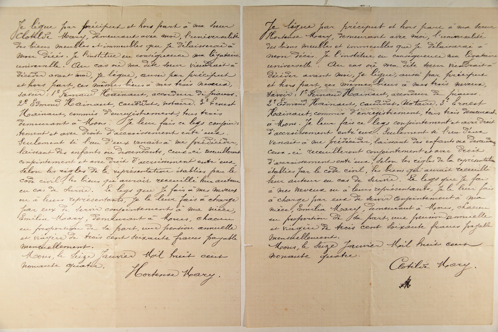

# Testaments de Hortence et Clotilde Mary (16 janvier 1894)

## Testament de Hortense Mary:
Je lègue par préciput et hors part à ma sœur Clotilde Mary, demeurant avec moi, l'universalité des biens meubles et immeubles que je délaisserai à mon décès. Je l'institue en conséquence ma légataire universelle. Au cas où ma dite sœur viendrait à décéder avant moi, je lègue, aussi par préciput et hors part, ces mêmes biens à mes trois neveux, savoir: 1° Fernand Hainaut, accordeur de pianos, 2° Edmond Hainaut, candidat notaire, 3° Ernest Hainaut, commis à l'enregistrement, tous trois demeurant à Mons. 

Je leur fais ce legs conjointement et avec droit d'accroissement entr'eux. Seulement si l'un d'eux venait à me prédécéder, laissant des enfants ou descendants, ceux-ci recueilleront conjointement et avec droit d'accroissement entr'eux, selon les règles de la représentation établies par le code civil, les biens qu'aurait recueilli leur auteur en cas de survie. 

Le legs que je fais à mes neveux ou à leurs représentants, je le leur fais à charge par eux de servir conjointement à ma nièce, Emilie Mary, demeurant à Mons, chacun en proportion de sa part, une pension annuelle et viagère de trois cent soixante francs payable mensuellement.

Mons, le seize janvier mil huit cent nonante quatre. 
[Signé] Hortense Mary.

## Testament de Clotilde Mary:
Je lègue par préciput et hors part à ma sœur Hortense Mary, demeurant avec moi, l'universalité des biens meubles et immeubles que je délaisserai à mon décès. Je l'institue en conséquence ma légataire universelle. Au cas où ma dite sœur viendrait à décéder avant moi, je lègue, aussi par préciput et hors part, ces mêmes biens à mes trois neveux, savoir: 1° Fernand Hainaut, accordeur de pianos, 2° Edmond Hainaut, candidat notaire, 3° Ernest Hainaut, commis à l'enregistrement, tous trois demeurant à Mons. 

[La suite est identique au testament précédent concernant les conditions d'accroissement et la pension à verser à Emilie Mary].

Mons, le seize janvier mil huit cent nonante quatre. 

[Signé] Clotilde Mary.

---

360 Francs: À la fin du XIXe siècle, en Belgique, un ouvrier non qualifié ou un journalier gagnait généralement entre 3 et 5 francs par journée de travail.

### Tableau récapitulatif des personnes citées

| Nom | Rôle | Notes |
| :--- | :--- | :--- |
| Hortense Mary | Testatrice / Sœur | Sœur de Clotilde |
| Clotilde Mary | Testatrice / Sœur | Sœur de Hortense |
| Fernand Hainaut | Neveu | Accordeur de pianos, à Mons |
| Edmond Hainaut | Neveu | Candidat notaire, à Mons |
| Ernest Hainaut | Neveu | Commis à l'enregistrement, à Mons |
| Emilie Mary | Nièce | Bénéficiaire d'une pension annuelle |

---

### Dates clés

* **Date des testaments :** 16 janvier 1894

